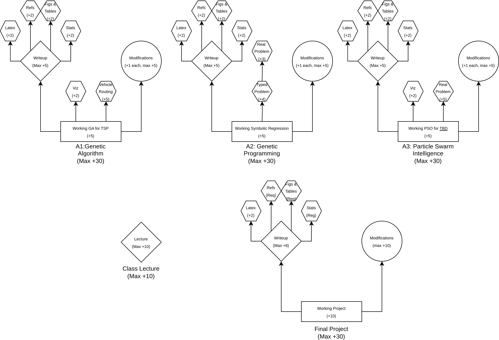

=================================================
Computer Science 340 --- Evolutionary Computation
=================================================

Fall 2023
=========

Course Description
==================

Evolutionary computation is a family of powerful optimization algorithms often used to find solutions to computationally
intractable problems. The study of these algorithms and their application to problems is a large research area within
computer science. Course topics include combinatorial optimization, genetic algorithms, particle swarm optimization,
search space analysis, multi-objective optimization, and neuroevolution. Research practices and technical writing will
be emphasized for course assignments/projects.

Prerequisites
=============

* CSCI  255
* CSCI 223 or CSCI 275

Instructor
==========

Lecture Section 11
------------------

* Dr. James Hughes
* Office: Annex 20B
* Office Hours: 
    * Tuesday, 10:00am -- 11:00am
    * Wednesday, 10:00am -- 11:00am
    * Friday, 10:00am -- 11:00am
    
* Email: jhughes at stfx.ca

Class Times
===========

* Tue 11:15 - 12:05 (K4), MULH 2070
* Wed 13:15 - 14:05 (K5), MULH 2070
* Fri 12:15 - 13:05 (K6), MULH 2070

Website
=======

* Mostly :doc:`this website </index>`
* MOODLE

Textbook and Lecture Notes
==========================

Lecture notes will be posted to the website. They are provided as a courtesy by the professor. Possessing and reading
these notes are not a suitable substitute for attending lectures.

The textbook for this class is:

Eiben, Agoston E., and James E. Smith.
*Introduction to Evolutionary Computing. Vol. 53.*
Berlin: springer, 2003.

Topics
======

Below is a list of topics in no particular order that may or may not be covered in the course:

* Evolutionary Algorithms

  * Genetic Algorithms
  * Genetic Programming

* Swarm Intelligence
* Representation/Encoding
* Common Algorithm Improvements
* Application Areas
* Search Space Analysis
* Evolving Neural Networks
* Technical Communication

    * Lecture
    * Written Reports

Student Evaluation
==================

.. list-table:: Final Grade Breakdown
    :widths: 50 50 50 50
    :header-rows: 1

    * - Deliverable
      - Maximum Points
      - Mandatory
      - Due Date
    * - Assignment 1
      - 30
      - ``False``
      - End of September-ish
    * - Assignment 2
      - 30
      - ``False``
      - Mid October-ish
    * - Assignment 3
      - 30
      - ``False``
      - Early November-ish
    * - Final Project
      - 30
      - ``True``
      - End of November-ish
    * - Lecture
      - 10
      - ``True``

For this course, in general, marks are obtained by completing tasks as opposed to losing marks from mistakes.

    Click the image to see a larger version of the mark allocation.

Notes
-----

* Items represented as diamonds will be marked slightly more traditionally as they are somewhat more subjective

    * E.g., Writeup marks will depend on prose, grammar, spelling, readability, structure, and overall effectiveness

* Completing a task does not guarantee a mark as it must be satisfactory and is to the discretion of the marker

    * E.g., the GA must be functional
    * E.g., no mark will be awarded for low quality visualizations

* Although there are more than 100 marks that can be obtained, the maximum grade an individual can receive in the class is 100
* Although you can chose to do or not do most items here, you must do a and a final project

Assignments
===========

Breakdown
---------

The majority of the marks will come from applying what was learned in class and independent research in a series of
assignments and projects. Most of these marks will be awarded for sufficiently completing tasks as opposed to a
traditional method of losing marks for mistakes.

Given that this is a more senior course, I am not that interested in your code as you should all be capable of getting
your assignments and projects working. You receive marks for completing the coding portions correctly, however only a
few marks are awarded for a working implementation. Implementing various enhancements on top of the base assignment
will give you additional marks. These enhancements are not required; however, you only receive the associated marks if
you complete the corresponding enhancement. The writeup/report accounts for a significant portion of the assignment and
the writeup/report also has various enhancements. Again, the writeup/report is not necessary for all assignments, but
the associated marks will only be awarded if the report is done.

Unlike the rest of the course deliverables, the base writeups/reports, and lecture will be marked in a more conventional
way where a mark reflecting the quality of the submitted work will be awarded. Things like grammar, prose, clarity, and
effectiveness will be evaluated.

The lecture and the final project are the only course deliverables that are required; however, if students receive
perfect grades on all required submissions, then the highest final grade obtainable is 40% which would be a fail. All
other deliverables are "optional", but completion is encouraged. It is not possible to pass the course without doing
some number of optional deliverables.

You will notice that the total marks available is 130. Each mark is worth 1% of your final grade. The maximum grade one
can receive in the course is 100. Although it is possible to obtain 130/100, the final grade will be reported as 100%
(or 99%). This course is designed for you to decide which learning objectives you want to complete. It is entirely
possible to obtain all 130 marks in the course; however, this would require a significant amount of work. This
effectively means you could decide on day one of the course which grade in the course you will more-or-less obtain by
picking which deliverables you will complete.

If any of this description is unclear, please ask the professor for clarification.

If you prefer a conventional grading paradigm with a typical mark breakdown, please see the professor to make
arrangements in the first two weeks of the course.

Submission
----------

Instructions for the submission of assignments will be posted on the course website. It is each student's responsibility
to read and follow the instructions. Failure to follow the submission instructions may result in the assignment
receiving a mark of zero.

You will be required to submit each programming assignment electronically. Details will be given in the assignment
descriptions. Similarity detection software to identify possible cheating cases will be used.

Due Dates
---------

The date and exact time assignments are due will be given in the assignment specifications. No submissions will be taken
after the due date; there are no late submissions. No extensions will be given for assignments.

Marking
-------

Assignments are marked by the Teaching Assistants, who follow marking schemes provided by instructors.

A request for adjustment in an assignment mark must be made within 2 weeks of the date on which it was first available
after marking. (Beyond that date, regrading will not be considered, regardless of whether you retrieved your
assignment). Such a request must be submitted to the course instructor in writing, and must include specific reasons why
you believe you deserve more marks. The request must be accompanied by all materials that were originally handed in, as
well as the original marker's grade summary sheet. The instructor will inform you by email when the reevaluation process
is complete.

It is each student's responsibility to keep up-to-date backups of assignment disk files in case of system crashes or
inadvertently erased files. Students must keep disk copies of all material submitted, as well as the actual graded
assignment, to guard against the possibility of errors in recording marks. It is not safe to discard these materials
until you are satisfied that your final mark for the course has been computed properly.

Project
-------

Each student will complete a final project. The topic and enhancements will be decided on by the student in consultation
with the professor.

Lecture
-------

Each student will complete and present a lecture. The student, in consultation with the professor, will decide on the
topic.

Email Contact
=============

**Email etiquette** --- Emails should be addressed to Dr./Prof. Hughes.

I may need to send email messages to the whole class or to students individually. Email will be sent to the StFX email
address assigned to students. It is the responsibility of the student to read this email on a regular basis. You may
wish to have mail forwarded to an alternative email address.

Note that StFX and most other email providers establish quotas or limits on the amount of space available to you. If you
let your email accumulate there, your mailbox may fill up and you may lose important email from your instructors. Losing
email is not an acceptable excuse for not knowing about the information that was sent.

Students are encouraged to contact their course instructor via email with brief, email appropriate questions regarding
lecture materials or clarification of assignments. However, before sending email to an instructor, the student should
check the course website to see if the requested information is already there. Students must send email from their StFX
account and include CSCI 340 in the subject line of the email. Lengthy and in-depth questions are to be asked during
office hours.

Office Hours
============

Office hours are provided to students to facilitate their success --- students are encouraged to come to office hours.

Students must understand that the professors and TAs are not there to provide them answers to problems, but to assist
students solving their problems.

Attendance
==========

Students missing three classes without reasonable cause will be reported to the Assistant Vice-President Academic
Affairs. See section 3.7 of the academic calendar for more details. You will be reported if you are repeatedly
delinquent in assignments or attendance at classes or laboratories.

Copyright Policy
================

The materials in CSCI 340 at StFX are the property of the instructor, unless stated otherwise by the instructor. Online
posting or selling this material to third parties for distribution without permission is subject to Canadian Copyright
law and is strictly prohibited.

The course copyright policy will be aggressively enforced.

Class Recording Policy
======================

Students may not create audio and/or video recordings of classes. Students creating unauthorized recording of lectures
violate an instructor's intellectual property rights and the Canadian Copyright Act. Students violating this policy will
be subject to disciplinary actions.

Statement of Academic Offenses and Academic Integrity
=====================================================

Please ensure that you are aware of the policy on Academic Integrity. Details can be found
`here <https://www.stfx.ca/media/40111/download>`_.

Scholastic offenses are taken seriously and students are directed to read the appropriate policy, specifically, the
definition of what constitutes a Scholastic Offense. See section 3.8 of the academic calendar.

It is your responsibility to understand what academic misconduct is. Ignorance of the rules is not an admissible excuse
for academic misconduct. I will pursue academic offenses fully. I will apply -100% (not 0) as a grade. I will also
advocate for an automatic failure in the course, or expulsion from the university when allowed.

Use of Plagiarism-Checking Software
-----------------------------------

All required papers/submissions may be subject to submission for textual similarity review to the commercial plagiarism
detection software under license to the University for the detection of plagiarism. All papers submitted for such
checking will be included as source documents in the reference database for the purpose of detecting plagiarism of
papers subsequently submitted to the system.

Use of Cheating-Analysis Software
---------------------------------

All submitted work may be subject to submission for similarity review by software that will check for unusual
coincidences in answer patterns that may indicate cheating (MOSS).

Tutoring
========

The role of tutoring is to help students understand course material. Tutors should not write assignments or take-home
tests for the students who hire them.

Information about Requesting an Accommodation at StFX
=====================================================

If you have a different learning ability and would like to request accommodations, please contact the instructor during
the first week of the semester so that your accommodations may be provided in a timely manner. Centre for Accessible
Learning (CAL) provides assistance in determining and facilitating appropriate accommodations for students with verified
disabilities.

Tramble Center for Accessible Learning
--------------------------------------

The Tramble Center for Accessible Learning welcomes students with documented permanent disabilities and offers them a
student-centered program of support. Located in Room 108 of the Angus L MacDonald Library, new and returning students
meet with program staff to discuss options for support. Deadline for registering with the Center is two weeks prior to
the end of classes each semester and 3 Business Days’ notice is required for booking all accommodated tests and exams.
To book an appointment please use the following link:
`Accessible Learning | St. Francis Xavier University (stfx.ca) <https://www.stfx.ca/student-life-support/accessible-learning>`_.

* Phone --- 902 867 5349
* Email --- tramble@stfx.ca

Academic Accommodation for Medical Illness
------------------------------------------

Those unable to attend class, submit an assignment, or write a test, should refer to sections 3.7 and 3.9 of the
academic calendar.

Scent Policy
============

For the benefit of the many students that have a scent sensitivity, my classroom is a no-scent zone; please respect this
policy.

Statement on Equitable Learning
===============================

Everyone learns more effectively in a respectful, safe and equitable learning environment, free from discrimination and
harassment. Instructors and students are invited to work together to create a classroom space --- both real and virtual
--- that fosters and promotes values of human dignity, equity, non-discrimination, and respect for diversity.

Please feel free to talk with your course instructor about your questions or concerns about equity in our classroom or
in the StFX community in general. Should students have additional questions, they are encouraged to talk to the
Chair/Coordinator of the Department/Program or the Human Rights and Equity Advisor, contact information can be found at
`Directory | St. Francis Xavier University (stfx.ca) <https://www.stfx.ca/directory-department/921?groupid=346>`_.

Preferred Pronouns
==================

Professional courtesy and sensitivity are especially important with respect to individuals and topics dealing with
differences of race, culture, religion, politics, sexual orientation, gender, gender variance, and nationalities. Class
rosters are provided to the instructor with the student's legal name. I will gladly honor your request to address you by
an alternate name or gender pronoun. Please advise me of this preference early in the semester so that I may make
appropriate changes to my records. See policies at
`Policies | St. Francis Xavier University (stfx.ca) <https://www.stfx.ca/human-rights-equity/policies>`_.

Support Services
================

There are various support services around campus and these include, but are not limited to:

#. Student Life: `Student Services | St. Francis Xavier University (stfx.ca) <https://www.stfx.ca/student-life-support/student-services>`_
#. Office of the Registrar: `Registrar’s Office | St. Francis Xavier University (stfx.ca) <https://www.stfx.ca/applications-admissions/registrars-office>`_
#. Health & Counselling Centre: `Health and Counselling Centre | St. Francis Xavier University (stfx.ca) <https://www.stfx.ca/student-life-support/health-counselling-centre>`_
#. Academic Advising: `Academic Advising | St. Francis Xavier University (stfx.ca) <https://www.stfx.ca/student-life-support/academic-advising>`_
#. Academic Success Centre: `Academic Success Centre | St. Francis Xavier University (stfx.ca) <https://www.stfx.ca/student-life-support/student-services/academic-success-centre>`_
#. Student Career Centre: `Student Career Centre | St. Francis Xavier University (stfx.ca) <https://www.stfx.ca/student-life-support/student-services/student-career-centre>`_
#. Office of Internationalization: `Internationalization | St. Francis Xavier University (stfx.ca) <https://www.stfx.ca/student-life-support/internationalization>`_
#. Financial Aid Office: `Financial Aid Office | St. Francis Xavier University (stfx.ca) <https://www.stfx.ca/applications-admissions/financial-support/financial-aid-office>`_

Health and Wellness
===================

As part of a successful undergraduate experience at St. Francis Xavier University, we encourage you to make your health
and wellness a priority. StFX provides several on-campus health-related services to help you achieve optimum health and
engage in healthy living while pursuing your degree. For example, to support physical activity, all students receive
membership to the StFX Athletics & Recreation Centre as part of their registration fees. Please visit the Athletics &
Recreation website at
`Campus Recreation | St. Francis Xavier University (stfx.ca) <https://www.stfx.ca/student-life-support/campus-life/campus-recreation>`_
for opportunities including intramural sports. Numerous cultural events are offered throughout the year. Please check
out the Department of Music web page
`Music | St. Francis Xavier University (stfx.ca) <https://www.stfx.ca/programs-courses/programs/music>`_,
the StFX Art Gallery (https://www.stfx.ca/art-gallery) or
Theatre Antigonish
`(Theatre Antigonish | St. Francis Xavier University) (stfx.ca) <https://www.stfx.ca/about/theater-antigonish>`_
for various events.

Further information regarding health and wellness-related services available to students may be found at
`Wellness@X | St. Francis Xavier University (stfx.ca) <https://www.stfx.ca/human-resources/wellnessx>`_.
If you are in emotional or mental distress please refer to the various mental
health supports provided through
`Health & Counselling at Health and Counselling Services | St. Francis Xavier University (stfx.ca) <https://www.stfx.ca/student-life-support/health-counselling/services>`_.