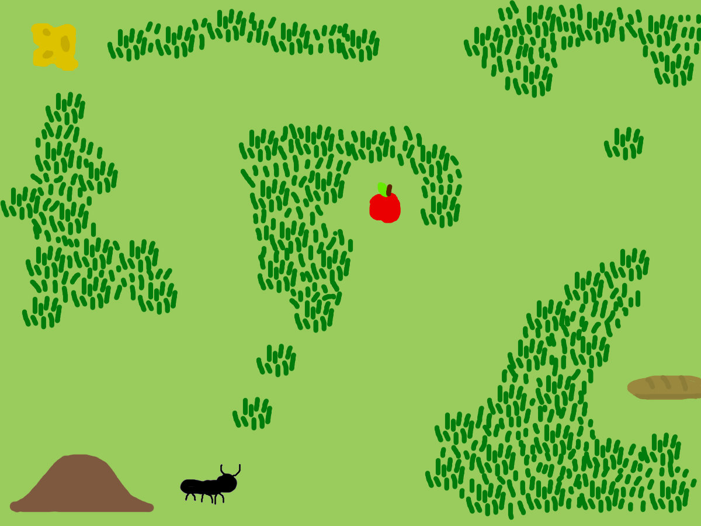
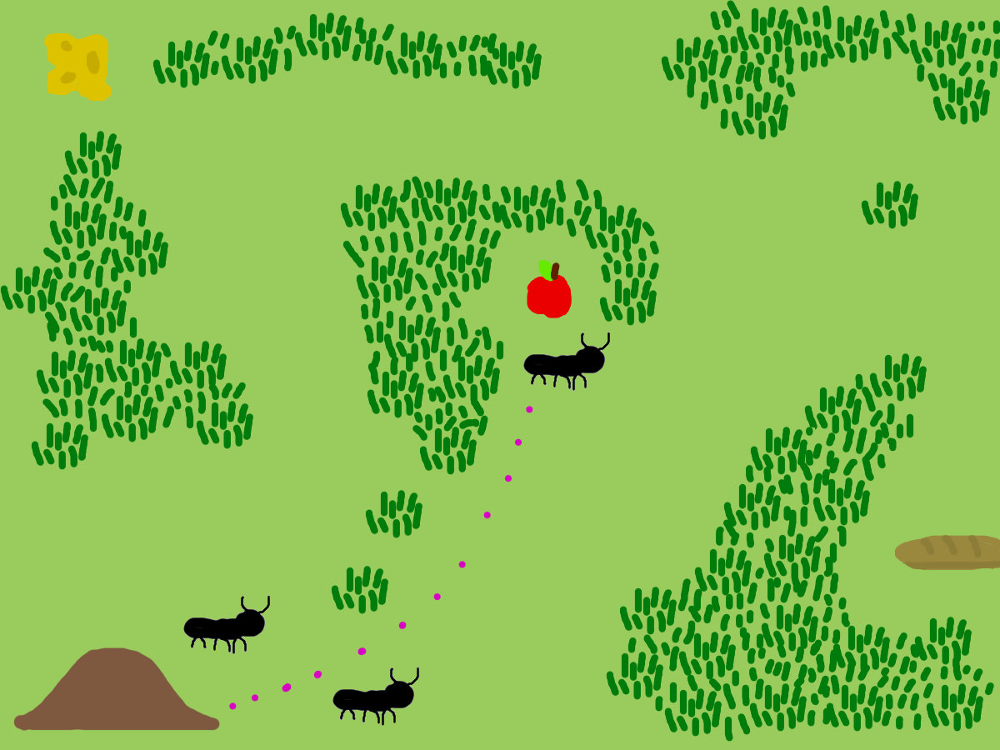
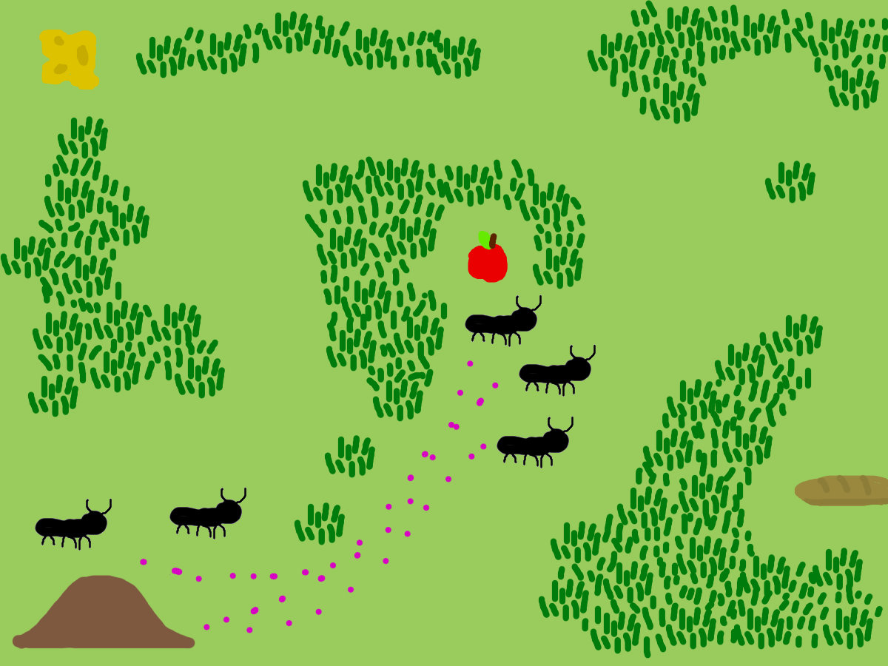
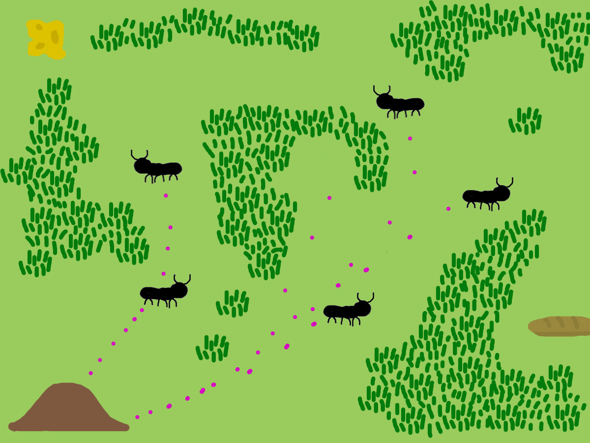
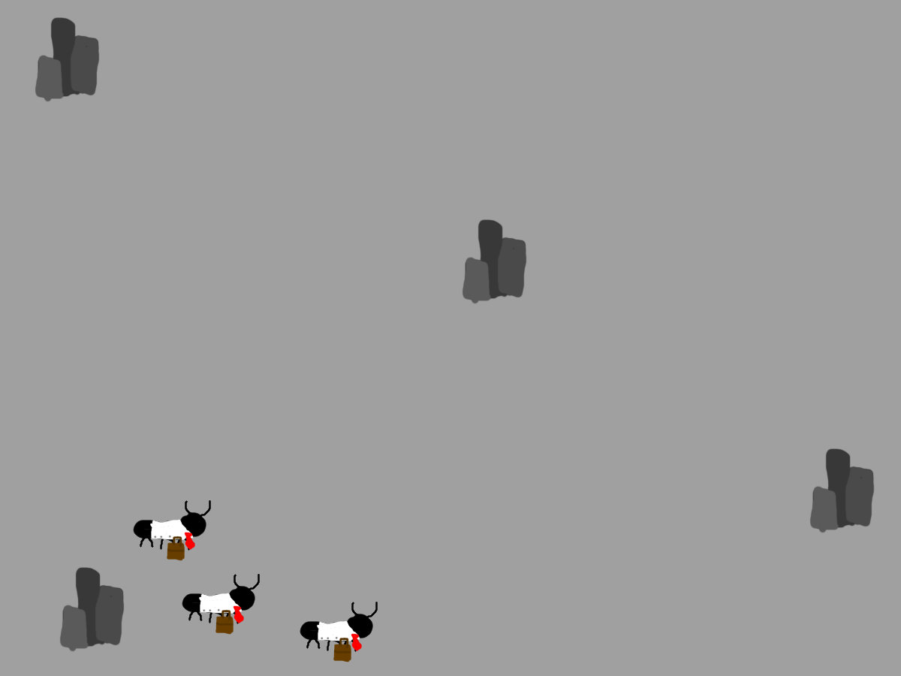
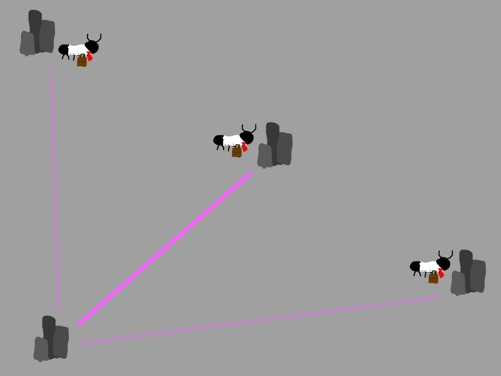
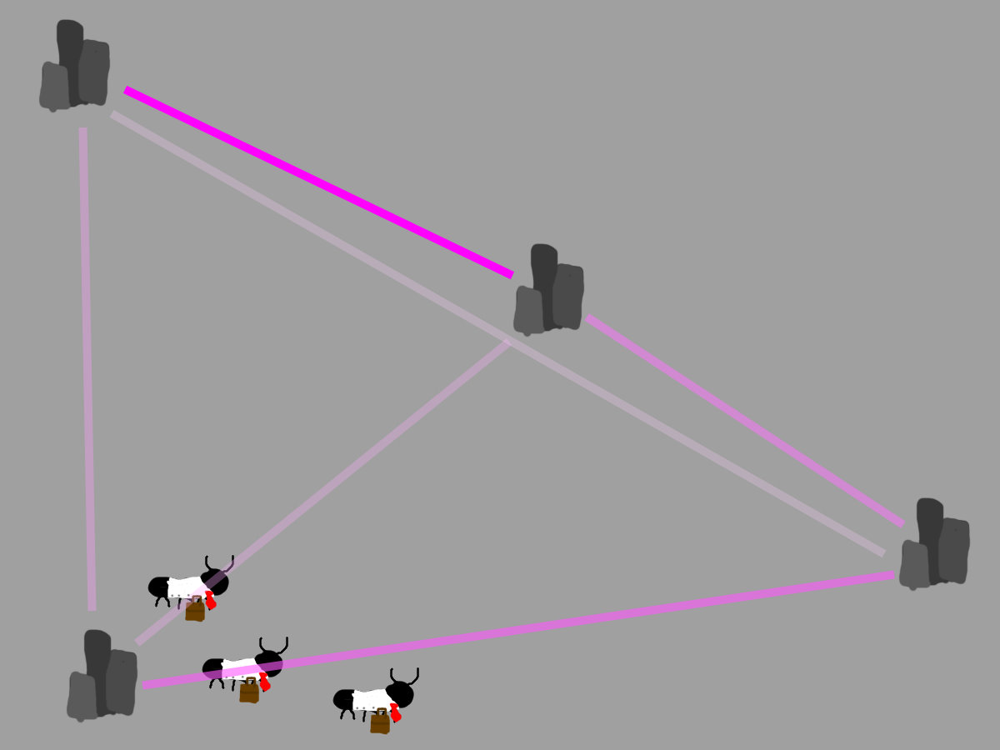
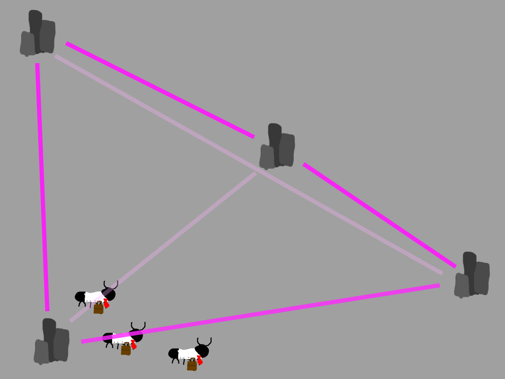

********************************
Ant Colony Optimization (ACO)
********************************

* Ant Colony Optimization (ACO) is a bio inspired optimization technique
* Based on the foraging behavior of ant colonies, it mimics how ants find the shortest path to food

Ants!
=======
.. note::

    This "backyard" will help visualize the ACO

* Ants leave pheromone trails as they travel to guide other ants
* The other ants are attracted to the pheromones
* more pheromones attract more ants reinforcing the shorter routes

* More pheromones accumulate on the shorter paths making them more favored by the ants
* The longer it takes an ant to travel a path the more time the pheromones have to evaporate

* Over time pheromone evaporate from paths
* This allows for the exploration of newer alternative paths

Traveling SalesAnt Problem
==========================

* The best way to understand this is to apply it to an already know problem like TSP
* But this time the S stands fro SalesAnt

* Now our back yard is a city and our ants are here to do some business
* The goal is the same as in normal TSP, visit every city in the shortest route and return to start

* To start Ants wil travel to random locations
* While traveling the ants will leave a pheromone trail,
* the longer it took them to travel to the city the weaker the pheromones will be when the next ant detects them

* These starter ants will randomly finish their routes and return home
* This sets up a base pheromone trail for the rest of the ants
* The pheromone trail on the left has gotten stronger because multiple ants used it in their paths

    * The strength of a pheromone trail is determined by the following formula

.. math::

    \tau_{xy} \leftarrow (1 - \rho) \tau_{xy}+{\sum_k^m \Delta\tau_{xy}^k}

* :math:`\tau_{xy}` is the amount of pheromone deposited from city :math:`x` to city :math:`y`
* :math:`\rho` is the pheromone evaporation coefficient
* :math:`m` is the number of ants who traversed the path from city :math:`x` to city :math:`y`
* :math:`\Delta\tau_{xy}^k` is the amount of pheromone deposited by the :math:`k` th ant between city :math:`x` to city :math:`y`
* In a TSP, the value of :math:`\Delta\tau_{xy}^k` is determined by the how long the path is

    * For example:
    * :math:`\Delta \tau_{xy}^k =\begin{cases}\frac{Q}{L_k} & \text{if ant } k \text{ uses path } xy \text{ in its tour}\\0 & \text{otherwise}\end{cases}`
    * :math:`Q` is a constant
    * :math:`L_k` is the distance between city :math:`x` and city :math:`y`

.. literalinclude:: \..\src\ACO.py
    :language: python
    :start-after: # [BEGIN PHEROMONE UPDATE]
    :end-before: # [END PHEROMONE UPDATE]

* This function ``update_pheromones`` is an implementation of the formula above for pheromone deposition
* The pheromone trails are updated once the current wave of ants have finished their paths

* The graph part way through the runs would look like this
* The middle path has less pheromones on it because to take that path you would also need to take the longest path
* The shortest route is made up of the paths with the most pheromones on them

\

* But how did the ants decide which way to go?

    * When an ant decides which way to go it follow this probability function

.. math::

   P_{xy} = \frac{(\tau_{xy}^\alpha) (\eta_{xy}^\beta)}{\sum_{z \in \text{allowed}} (\tau_{xz}^\alpha)  (\eta_{xz}^\beta)}

* :math:`P_{xy}` is the probability that the ant will go from city :math:`x` to city :math:`y`
* :math:`\tau_{xy}` is the amount of pheromone to be deposited between city :math:`x` to city :math:`y`
* :math:`\alpha \geq 0` is a constant variable to change how strong :math:`\tau_{xy}` is
* :math:`\eta_{xy}` is the attractiveness of a route,

    * in a tsp is the inverse of the distance from city :math:`x` to city :math:`y`
    * Can be represented as :math:`\frac{1}{d_{xy}}` where :math:`d` is the distance from city :math:`x` to city :math:`y`

.. note:: This is information is not known to normal ants, however these ants are business ants and are each given a GPS when they are hired

* the sum :math:`\sum_{z \in \text{allowed}}` sums the values of other routes from city :math:`x`

    * :math:`z \in \text{allowed}` makes sure only cities that have not been visited by this ant are included in the summation
    * :math:`\beta\geq1` is a constant like :math:`\alpha` used too change how strong :math:`\eta_{xy}` is
    * :math:`\tau_{xz}` and :math:`\eta_{xz}` represent the pheromone level and distance of other possible routes from city :math:`x`

.. literalinclude:: \..\src\ACO.py
    :language: python
    :start-after: # [START SELECT PATH]
    :end-before: # [END SELECT PATH]

This Function ``select_next_city`` is an implementation of the above formula for ants picking a path

The Ants Go Marching 1x1
========================

When this is all put together a sequence of ACO goes as followed

#. First wave of ants travel a complete route randomly
#. The pheromones are updated based on the first wave of routes
#. Another wave of ants begin their routes from the first city
#. The ants probabilistically chose their paths based on the pheromones and distance between the cities
#. The wave of ants return to the first city and the pheromones are updated based on the paths taken
#. Repeat steps 3-5 as many times as you want
#. End the loop
#. The most efficient route will have been found by our trusty business ants

A basic python implementation of ACO is available on the `GitHub <https://github.com/jameshughes89/cs4XX-EvolutionaryComputation/tree/main/site/student-lectures/Ant%20Colony%20Optimization>`_