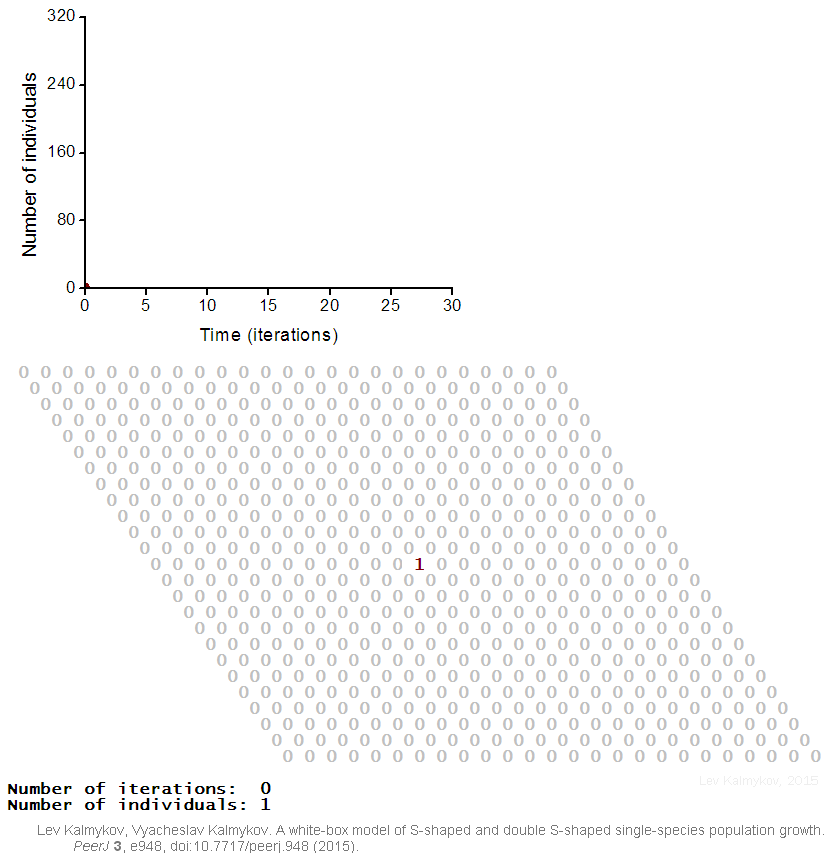
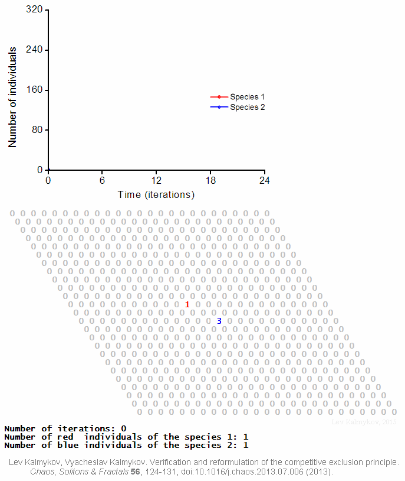
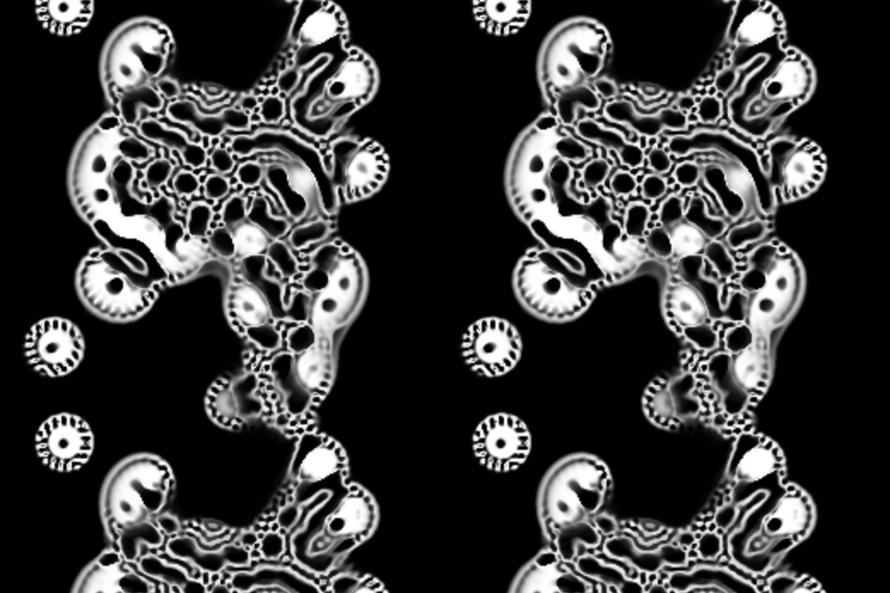
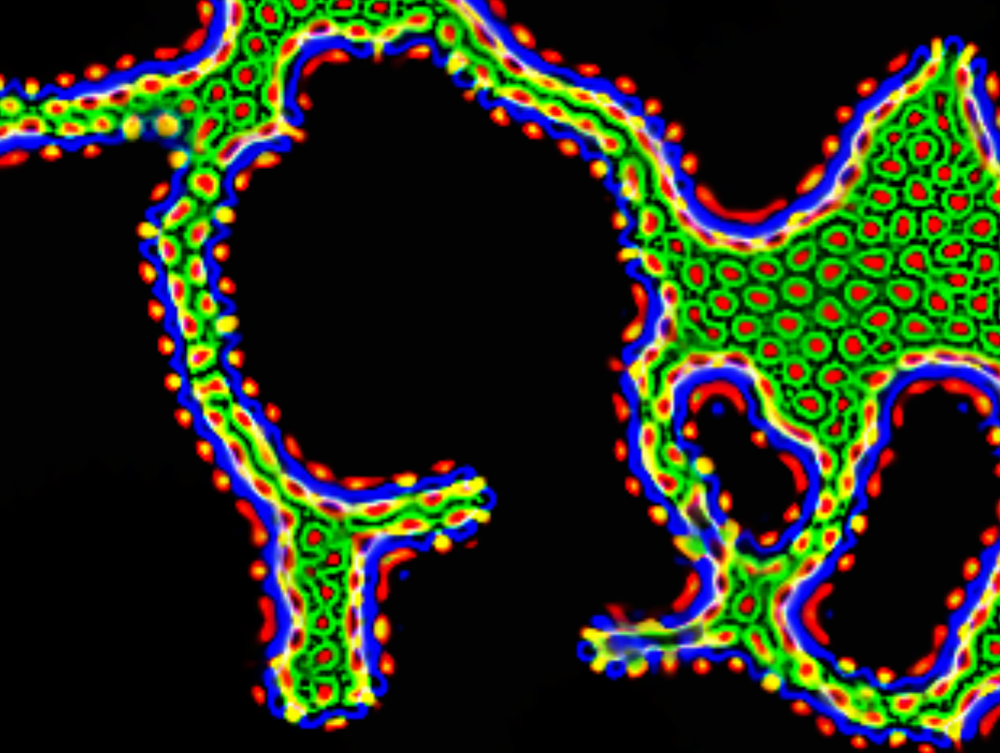

***************
Artificial Life
***************
Overview
========
Artificial life studies the fundamental processes of living systems in artificial environments in order to gain a deeper understanding of the systems in the real world and to model alternate pathways and rules in a system that might not be observed in nature.

* In 1987, Christopher G. Langton introduced the phrase "Artificial Life"
* In 1994, the first international official journal of artificial life was published

Inspiration from Biology
========================

The modeling philosophy of artificial life strongly differs from traditional modeling by studying not only "life-as-we-know-it" but also "life-as-it-might-be" and "life-as-it-could-be". 

The main goal of artificial life is to understand the basic principles of living systems by means of a bottom-up approach, where the focus is on complex systems emerging from the interaction of simple components and rules.

    Logical deterministic individual-based cellular automata model of an ecosystem with one species. The model demonstrates a mechanism of S-shaped population growth.

    Logical deterministic individual-based cellular automata model of interspecific competition for a single limited resource

Conway's Game of Life
---------------------
Like we have gone over in previous classes, Conway's Game of Life is a cellular automaton that follows a simple set of rules to create complex patterns. This is a very basic and easy to understand example of artificial life.

* As a refresher, the rules are

    #. Any live cell with fewer than two live neighbours dies off
    #. Any live cell with two or three live neighbours survives
    #. Any live cell with more than three live neighbours dies off
    #. Any dead cell with exactly three live neighbours becomes live

* Visit `this website <https://conwaylife.com/>`_ and play with Conway's Game of Life

.. figure:: /topics/origin/game_of_life_puffer.gif
    :width: 1000 px
    :align: center
    :target: https://en.wikipedia.org/wiki/Conway%27s_Game_of_Life

    Execution of Conway's Game of Life. The initial conditions for this execution created a "puffer".

Smooth Life
-----------
What if instead of thinking of a cell as either dead or alive, we thought of the cell's life as a continuous value between 0 and 1? This is the idea behind Smooth Life. 

This new simulation, acts as an extension/addition of Conway's Game of Life.

The white/light value of each cell now represents the "health" of the cell.

* The simulation now seems to have a more natural look and feel to it. 
* Closer resembles cells in biology.

Further Extensions
------------------
This idea can be futher extended to include multiple different types of cells and adjusting the rules between each type of cell.

Now not only does each type cell have relationships with others of its type it also has relationships with other types of cells.

* This is a very simple example of how artificial life can be used to model complex systems.

Conclusion
==========
When making an artificial life program you don't start with an idea of what you want the end result to be. If that approach was used the simulation would already have been completed and there would be no need to study it further. 

Instead we can determine the rules and relationships that govern the system and then let the system evolve. This is the idea behind artificial life. 

* While the rules can lead to a desired outcome, the outcome is not known until the simulation is run.
* The initial conditions of the system also affect the outcome of the simulation and how it evolves.
  * Just like in life the conditions that led up to 
    