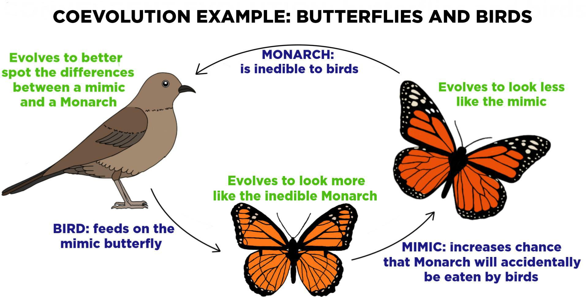

****************************************
Coevolution in Evolutionary Computation
****************************************

Introduction
============

Definition of Coevolution
-------------------------

* Coevolution denotes an evolutionary trajectory where multiple species influence each other's evolutionary paths. This unfolds through dynamics such as mutualism and antagonism, molding adaptive terrains that species navigate over time.

In Computational Domain
-----------------------

* Translating biological coevolution to computational terms, Coevolutionary Algorithms (CEAs) take inspiration from how different species evolve together in nature and apply this idea to computer programs. 

* They use the rules of coevolution to find solutions to complex problems, adapting and changing these solutions as the situation or environment changes.

Coevolution in Biological Systems
=================================

Mutualistic Coevolution
-----------------------

* Species interact symbiotically, bestowing mutual benefits. The relationship between pollinators (bees, birds) and plants serves as a prime example:
   * Plants evolve to have different traits to attact bees for example, for pollination.
   * These include:  nectar production, colorful flowers, and pleasant scents to entice pollinators.
   * In return, pollinators benefit from the food source provided by the plants while inadvertently aiding in plant reproduction through pollen transfer. 
   * This mutualistic relationship drives ongoing adaptation and benefits both parties.

Antagonistic Coevolution
------------------------

* An evolutionary "arms race" between interacting species, usually involving predators and their prey. The predator-prey dynamics, such as those between cheetahs and gazelles, exemplify this. 

* A good example involves birds and butterflies:
   * Many birds avoid certain butterflies that taste bad, like the Monarch, which acquires its bitter taste from feeding on milkweed. 
   * To deter birds, some butterflies have evolved to resemble the Monarch.
   * These birds then learn (evolve) to distinguish Monarch bbutterflies from other kinds of butterflies.
   * Leading to an ongoing coevolutionary cycle.

   An illustration of the coevolutionary dynamics between predators (birds) and prey (butterflies), showcasing the evolutionary adaptations in response to each other.

Coevolutionary Algorithms (CEAs)
================================

Fundamental Principles
----------------------

* CEAs, as a subset of evolutionary algorithms, encode coevolutionary principles, directing the evolution of computational entities for specific problems.

* Unlike traditional evolutionary algorithms where a population is composed of a single species, CEAs involve multiple interacting populations that evolve simultaneously, influencing each other's development and adapting together to solve complex problems more effectively.

Types of CEAs
-------------

#. Cooperative Coevolution: Entities evolve through collaboration and sharing (Mutualistic).
#. Competitive Coevolution: Entities evolve in competition (Antagonistic).

Models and Strategies in CEAs
=============================

Cooperative Coevolution Model
-----------------------------

Entities deconstruct problems and evolve cooperatively --- i.e. collaborate by typically partitioning a larger problem into smaller components, each of which evolves separately but contributes to solving the overarching problem.

Examples
--------

Vehicle Control Algorithms
--------------------------

* Create two populations: one for designing vehicle control algorithms (with random parameters and strategies) and another for simulating various driving scenarios.

* Simulate various driving scenarios using a separate population and evaluate algorithm performance in terms of safety and efficiency.

* Evaluate the performance of each control algorithm based on criteria such as safety, efficiency, and compliance with traffic rules.

* Select the best-performing control algorithms and use them as a basis for generating the next generation of algorithms. 

* Repeat the process iteratively, with control algorithms and driving scenarios coevolving. 

* As control algorithms improve, driving scenarios become more complex, and vice versa --- until the CEAs converge to produce highly effective and adaptable vehicle control algorithms capable of handling a wide range of real-world driving conditions.

NN Architecture and Weight Optimization:
----------------------------------------

* Consider the challenge of optimizing a neural network's structure and weights. One can partition this into two distinct problems: designing the architecture (number of layers, neurons per layer, etc.) and tuning the weights. 

* Separate populations could evolve for each task. The architecture population suggests structures, while the weight population fine-tunes these structures. They evolve cooperatively, aiming to improve the network's performance on a task.

* Over evolutionary generations, the process can lead to both efficient neural network architectures and well-tuned weights, resulting in optimized deep learning models.

Robot Motion Planning:
----------------------

* In robotics, different evolutionary populations focus on different aspect of motion such as trajectory planning, obstacle avoidance, and energy optimization for effective motion through complex environments.

* Periodically, the best trajectories, avoidance strategies, and energy patterns are combined, and the robot's performance in a simulated environment measures their cooperative effectiveness.

* Through cooperative coevolution, harmonized robot motion plans emerge that are efficient, safe, and energy-optimized.

Competitive Coevolution Model
-----------------------------

* Analogous to predator-prey dynamics, entities are pitted against each other, and their evolution is driven by the challenges presented by adversaries. The fitter an entity becomes, the more it pushes its adversaries to evolve in response.

Examples
--------

Game Strategy Development:
--------------------------

* In a chess game, two populations are evolved concurrently - one playing as white and the other as black. 

* The strategies of one population are tested against those of the other, with individuals in each population representing different chess strategies. 

* As strategies in one population improve, they serve as a stronger selection pressure for the other population.

* Over time, both populations could develop highly refined strategies, with each evolutionary step of one population prompting a counter-adaptive step in the other. 

Intrusion Detection Systems:
----------------------------

* In cybersecurity, we can evolve a population of potential security breaches or hacks (attackers) while simultaneously evolving a population of intrusion detection strategies (defenders). 

* The fitness of a hacker strategy might be determined by its success rate against the detection strategies, and vice versa.

* The detection system becomes more robust as it is continuously tested against an evolving set of threat strategies, leading to development of more robust and effective intrusion detection systems over time.

Some General Applications of CEAs
=================================

Ecological Modeling (Species behavior)
--------------------------------------
* Beyond game strategies and neural networks, CEAs shine in modeling intricate ecological dynamics. By simulating interactions of multiple species, researchers gain insights into ecological balance, potential disruptions, and conservation strategies.

Financial Systems
-----------------
* Financial markets can be viewed as complex adaptive systems. CEAs can help model investor behavior and market dynamics, providing deeper insights into bubbles, crashes, and systemic risks.

Personalized Medicine
---------------------
* In the realm of health, CEAs are employed to coevolve drug compounds with modeled pathogens. By understanding how pathogens might evolve in response to new drugs, more robust treatment strategies can be devised.

Challenges in Implementing CEAs
===============================

Technical Challenges
--------------------
* **Modeling Fidelity**: Ensuring that the CEA accurately represents real-world dynamics can be complex. Only limited paramters can be accounted for in a given model.

* **Parameter Tuning**: Like other evolutionary algorithms, CEAs can be sensitive to parameter settings, demanding meticulous tuning. Finding the right combination of parameters that ensures efficient convergence and effective coevolutionary dynamics is a non-trivial task. This tuning process often requires experimentation and expertise.

* **Convergence Concerns**: Ensuring that CEAs converge to a solution, especially in highly dynamic (evolving) environments, remains a technical hurdle. Because of the interaction between different populations which can lead to complex dynamics erupting.

Practical Challenges
--------------------
* **Scalability**: Scaling CEAs for large-scale problems, while maintaining efficiency, is challenging. As the problem complexity increases, managing multiple interacting populations and the computational resources required for their evolution becomes a practical challenge. Developing parallel and distributed algorithms to handle scalability is essential.

* **Interpretability**: The evolved solutions or strategies, while effective, might lack interpretability, making them hard to understand or trust in critical applications. Ensuring that these solutions can be explained and trusted in real-world applications remains a practical concern.

Future Potentials: The Cutting Edge
===================================

Quantum Computing and CEAs: A New Partnership
---------------------------------------------

* With the rise of quantum computing, CEAs are being reimagined in the quantum realm. 

* Quantum computing has the potential to significantly accelerate the convergence of CEAs and explore previously intractable solution spaces --- by allowing CEAs to explore multiple solution paths simultaneously, thus solving very complex problems more efficiently.

* Imagine trying to solve a giant maze: Quantum computing could help CEAs look at many paths at once, rather than one by one. This could make it easier to solve very complicated problems that are too hard for regular computers.

Evolving Artificial Life: Learning from Simulations
---------------------------------------------------

* Researchers are using CEAs to create simulations that act like real ecosystems. 

* This is a bit like making a computer game where the characters learn and evolve over time without any outside instructions. 

* The hope is that by watching these digital worlds evolve, we can learn more about how real life started and works. 

* It's like having a laboratory where you can watch evolution happen and study it.

Neuroevolution in Reinforcement Learning: Smart Learning
--------------------------------------------------------

* CEAs are now being used to help create and improve neural networks in reinforcement learning. 

* This is the kind of machine learning where programs learn to make good decisions by trying things out and seeing what works, kind of like teaching a dog new tricks. 

* CEAs can help by changing the way these neural networks are built and how they learn, making them better at their tasks. 

* In the future, this might lead to programs that can learn to do complicated things more easily, maybe even things that we haven't taught them directly.

Conclusion
==========

* The whole field of evolutionary computation is nature-inspired in many, and through studying coevolution in nature, a lot of that can be incorporated in advancing these algorithms.

* From simulating life's intricacies to modeling financial systems, they show a lot of potential. 

* As we exploit this potential, CEAs underscore the profound ways nature's ever-changing strategies can be repurposed to solve our most complex problems.

References
==========
* De Jong, K. A. (2006). "Evolutionary Computation: A Unified Approach." MIT Press.
* Holland, J. H. (1992). "Adaptation in Natural and Artificial Systems." MIT Press.
* IEEE Transactions on Evolutionary Computation, IEEE.
* "Evolutionary Computation" Journal, MIT Press Journals.
* Mitchell, M. (1998). "An Introduction to Genetic Algorithms." MIT Press.
* Expii.com "Coevolution — Definition & Examples".
