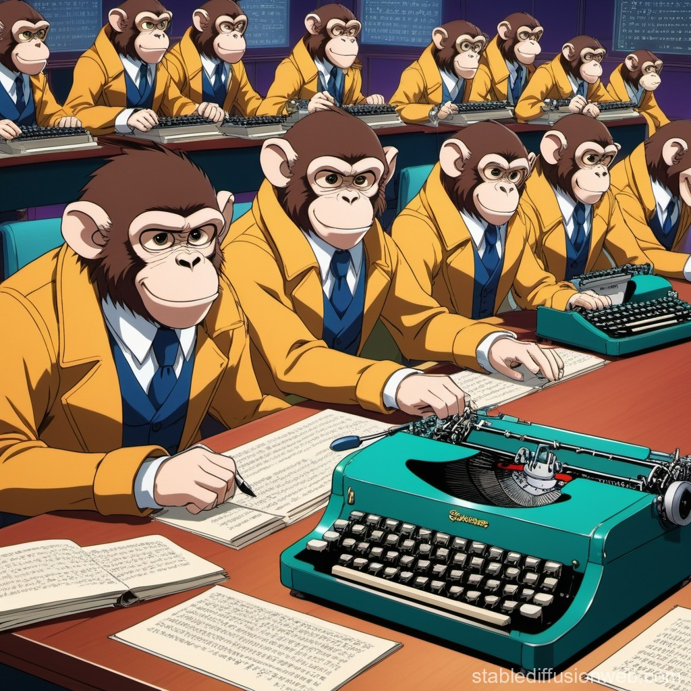
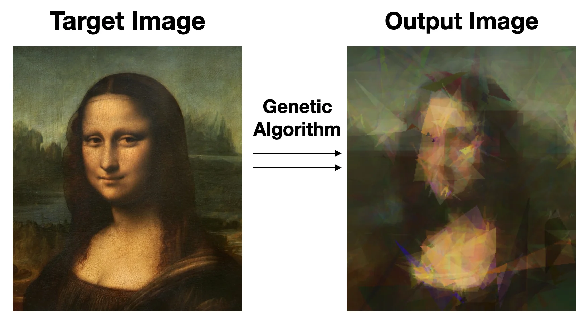
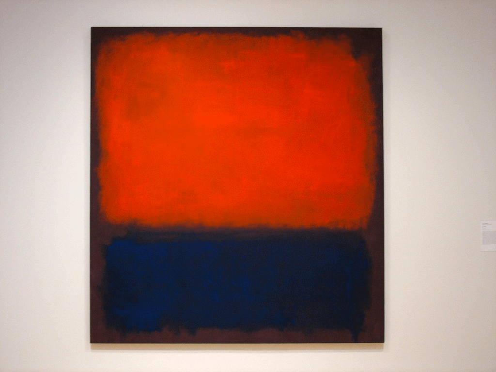
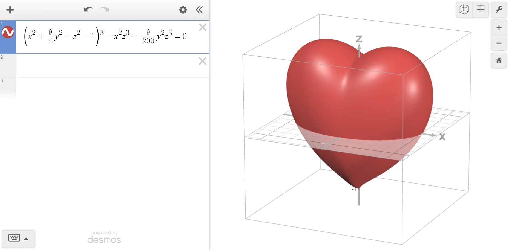
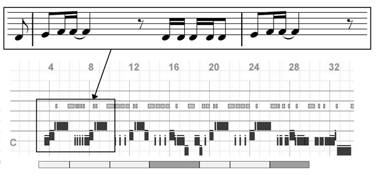

****************
Evolutionary Art
****************

* Evolutionary Art represents the convergence of Creative Expression and Evolutionary Computing
* The evolutionary period often produces new forms of art

    A Banana by any Other Name

Evolutionary Artforms
=====================

* This is really just "How do humans make art?"

Music & Dance
-------------
* Make melodies and full songs
* Develop rhythms and musical structure
* Create sequences of choreography

Paintings & Sculpting
---------------------
* Attempts to achieve a target solution (TSP? Or SymboReg)

    Poly Lisa

* Complete Randomization of art
* Creating 3d Sculptures that can be modeled

Poetry & Shakespeare (or really… any book)
------------------------------------------
* Attempts to form grammatically correct sentences or follow rules of poetry

.. note::
    Follow the rules of a Haiku: 
        - Start and end with five,
        - Middle line houses seven, 
        - Structured syllables

Actually, I think math is art 🤓
--------------------------------
* Okay

* See Assignment Two

Making an Evolutionary Program
==============================
* What is a population?
* How could you possibly give a fitness score? Isn’t art subjective?
* What does crossover look like? 
* Mutation?
* Elites? Like Van Gogh? 

    Painting Crossover Example?

Encoding Art As Chromosomes
---------------------------

* Visual Art
    * Create nxm pixel lists that can have any colour in any give spot
    * Mathematical functions that make specific shapes

    Mathematical Love 

* Music
    * Store Musical Components as Variables (Like chords)
    * MIDI representations that can be stored as numeric values

    Music to MIDI

.. note::
    For example, Hot cross buns follows: 
        - 64, 62, 60
        - 64, 62, 60
        - 60, 60, 60, 60
        - 62, 62, 62, 62
        - 64, 62, 60

    Where 64 = E4, 62 = D4, and 60 = C4

Establishing a Population
-------------------------

* To create a painting, you could simply start with an nxm grid of:
    * A solid colour
    * A random colour for each pixel

* To make a musical sequence, you can:
    * Generate random sequences within music constraints
    * Based on existing songs, steal and splice segments

Defining Fitness
----------------

* Symmetry
* Contrast of Colour (Pixel by pixel Basis)
* Human Scoring
* Statistical Analysis (% of colour)
* Using Machine Learning for Score

Mutating Art
------------
* In Visual Art
    * Pixel Colour Mutation
    * Redefining Generative functions
    * Altering the length of 3d Modelling Vectors
* In Music
    * Changing a Note (Pitch, Length, Volume)
    * Swapping an existing musical variable with a random new one

Artistic Crossover
------------------
* In Visual Art
    * Swapping segments of pixels (Layers/Regions)
    * Swapping Functions and Preset Drawings
* In Music
    * Changing a Note (Pitch, Length, Volume)
    * Swapping segments of songs
    * Exchanging instrument assignment

Elitism
-------

* Now that everything else is defined, elitism works as it normally would

Example of Creating a Painting
==============================

 .. figure:: IMG_0054.jpg
    :width: 500 px
    :align: center

    Making a Dirt Block

Trends and Relavant Applications
================================

* A surgence in Machine Learning has led to more capability for less objective computation
* Can be applicable to structrual engineering (architecture...) and fashion design