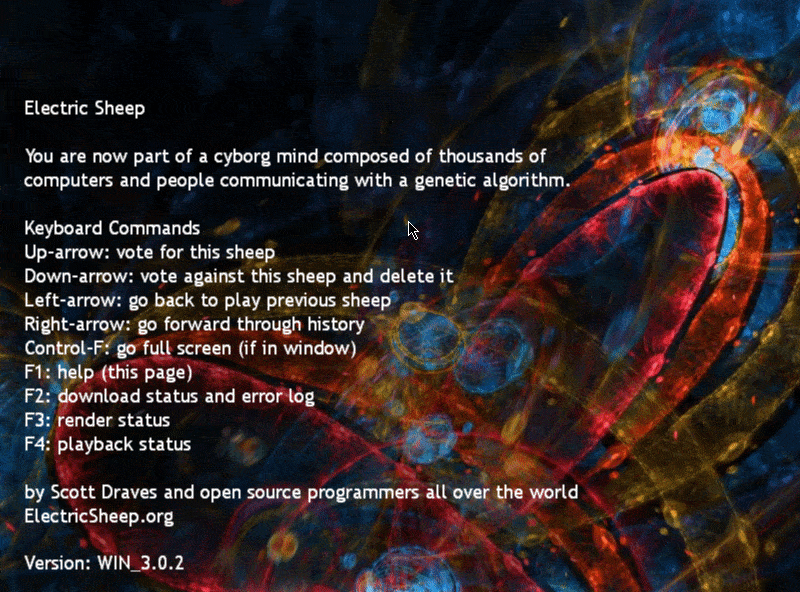

***************
Evolutionary Art
***************

Overview
========

Evolutionary Art is a branch of Generated Art (art created by an autonomous system) in which alterations are made to an initial state over many iterations. Evolutionary Art can be used to create artificially generated visual randomness, stylized recreations of existing images, and infinitely changing/evolving images.

* `Evolutionary Art can be carried out in a variety of ways: <https://franciscouzo.github.io/>`_ some popular ones include:
    #. Building something out of nothing (Maze Generator, Fractals, Chaotic Map)
    #. Manipulating and producing new art based on an existing initial input (Genetic Art, Ishihara Plate Generator)
    #. A continually changing and evolving visual that can respond to feedback (Random Art)

It is important to separate Evolutionary Art from Biological Art, which uses organic living material as opposed to, paint, metal, wood, and computer code.

Variations From other GAs (Genetic Algorithms)
=========================

Art is a much more subjective medium than strictly logistical problems. Because of this, evaluating fitness is executed differently than in most other GAs.

* Many Evolutionary Art GAs have strict process rules between generations
    * An example of this is found in `Conway's Game of Life <https://electricsheep.org/>`_, where the number of living neighbours determines whether a cell will be alive or dead next generation

* Other programs implement user input to assist with fitness evaluation, where users are prompted to choose one or more of their favourite models
    * `Electric Sheep <https://electricsheep.org/>`_ is a modern implementation of evolutionary art that allows users to contribute and influence selection on a massive population
    * Sheep with the most votes will be selected for breeding and mutation into tomorrow's population pool

    The Electric Sheep UI allows users to vote for or against individuals in the population, collectively contributing to their fitness like a hive mind

* In rare cases, it is left to the computer to handle fitness evaluation
    * See `Procedural Paintings <https://shahriyarshahrabi.medium.com/procedural-paintings-with-genetic-evolution-algorithm-6838a6e64703>`_ by Shahriar Shahrabi for an example of this

Evolutionary Music
==================
A subsection of Evolutionary Art, a population is initialized with the ability to create some audio.

`DarwinTunes <http://darwintunes.org/>`_ (created in 2009) is a great example of this.

DALL-E
======

DALL-E does not meet the requirements to qualify as evolutionary art.

* DALL-E was first revealed in January 2021

* DALL-E 2 was then announced in April 2022

* DALL-E 3 was recently announced this September (2023)

`Cool DALL-E 2 Video <https://www.reddit.com/r/dalle2/comments/wk2vn0/4_minutes_of_variations_from_a_single_prompt/>`_

The key difference that halts DALL-E from being considered evolutionary art is a lack of fitness evaluation.

Affect on our Lives
===================

As improvements to evolutionary art continue to be made, its prevalence in our lives will increase.

* Corporations can save big on budgets by employing software instead of a real commissioned artist
* Animators can start outsourcing their more tedious work to a computer
* Producers and composers can be simulated through an application

Production among these occupations could surpass human capabilities, putting those who choose not to employ the help of computers at an unfair disadvantage.

Conclusion
==========

Technology is currently incapable of finding the same nuanced value for something "artistic" as we do.

To address this issue, the way we usually evaluate fitness is altered.

* Some use strict rules that don't have any variance or mutation
* Others employ the help of human aid to handle fitness evaluation

Evolutionary art GAs that let the computer handle fitness evaluation usually attempt to recreate an image. Fitness is evaluated based on how similar the recreation is to the original.

It isn't far-fetched to imagine that evolutionary art and generative art as a whole will need to be regulated in the future to deal with issues of ownership, compensation, and human job security. That said, until that happens, people are free to try, experiment with, and utilize processes like these for whatever they please.

Currently, the only restriction on generative art is the inability to copyright any work made by it.
