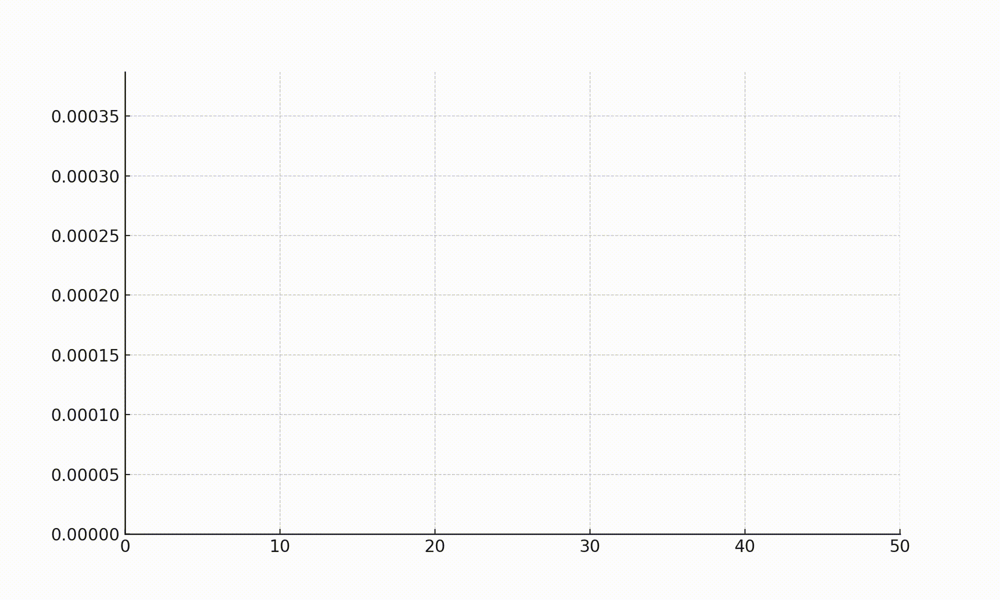

**********************************
Introduction to Memetic Algorithms
**********************************

* Genetic Algorithms (GA): Genetic algorithms are inspired by the process of natural selection and evolution. They involve creating a population of potential solutions to a problem, selecting the best ones, and using genetic operators (like crossover and mutation) to produce new solutions. This mimics the way traits are passed on and evolve in biological organisms.
* Local Search: This is a more focused exploration of the solution space. Instead of making big changes to solutions, local search methods make small adjustments to improve the current solution. It's like fine-tuning.

* Now, combine these two: A memetic algorithm takes the idea of genetic algorithms and adds a touch of "cultural evolution." After applying genetic operations to create new solutions, it also incorporates a local search to fine-tune those solutions

Memetic algorithm using a chef's recipe as an analogy
=====================================================

* Genetic Algorithm (GA): Imagine you have a chef who wants to create the perfect recipe for a delicious dish. In a genetic algorithm, you start with a population of potential solutions, just like the chef starts with a variety of ingredients. Each solution (or individual in genetic terms) is like a unique combination of ingredients for a recipe. The chef then selects the best recipes based on some criteria, just like in a genetic algorithm where individuals with better traits (closer to the optimal solution) are selected for the next generation.
* Local Search: Now, the chef wants to improve the selected recipes further by tweaking some ingredients or adjusting cooking times. This is similar to the concept of local search in optimization algorithms. It involves making small changes to a solution to see if it leads to a better result. For example, the chef might try adding a pinch of salt or cooking the dish for an extra minute to see if it enhances the flavor.
* Memetic Algorithm: Here's where the memetic algorithm comes in. "Memetic" is derived from "meme," which, in this context, means a unit of cultural information that is passed from one generation to another. In a memetic algorithm, you combine the ideas of genetic algorithms and local search to create a more robust optimization process. Going back to our chef analogy, it's like the chef not only selecting the best recipes but also sharing tips with other chefs and incorporating those tips into the recipes to make them even better.

* Putting it all together:
	* The chef starts with various recipes (genetic algorithm population).
	* The chef selects the best recipes (genetic algorithm selection).
	* The chef makes small adjustments to those recipes (local search).
	* The chef shares successful tips with other chefs and incorporates those tips into the recipes (memetic algorithm).

**************************************************
Comparison: Memetic algorithm vs Genetic algorithm
**************************************************

* Exploration and Exploitation:
	* GAs are generally better at exploration.
	* MAs are designed to balance both exploration and exploitation.

* Convergence:
	* MAs often converge faster due to the inclusion of local search.
	* GAs may take more generations to converge.

* Representation:
	* Both algorithms use similar representations for solutions.

* Flexibility:
	* MAs are more flexible and can be adapted to different problem characteristics by adjusting the local search component.

* Performance:
	* The performance depends on the problem at hand; for some problems, GAs might be more suitable, while for others, MAs could outperform GAs.

In summary, memetic algorithms extend genetic algorithms by incorporating local search mechanisms to enhance the exploitation of solutions. The choice between them depends on the specific characteristics of the optimization problem you are addressing.

**************************
Types of memetic algorithm
**************************

* Memetic algorithms come in various types, each with its own way of combining and evolving solutions. 

	* Simple Memetic Algorithm:
		Think of this as the basic version. It involves a population of solutions to a problem. These solutions exchange and combine their best traits, creating new and potentially better solutions. It's like a group of friends sharing their strengths to collectively improve and find the best solution.

	* Adaptive Memetic Algorithm:
		This type is a bit smarter. It adjusts its strategy based on how well the solutions are doing. Imagine a team that not only shares ideas but also changes the way they share based on what's working best. It adapts its collaboration strategy.

	* Parallel Memetic Algorithm:
		Picture several groups working on the same problem at the same time. Each group has its own set of solutions and evolves independently, but occasionally they share their best solutions with other groups. It's like having multiple brainstorming sessions happening simultaneously, and occasionally, teams swap their most promising ideas.

	* Cooperative Memetic Algorithm:
		This is all about teamwork. Solutions work together in a more coordinated way. Instead of just borrowing ideas, solutions actively help each other, working as a team to improve collectively. It's like a group project where everyone contributes, and the final result is a joint effort.

	* Hybrid Memetic Algorithm:
		This one combines the strengths of memetic algorithms with other types of optimization methods. Think of it as having a versatile toolbox. The algorithm can use different strategies, not just sharing and combining ideas, to find the best solution.

In a nutshell, these types of memetic algorithms are like different flavors of problem-solving teams. Some are more adaptive, some work in parallel, some focus on cooperation, and others blend the best of various approaches. They all aim to efficiently find optimal solutions by evolving and combining ideas in different ways.

********************************
Memetic Algorithm Implementation
********************************

Here's a basic implementation of a memetic algorithm for finding the minimum of a sum equation i.e. the sum of squares = sum(i**2)

* This function calculates the sum of squares of elements in an array x. It's the objective function for the optimization.

How will the below code look like

.. code-block:: python
   :linenos: 7-15

	def sum_of_squares_equation(x):
		"""
		Calculate the sum of squares for a list of numbers.
		Args:
			x (list of numbers): The list of numbers for which the sum of squares will be calculated.
		Returns:
			float: The sum of squares of the input numbers.
		"""
			return sum([i**2 for i in x])

* Fitness function Calculates the fitness of a solution using the sum_equation

.. code-block:: python
   :linenos: 31-39

    def fitness(self, solution):
        """
        Calculate the fitness score of a given solution.
        Parameters:
        solution: A list or data structure representing the solution to be evaluated.
        Returns:
        fitness_score: A numerical value representing the fitness score of the solution.
        """
        return sum_of_squares_equation(solution)

* select_parents function implements tournament selection for choosing parents for crossover.

.. code-block:: python
   :linenos: 41-58

    def select_parents(self):
        """
        Perform tournament selection to choose parents for the next generation.
        This function conducts a tournament selection process to select parents from the current population.
        It randomly pairs individuals and selects the one with the higher fitness value as a parent.
        Returns:
        numpy.ndarray: An array containing the selected parents for the next generation.
        Note:
        The number of selected parents is equal to the population size defined for the genetic algorithm.
        """
        parents = []
        for _ in range(self.pop_size):
            i, j = np.random.randint(0, self.pop_size, 2)
            if self.fitness(self.population[i]) < self.fitness(self.population[j]):
                parents.append(self.population[i])
            else:
                parents.append(self.population[j])
        return np.array(parents)

* crossover function performs crossover between two parent solutions based on the crossover rate.

.. code-block:: python
   :linenos: 60-83

    def crossover(self, parent1, parent2):
        """
        Perform crossover operation between two parent individuals.
        Args:
        parent1 (array-like): The first parent individual.
        parent2 (array-like): The second parent individual.
        Returns:
        tuple: A tuple containing two child individuals resulting from the crossover operation.
        If the crossover rate is below the specified threshold, the function returns the parents unaltered.
        """
        if np.random.rand() < self.crossover_rate:
            crossover_point = np.random.randint(1, self.dimensions)
            child1 = np.concatenate([parent1[:crossover_point], parent2[crossover_point:]])
            child2 = np.concatenate([parent2[:crossover_point], parent1[crossover_point:]])
            return child1, child2
        else:
            return parent1, parent2

* mutate function mutates a given solution based on the mutation rate.

.. code-block:: python
   :linenos: 85-106

    def mutate(self, solution):
        """
        Apply mutation to the given solution.
        Args:
        solution (numpy.ndarray): The solution to be mutated, represented as a NumPy array.
        Returns:
        numpy.ndarray: The mutated solution, with random changes applied to some elements.

        This method applies mutation to the input solution by randomly altering the values of
        its elements. The mutation is controlled by the `mutation_rate` property of the object.
        For each element in the solution, a random value is generated using a standard normal
        distribution (mean = 0, standard deviation = 1), and if a randomly generated value is
        less than the `mutation_rate`, the corresponding element in the solution is modified
        by adding the random value.
        Returns the mutated solution as a NumPy array.
        """
        for i in range(self.dimensions):
            if np.random.rand() < self.mutation_rate:
                solution[i] += np.random.randn()
        return solution

* local_search function implements a hill-climbing local search to improve solutions.

.. code-block:: python
   :linenos: 108-127

    def local_search(self, solution):
        """
        Perform Hill Climbing local search to improve a given solution.
        Parameters:
        - solution: numpy array-like
            The initial solution to be optimized.
        Returns:
        - numpy.ndarray
            The optimized solution after a number of local search steps.
            This function applies Hill Climbing local search by iteratively generating new solutions by adding small random steps
            to the current solution. If a generated solution results in a better fitness value than the current solution, it
            replaces the current solution with the new one. This process is repeated for a fixed number of iterations (10 by
            default).
        The `fitness` method of the calling object is used to evaluate the fitness of each solution.
        """
        for _ in range(10):  # number of local search steps
            new_solution = solution + np.random.randn(self.dimensions) * 0.1  # small random step
            if self.fitness(new_solution) < self.fitness(solution):
                solution = new_solution
        return solution

* run function runs the algorithm for a specified number of generations, updating the population through selection, crossover, mutation, and local search. It also keeps track of the best solution and its fitness.

.. code-block:: python
   :linenos: 129-161

    def run(self):
        """
        Evolve a population of solutions over multiple generations using a genetic algorithm.
        This method runs the genetic algorithm for a specified number of generations, aiming to find the
        best solution with the highest fitness in the population.
        Returns:
            Tuple[Any, float]: A tuple containing the best solution found and its fitness score.
        Note:
            This method updates the internal state of the genetic algorithm object, including the
            population, fitness history, and the best solution found so far.
        """
        for generation in range(self.max_generations):
            new_population = []
            parents = self.select_parents()
            for i in range(0, self.pop_size, 2):
                parent1, parent2 = parents[i], parents[i + 1]
                child1, child2 = self.crossover(parent1, parent2)
                child1 = self.mutate(child1)
                child2 = self.mutate(child2)
                child1 = self.local_search(child1)
                child2 = self.local_search(child2)
                new_population.extend([child1, child2])

            self.population = np.array(new_population)
            current_best = min(self.population, key=self.fitness)
            current_best_fitness = self.fitness(current_best)
            self.fitness_history.append(current_best_fitness)

            if current_best_fitness < self.best_fitness:
                self.best_solution = current_best
                self.best_fitness = current_best_fitness

        return self.best_solution, self.best_fitness

* What is different between Genetic algorithm and above memetic algorithm implementation:  local_search function.
	* The local_search function in the code implements a hill climbing local search algorithm. This method is used to improve an existing solution by making small, random changes and keeping changes that result in an improved solution. 
	
	Here's a step-by-step 	breakdown of how this function works:

	* Iterative Process: The function iterates 10 times, as indicated by for _ in range(10). Each iteration represents a local search step.
	* Generating a New Solution: In each iteration, a new solution is generated by modifying the current solution (solution). This modification is done by adding a small, random value to each element of the solution. This random value is generated using np.random.randn(self.dimensions) * 0.1. Here, np.random.randn(self.dimensions) generates a random value for each dimension of the solution, and multiplying by 0.1 scales these values to ensure that the changes are small.
	* Evaluating the New Solution: The fitness of this new solution is evaluated using the fitness function. This function computes how "good" or "fit" the solution is according to the defined optimization problem.
	* Hill Climbing Decision: The algorithm then checks if the new solution is better than the current solution. This is done by comparing the fitness of the new solution with the fitness of the current solution. If the fitness of the new solution is less than the fitness of the current solution (remembering that in optimization problems, a lower fitness value often means a better solution), the new solution is considered better.
	* Updating the Solution: If the new solution is better, the current solution is updated to this new solution. This step represents the "climbing" part of the hill climbing algorithm, where the algorithm moves towards a better solution.
	* Return the Improved Solution: After completing all iterations, the function returns the improved solution. If no better solution was found during the iterations, the original solution is returned.

	In summary, this local_search function aims to incrementally improve a given solution by exploring its local neighborhood (making small changes) and moving towards better solutions within that neighborhood. This process is analogous to climbing towards the peak of a hill, hence the name "hill climbing".

Analysis of implementation using MA and GA for sum equation
===========================================================

* The sum of squares equation is a simple optimization problem that can be solved using a variety of optimization algorithms. Here, we'll compare the performance of a memetic algorithm and a genetic algorithm for this problem.

    Learning Curve for Memetic Algorithm created to find the mimimum of the sum of squares

.. figure:: genetic_algorithm_learning_curve.gif
    :width: 500 px
    :align: center

    Learning Curve for Genetic Algorithm created to find the mimimum of the sum of squares 

.. code-block:: python
   :emphasize-lines: 10
   # Code used to create the animation plots showing the learning curve 
   fig, ax = plt.subplots()
   (line,) = ax.plot([], [], lw=2)

   def init():
     ax.set_xlim(0, max_generations)
     ax.set_ylim(0, max(best_fitness, max(ma.fitness_history)))
     return (line,)

   def update(frame):
     line.set_data(range(frame + 1), ma.fitness_history[: frame + 1])
     return (line,)

   ani = animation.FuncAnimation(fig, update, frames=max_generations, init_func=init, blit=True)

* Comparison Analysis: 
	* Algorithm Efficiency: The Memetic algorithm appears to be more efficient for this problem, as it has reached a solution closer to the global optimum within the same number of generations.
	* Convergence: The Memetic algorithm not only found a better solution but also converged faster based on the plotted fitness values.
	* Stability: The Memetic algorithm plot indicates a more stable convergence compared to what is typically expected from a Genetic algorithm plot, which might show more fluctuations due to the randomness in genetic variations.
	* Local Search Benefit: The Memetic algorithm's local search likely aided in fine-tuning solutions, which could explain its superior performance over the Genetic algorithm.
	
In summary, for the task of minimizing the sum of squares equation, the Memetic algorithm has outperformed the Genetic algorithm both in terms of finding a solution closer to the global optimum and in the stability and speed of convergence as evidenced by the plot and fitness values.

********************************************
Real life applications of memetic algorithms
********************************************

* Optimizing Supply Chain Routes: Companies can use memetic algorithms to find the most efficient routes for transporting goods, considering factors like traffic, weather, and delivery time.
* Network Design: In telecommunications, memetic algorithms can help design optimal network configurations, considering factors such as data traffic, signal strength, and hardware limitations.
* Job Scheduling: When you have multiple tasks or jobs to be done, like in project management or manufacturing, memetic algorithms can be used to optimize the scheduling to minimize time and resources.
* Financial Portfolio Management: For investment purposes, memetic algorithms can help in creating and adjusting investment portfolios by considering various factors like risk tolerance, market conditions, and historical performance.

In essence, memetic algorithms are a clever way of solving complex problems by combining the best solutions and gradually refining them over time, much like how nature optimizes living organisms through evolution.

