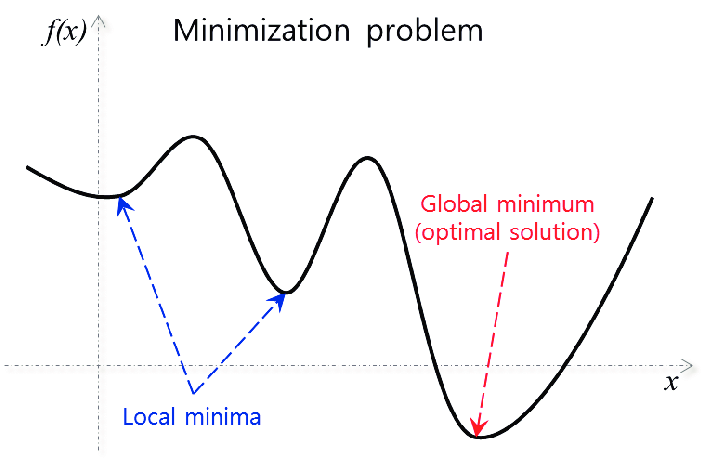
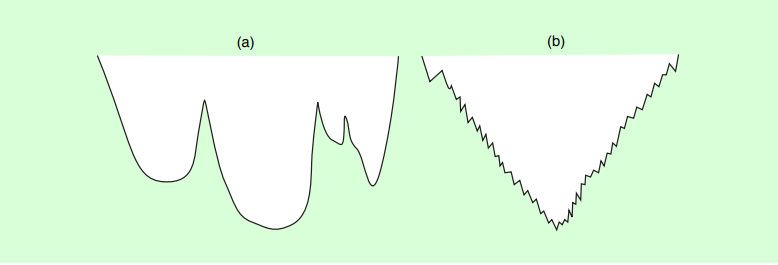
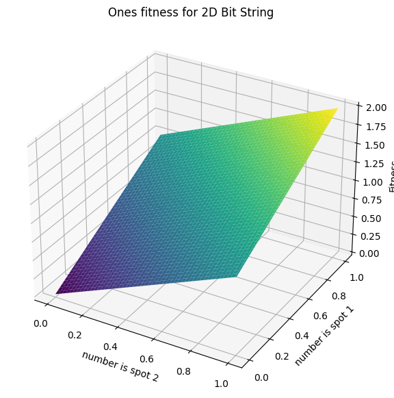
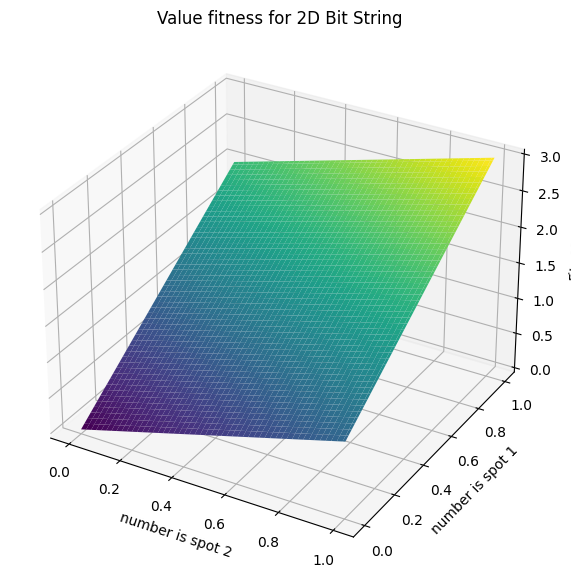

*********************
Search Space Analysis
*********************
 

Search Space Terminology 
========================
- search space size #S
- number of (optimal) solutions #S' ,solution density #S'/#S
- search space diameter (:math:`G_{N}`) = maximal distance between any two candidate solutions
- N(:math:`\pi`)  is the  neighborhood relation of a given candidate solution (:math:`\pi`)
- g(:math:`\pi`) is the fitness of a given candidate solution (:math:`\pi`)
- all together L(:math:`\pi`) is the search landscape and it is based off of S(:math:`\pi`) , N(:math:`\pi`),and  g(:math:`\pi`) 

Local vs Global Optimization
============================

   Fig 1. from :  from Calculation of Detector Positions for a Source Localizing Radiation Portal Monitor System Using a Modified Iterative Genetic Algorithm - Scientific Figure on ResearchGate. Available from: https://www.researchgate.net/figure/Example-of-local-and-global-solutions-in-an-optimization-problem_fig3_322270023 [accessed 8 Nov, 2023]

- Local optimization focuses on finding the best solution in a small region, while global optimization seeks the best solution overall.
- Discuss the trade-offs between exploring locally and exploiting globally.

Types Search Spaces
===================
Discrete Search Spaces
----------------------
Discrete search spaces consist of distinct, separate elements or configurations. Problems such as the traveling salesman, where the solution is a sequence of cities visited exactly once, are examples of discrete search spaces.

- **Example**: In the Traveling Salesman Problem (TSP), the search space includes all possible orderings of cities.
- **Impact on Search**: Evolutionary algorithms use operators like permutation to navigate discrete spaces efficiently.

Continuous Search Spaces
------------------------
Continuous search spaces are characterized by an infinite number of possible solutions within a bounded space. Real-number optimization problems, where the solution can be any real value within a range, typically have continuous search spaces.

- **Example**: Optimizing aerodynamic shapes, where any shape within certain parameters is possible.
- **Impact on Search**: These spaces often require the use of real-coded genetic algorithms and operators that can handle real numbers.

Mixed Search Spaces
-------------------
Mixed search spaces contain both discrete and continuous elements. Real-world problems often fall into this category, requiring a hybrid approach in evolutionary algorithms.

- **Example**: Robot design optimization, where the robot's dimensions (continuous) and component types (discrete) are both variables.
- **Impact on Search**: Algorithms need to balance discrete and continuous operators to navigate these spaces effectively.

Topology
========

- **Non-degenerate (or invertible)**: A function is considered non-degenerate or invertible if assigning the same output to two different inputs is not possible. This means that each output is unique to a single input, which allows the function to be reversed.

  * ∀s, s₀ ∈ S : [g(s) = g(s₀) ⇒ s = s₀];

- **Locally invertible**: A function is locally invertible if, within a small vicinity around any given input, it acts invertible. That is, within this local neighborhood, each output can still be traced back to one specific input.

  * ∀r ∈ S : ∀s, s₀ ∈ N(r) ∪ {r} : [g(s) = g(s₀) ⇒ s = s₀];

- **Non-neutral**: A function is non-neutral if it does not produce the same output for distinct but close inputs. In other words, nearby inputs must lead to different outputs, ensuring the function distinguishes between closely spaced inputs.

  * ∀s ∈ S : ∀s₀ ∈ N(s) : [g(s) = g(s₀) ⇒ s = s₀].

Position Type Characteristics Based on Neighboring Values
---------------------------------------------------------

.. csv-table::
   :header: "Position Type", ">", "=", "<"
   :widths: 20, 10, 10, 10

   "SLMIN (strict local min)", "True", "False", "False"
   "LMIN (local min)", "True", "True", "False"
   "IPLAT (interior plateau)", "False", "True", "False"
   "SLOPE", "True", "False", "True"
   "LEDGE", "True", "True", "True"
   "LMAX (local max)", "False", "True", "True"
   "SLMAX (strict local max)", "False", "False", "True"

>table and definitions from [2]_

Barriers
--------
Barriers refer to the points in the search space that act as thresholds between different regions. They are characterized by the lowest evaluation function values at the edge of each region.

- **Implication**: The height of a barrier indicates the difficulty of moving from one region to another using local search strategies. Higher barriers suggest more effort is needed to transition between solutions.

Separability
------------
Separability describes whether the solution variables are interdependent (non-separable) or can be optimized independently (separable).

- **Example**: If optimizing one variable at a time leads to the optimum, the space is separable.
- **Impact on Search**: Non-separable spaces often require more complex operators that can consider interactions between variables.

Smooth vs Jagged
----------------

Basins
------
Basins define the collection of solutions that converge to a specific local minimum when a gradient descent method is applied.

- **Implication**: The size of the basin determines the pull or the attraction strength a local minimum exerts on the search. Larger basins mean a stronger attraction, increasing the likelihood that a local search method will converge to that minimum.

Basin Size and Depth
--------------------
The size and depth of a basin provide insights into the landscape's topography and the potential challenges an algorithm may face.

- **Basin Size**: Represents the volume of the basin, quantifying how many solutions belong to it.
- **Basin Depth**: Measures how much lower the local minimum is compared to the surrounding barriers.

- **Implication**: A deep and large basin suggests a significant local minimum that could potentially be mistaken for a global minimum by search algorithms.

Basin Hopping
=============
Basin hopping is a technique designed to overcome the limitations of local search by combining large jumps in the search space with local optimization.

- **Strategy**: After reaching a local minimum, the algorithm makes a substantial, often random, leap to another point in the search space, followed by a gradient descent to the nearest local minimum.

- **Implication**: This approach is particularly useful in rugged landscapes, where it can prevent the algorithm from becoming trapped in suboptimal local minima.

By analyzing the barriers and basins of a fitness landscape, we can better understand the challenges inherent to the search space and tailor search algorithms to navigate the landscape more effectively.

   Fig 2. Smooth vs Jagged Terrain Comparison. [1]_

The empirical autocorrelation function `r(i)` for lag `i` is defined as:

.. math::

    r(i) = \frac{\frac{1}{m - i} \sum_{k=1}^{m-i} (g_k - \bar{g}) \cdot (g_{k+i} - \bar{g})}{\frac{1}{m} \sum_{k=1}^{m}(g_k - \bar{g})^2}

Where:
- `m` is the total number of points (evaluation function values).
- `g_k` is the evaluation function value at step `k`.
- `ḡ` is the average evaluation function value across all steps.
- `i` is the lag, representing the step difference between points being compared.

The numerator calculates the average product of differences from the mean for pairs of points `i` steps apart, measuring the predictability of the evaluation function values at one point on the value at another point `i` steps away.

The denominator is the average of the squares of differences from the mean for all points, a measure of the variance of the evaluation function values.

The ratio of these two gives us `r(i)`, the autocorrelation at lag `i`. A value close to 1 indicates a strong positive correlation; a value close to 0 indicates no correlation.

Empirical Autocorrelation Coefficient (ACC) `ξ`:
-------------------------------------------------

The empirical autocorrelation coefficient (ACC) `ξ` is derived from the first lag of the autocorrelation function `r(1)`: ξ = 1/(1 − r(1))

The ACC provides a summary measure of the autocorrelation for the entire search space:

- A high `ξ` (close to 1) suggests a "smooth" search space where neighboring solutions have similar fitness values.
- A low `ξ` (close to 0) suggests a "rugged" search space with neighboring solutions likely to have very different fitness values.

This coefficient is crucial for understanding the behavior of the search space and affects the design and application of SLS algorithms in their exploration and exploitation to find optimal solutions.

Dimensionality and Its Challenges
=================================

- Dimensionality refers to the number of variables or features in a dataset or problem.
- High dimensionality can lead to the "curse of dimensionality," making optimization computationally expensive.

Search Space Reduction Techniques
---------------------------------
To manage complexity and improve the efficiency of evolutionary algorithms, various search space reduction techniques can be employed. These methods aim to simplify the search space, thereby accelerating the search process and potentially improving the quality of solutions.

Feature Selection
-----------------

Feature selection involves choosing a subset of relevant features for model construction, which reduces the number of dimensions and simplifies the problem.

* **Example**: In a dataset with hundreds of features, feature selection might identify a dozen that are most predictive of the outcome.
* **Impact on Search**: By eliminating irrelevant or redundant features, the search space is reduced, leading to faster convergence and less computational overhead.

Dimensionality Reduction
------------------------

Dimensionality reduction techniques transform high-dimensional data into a lower-dimensional space, preserving as much information as possible.

* **Example**: Principal Component Analysis (PCA) can reduce the dimensions of a dataset by projecting it onto a smaller set of orthogonal features.
* **Impact on Search**: Reducing dimensionality helps to alleviate the curse of dimensionality, allowing evolutionary algorithms to operate more efficiently.

Constraint Handling
-------------------

Integrating constraints into the search process can effectively reduce the feasible search space by eliminating invalid solutions.

* **Example**: In a vehicle routing problem, constraints might include vehicle capacity or delivery time windows.
* **Impact on Search**: Constraint handling ensures that the evolutionary algorithm focuses on viable solutions, improving the overall search quality and resource utilization.

Implementing these reduction techniques can significantly enhance the performance of evolutionary algorithms, especially in complex problems with large and intricate search spaces.

Fitness Functions and Landscape
===============================

The fitness function in evolutionary computing plays a pivotal role in defining the search space by assigning a fitness value to each candidate solution, which reflects its quality or suitability.

Role of Fitness Functions
-------------------------

Fitness functions quantify the objective(s) of the problem, guiding the evolutionary search towards optimal solutions.

* **Example**: binary number
* **Impact on Search**: The design of the fitness function affects the search's efficiency and the algorithm's ability to find global optima by influencing which areas of the search space are more attractive.

   Fig 3. Search space using Ones fitness

   Fig 4. Search space using value fitness fitness

----------------------

 Sources for lecture 

.. [1] “Search Space Structure and SLS Performance,” University of British Columbia, 2023. [Online]. Available: [https://www.cs.ubc.ca/labs/algorithms/Courses/CPSC532D-05/Slides/ch5-slides.pdf]. [Accessed: [November 8]].

.. [2] “Lecture_05_on_Local_Search.pdf,” University of Toronto, 2023. [Online]. Available: [https://www.cs.toronto.edu/~axgao/cs486686_f21/lecture_notes/Lecture_05_on_Local_Search.pdf]. [Accessed: [November 8]].

[3] “2108.09126v1.pdf,” arXiv, 2023. [Online]. Available: [https://arxiv.org/pdf/2108.09126v1.pdf]. [Accessed: [November 6]].
