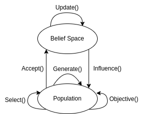

*******************
Cultural Algorithms
*******************

Introduction
============
* It is a branch of evolutionary computation
* Unlike genetic algorithms, cultural algorithms have not only **population space** but also **belief space**
* Here shows the components of cultural algorithms and its structure [#]_:

* Object() is the fitness function
* The most important part of the cultural algorithm is:

    * Accept() picks top n individuals from population
    * Update() updates belief space based on the individuals pick from Accept()
    * Influence() is to use the knowledge in belief space to update population

Example Problem -- Minimization
===============================
* Find a vector :math:`x` to minimize :math:`f(x)`
* A simple example is :math:`f(x) = x_1^2 + x_2^2`
* So the problem is to find a vector :math:`(x_1, x_2)` to minimise :math:`f(x)`

* Fitness function:

.. literalinclude:: ca.py
    :language: python
    :lineno-match:
    :pyobject: fitness_function

* Initialize population:
* This is to generate :math:`(x_1, x_2)` where :math:`x_1` and :math:`x_2` are both floats between :math:`-10` and :math:`10`

.. literalinclude:: ca.py
    :language: python
    :lineno-match:
    :pyobject: initialize_population

Belief Space
============
* Belief space contains a number of components (at least following two) to represent the cultural information
* **Situational knowledge**: keep track of best solution found in each generation
* **Normative knowledge**: provides standards for individual behaviours, such as a rough guideline during crossover/mutation operations.

    * For minimization problem, a list with :math:`4` elements are used to represent one standard
    * For each variables (:math:`x_1` and :math:`x_2`), ``[min, max, Lower, Upper]`` is used as normative bounds

        * ``min`` and ``max`` represent the lower and upper bounds of :math:`x` variables
        * ``Lower`` and ``Upper`` represent the lower and upper bounds of fitness function values

* Other components: domain knowledge, history knowledge and topographical knowledge (not used in the example)

* Initialize belief space:

.. literalinclude:: ca.py
    :language: python
    :lineno-match:
    :pyobject: initialize_belief_space

* So the belief space is:

    .. code-block:: text

        {
         'situational': None,
         'normative': [[-10, 10, 100, 100], [-10, 10, 100, 100]]
        }

Acceptance Function
===================
* Pick top n individuals from population
* This is used to update belief space
* There are two ways of method to pick top n individuals: **static method** and **dynamic method**
* Static method: select a certain percentage (fixed number) of individuals from the population
* Dynamic methods: the number is variable and changes from generation to generation
* In the minimization example, static method is used.

.. literalinclude:: ca.py
    :language: python
    :lineno-match:
    :pyobject: accept

Update Function
===============
* Based on n individuals return from acceptance function
* Perform updates on components of belief space
* Situational knowledge: store the best individual
* Normative knowledge: boundaries are widened/narrowed

* The mathematical expression for updating normative knowledge is slightly complex. I will illustrate with the following example
* For example, now I have the initialized belief space
* Then use one of individuals :math:`(6, 5)` return from acceptance function to update the belief space:

    .. code-block:: python

        # individual: (6, 5), its fitness: 61

        # 1. update situational knowledge
        best = situational
        if situational is None or fitness(individual) < fitness(best):
            situational = individual
        # situational is None originally, now update to (6, 5)

        # 2. update normative knowledge (this part use loop, but I separate them for explanation

        # 2.1 update the bound for x_1, which is [-10, 10, 100, 100], representing [min, max, Lower, Upper]
        # individual = (6, 5)  -> individual[0] = 6
        # bound[0] is min value for x_1, bound[2] is Lower bound for x_1 fitness value
        # bound[1] is max value for x_1, bound[2] is Upper bound for x_1 fitness value

        # 2.1.1 update min and Lower for x_1
        if individual[0] <= bound[0] or fitness(individual) < bound[2]:
            bound[0] = individual[0]
            bound[2] = fitness(individual)
        # this satisfy fitness(individual) < bound[2], which is 61 < 100
        # so update: [-10, 10, 100, 100]  ->  [6, 10, 61, 100]

        # 2.1.2 update max and Upper for x_1
        if individual[0] >= bound[1] or fitness(individual) < bound[3]:
            bound[0] = individual[0]
            bound[2] = fitness(individual)
        # this satisfy fitness(individual) < bound[2], which is 61 < 100
        # so update: [6, 10, 61, 100]  ->  [6, 6, 61, 61]

        # 2.2 update the bound for x_1, which is [-10, 10, 100, 100], representing [min, max, Lower, Upper]
        # do same thing
        # so x_2 is update to [5, 5, 61, 61]

* Above is updated based on one individuals (6, 5). There are other individuals, repeat above process for them.
* The update function:

.. literalinclude:: ca.py
    :language: python
    :lineno-match:
    :pyobject: update

Influence Function
==================
* Use knowledge in belief space to influence population
* Depending on the problem, the influence function is different
* Reynolds and Chung [#]_ proposed the following four influence functions:

Method 1
--------
* Only the normative knowledge source to determine the step size
* step size = bound[max] - bound[min]

.. literalinclude:: ca.py
    :language: python
    :lineno-match:
    :pyobject: influence_method_1

Method 2
--------
* Use both situational and normative knowledge
* For each individual in population, do following

 .. code-block:: python

    # strategy parameter: a customised numbers
    # N: random number generated by normal distribution with mean value of 0 and standard deviation of 1
    # j is the jth variable of individual
    if individual[j] < situational[j]:
        individual[j] += abs(strategy * N)
    elif individual[j] > situational[j]:
        individual[j] -= abs(strategy * N)
    else:
        individual[j] += strategy * N

* The whole update function:

.. literalinclude:: ca.py
    :language: python
    :lineno-match:
    :pyobject: influence_method_2

Method 3
--------
* Combine Method 1 and Method 2
* Change strategy parameter to size

 .. code-block:: python

    # size = bound[max] - bound[min]
    # N: random number generated by normal distribution with mean value of 0 and standard deviation of 1
    # j is the jth variable of individual
    if individual[j] < situational[j]:
        individual[j] += abs(size * N)
    elif individual[j] > situational[j]:
        individual[j] -= abs(size * N)
    else:
        individual[j] += size * N

* The whole update function:

.. literalinclude:: ca.py
    :language: python
    :lineno-match:
    :pyobject: influence_method_3

Method 4
--------
* Only using the normative knowledge

 .. code-block:: python

    # size = bound[max] - bound[min]
    # N: random number generated by normal distribution with mean value of 0 and standard deviation of 1
    # j is the jth variable of individual
    # bound is normative[j]
    # beta is a constant > 0
    if individual[j] < bound[0]:
        individual[j] += abs(size * N)
    elif individual[j] > bound[1]:
        individual[j] -= abs(size * N)
    else:
        individual[j] += beta * N

* The whole update function:

.. literalinclude:: ca.py
    :language: python
    :lineno-match:
    :pyobject: influence_method_4

General Process
===============

.. literalinclude:: ca.py
    :language: python
    :lineno-match:
    :emphasize-lines: 2
    :start-after: # [begin-main]
    :end-before: # [end-main]

----------------------

.. [#] `A comprehensive survey on cultural algorithms <https://www.sciencedirect.com/science/article/abs/pii/S2210650221000079>`_
.. [#] `Knowledge-based self-adaptation in evolutionary programming using cultural algorithms <https://ieeexplore.ieee.org/abstract/document/592271>`_
