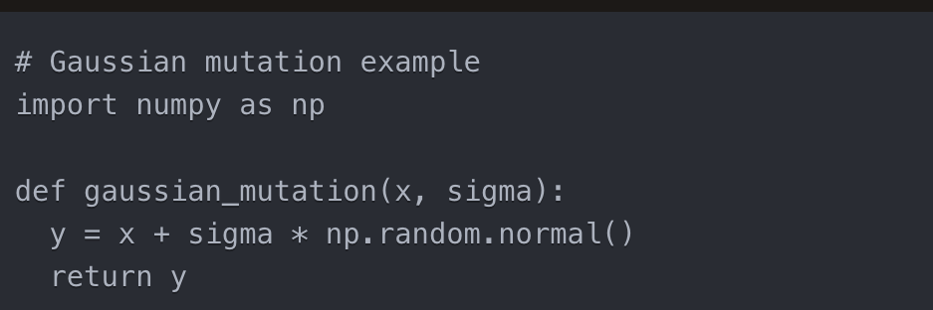
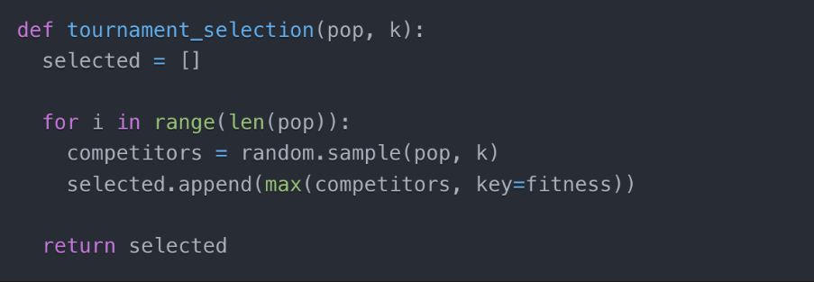
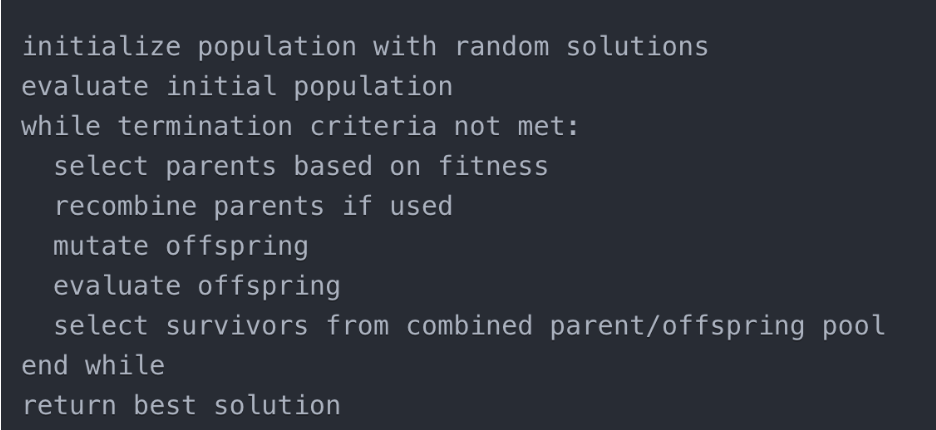
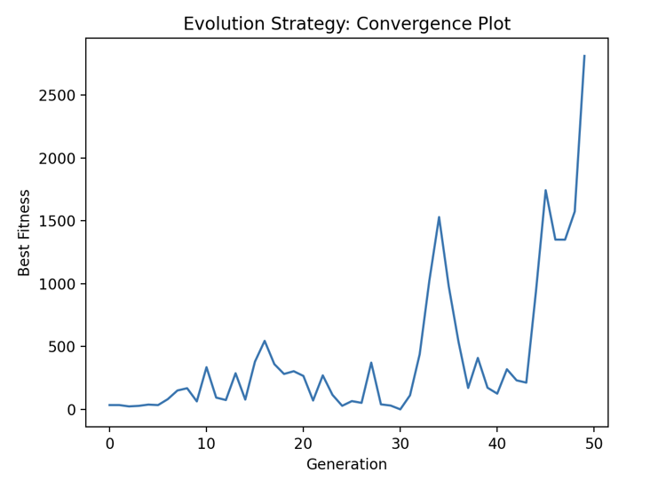
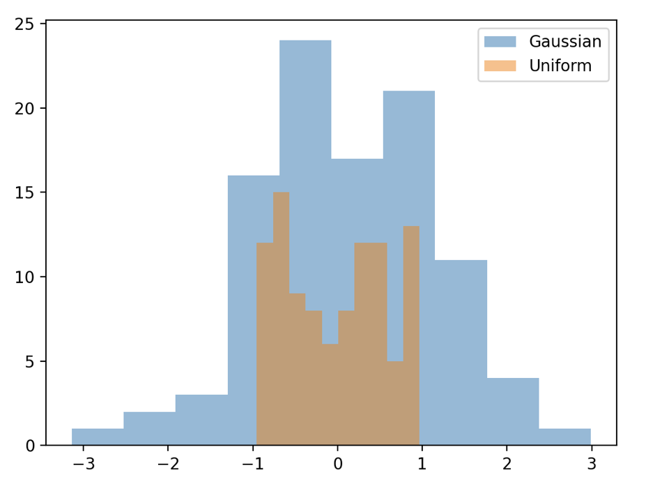

***********************
Evolutionary Strategies
***********************

Introduction to Evolutionary Strategies
=======================================

Evolutionary strategies were first proposed in the 1960s by Ingo Rechenberg and Hans-Paul Schwefel. The key characteristics of evolutionary strategies are:

* They operate on real-valued vectors, rather than binary strings like genetic algorithms. This makes them well-suited to continuous parameter optimization problems.
* They use a population of candidate solutions called individuals. Each individual is represented by a vector of real values.
* New individuals are generated by applying mutation to existing individuals. Crossover is rarely used.
* Selection is performed stochastically. Better performing individuals are more likely to be selected as parents for the next generation. This is called fitness proportionate selection.
Background
==========

Foundations
-----------
* Proposed in the 1960s by Ingo Rechenberg and Hans-Paul Schwefel at the Technical University of Berlin, evolutionary strategies were designed to optimize real-valued parameters for complex engineering problems. 
* At the time, calculus-based techniques like gradient descent struggled with the noisy, irregular, and multi-modal solution spaces characteristic of real-world design challenges. 
* Rechenberg and Schwefel recognized that key Darwinian principles of mutation, recombination and selective reproduction could be abstracted into an algorithmic optimization process.
* Their evolutionary approach provided a robust, flexible alternative by mimicking natural evolution.

Evolution of Applications
-------------------------
The earliest applications of evolutionary strategies were in challenging aerodynamic engineering problems like airfoil design, where they demonstrated superior performance to calculus-based methods. As research continued through the 1970s and 1980s, their usage expanded into other domains of engineering design, control systems, operations research, and hydrology. More recently, the flexibility and gradient-free operation of evolutionary strategies has led to increased adoption in fields like machine learning, hyperparameter tuning, deep neural network optimization, robotic control, and more. The number of publications related to evolutionary strategies has grown steadily over the decades as they have proven broadly useful across continuous optimization problems.

Components and Operators
========================

Representation
--------------
At their core, evolutionary strategies operate on a population of candidate solutions encoded as fixed-length real-valued vectors. The vector length is determined by the dimensionality of the problem, with each element corresponding to a parameter value. This provides a natural and efficient representation for optimizing over continuous spaces, in contrast to binary encodings used in genetic algorithms.

Variation
---------
The primary variation operator used to generate new solutions is mutation. Common mutation types include Gaussian, uniform, and adaptive schemes which modulate the mutation strength. Discrete recombination is incorporated less frequently than in other evolutionary algorithms. The mutation operator drives exploration by perturbing solutions, while selection focuses exploitation on high-quality regions.

    Mutation operator

Selection
---------
Selection is used to choose parents for variation and next-generation survivors. Parents can be selected via fitness proportionate schemes like roulette wheel or tournament selection. (μ + λ) survival selection combines parents and offspring, selecting the μ best to survive. Elitist strategies also retain some fraction of the best solutions to prevent loss of good solutions.

    Selection operator

    Tournament selection

Adaptation
----------
A key benefit of evolutionary strategies is the incorporation of self-adaptive mechanisms. Control parameters like mutation step size can be encoded into the solution representation and co-evolved along with the objective parameters. This allows the strategy to self-tune based on feedback from selection to improve robustness.

Here is some pseudocode demonstrating the general evolutionary strategy approach:

Properties and Advantages
=========================
* Continuous parameter optimization: The real-valued vector representation makes evolutionary strategies naturally suited for optimizing parameters with continuous domains. Can handle very large, high-dimensional continuous search spaces effectively.
* Flexibility: Can optimize constraints, multi-modal, and multi-objective problems through flexible variation and selection schemes. Representation allows hybridization with other methods like local search.
* Self-adaptation: Strategy parameters like mutation strength can be adapted dynamically during the optimization run. Allows strategy to self-tune based on feedback from selection.
* Robustness: Do not require continuity, convexity, or derivative information about objective function. Can handle noisy, dynamic, and time-varying fitness functions.
* Parallelization: Algorithms are straightforward to parallelize by evaluating populations in parallel. Parallel implementations can provide significant speedup.
In summary, key advantages are the ability to effectively optimize challenging continuous problems, flexibility in handling complex constraints, self-tuning strategy parameters, and robustness to noisy objective functions.

Examples and Empirical Analysis
===============================
Some common application areas include:

* Airfoil shape optimization: Evolutionary strategies optimize airfoil shapes by representing curves as control points. CFD(Computational fluid dynamics) simulations evaluate lift and drag, allowing optimization of airfoil performance. Studies show significant lift-to-drag improvements.
* Neural network hyperparameter tuning: Encoding hyperparameters like learning rates into the genome, evolutionary strategies can efficiently optimize model performance. Used to effectively tune deep neural networks, SVM, and other machine learning algorithms.
* PID controller optimization: The gains of PID controllers are optimized by evolutionary strategies against performance criteria like stability margins. Automates manual tuning process and handles constraints. Outperforms trial-and-error tuning.
* Few other real life examples are like Turbine blade design,Antenna configuration, etc.

Analysis techniques like convergence plots, diversity metrics, and fitness landscapes provide insight into evolutionary strategy dynamics on test problems.

Convergence Plot - ES:
======================
The following is a convergence plot over generations for a simple (μ+λ) ES algorithm with Gaussian mutation and tournament selection.

    Evolution strategy convergence plot

This convergence plot demonstrates some typical characteristics of evolutionary strategy performance:
* Rapid initial improvements as selection amplifies beneficial mutations
* Steady long-term convergence as the search space is explored
* Final convergence levels off but does not fully stagnate
This helps illustrate the balance of exploration and exploitation provided by mutation and selection in evolutionary strategies. The graph could be extended further to observe steadier long-term convergence. Tracking diversity could also provide more insight into the dynamics. But this covers some key high-level trends observable in a typical ES convergence plot.

Mutation Comparison:
====================

    The histogram plot shows the distribution of mutation values generated by Gaussian versus uniform mutation.

For Gaussian mutation, the values are clustered around the mean of 0, with fewer samples in the tails. This reflects the shape of the normal distribution, and results in mostly small perturbations with occasional larger jumps.
Uniform mutation generates an even spread of values from -1 to 1. All perturbations in this range are equally likely, allowing for more global exploration.
In summary, Gaussian mutation provides a balance of local and global search, while uniform mutation is more global. This comparison of the mutation distributions helps illustrate their different search properties. Gaussian mutation is commonly preferred in evolutionary strategies due to this balance, but both types as well as adaptive schemes are used.

Evolutionary strategies and its comparison with Genetic Algorithm and Genetic Programming
=========================================================================================
* Representation: ES represents solutions as real-valued vectors suitable for continuous parameters, whereas GA uses binary strings for discrete optimization and GP uses tree structures for programs.
* Variation Operators: ES rely primarily on mutation operators like Gaussian mutation to vary solutions, while GA uses both crossover and mutation operators and GP uses multiple operators like crossover, mutation, encapsulation, etc.
* Parameters: ES adapts key strategy parameters like mutation rate during the run based on feedback, while GA and GP typically use fixed variation rates that do not change.
* Selection: All three techniques use selective pressure based on fitness to evolve the populations, favoring better solutions.
* Applications: ES are specialized for optimizing problems with continuous real-valued parameters, GA are often used for discrete binary optimization tasks, and GP optimizes executable computer programs and expressions represented as trees.

In summary, the main distinctions are the representation for continuous vs discrete domains, the reliance on mutation in ES vs crossover in GA/GP, and the self-adaptation of strategy parameters that provides a key advantage for ES.

Conclusion
==========
In summary, evolutionary strategies are powerful optimization algorithms inspired by natural evolution. Through mutation, recombination and selection acting on populations of real-valued solutions, they efficiently search large continuous spaces.

First proposed in the 1960s, evolutionary strategies have expanded across engineering and machine learning for applications like airfoil design, control system tuning, and hyperparameter optimization. Their core principles provide robustness to noise, constraints, and irregular objectives.

Key strengths include handling high-dimensional continuous parameters, self-adaptation, and parallelization. Decades of research have enhanced their capabilities while retaining the fundamental evolutionary mechanisms.

Evolutionary strategies have proven versatile and effective for challenging real-world optimization problems involving expensive black-box simulations. Their bio-inspired search process continues driving innovation across industries

