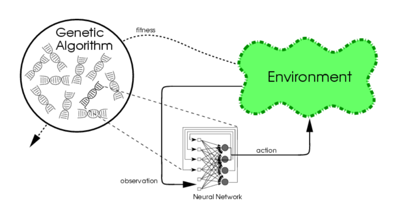
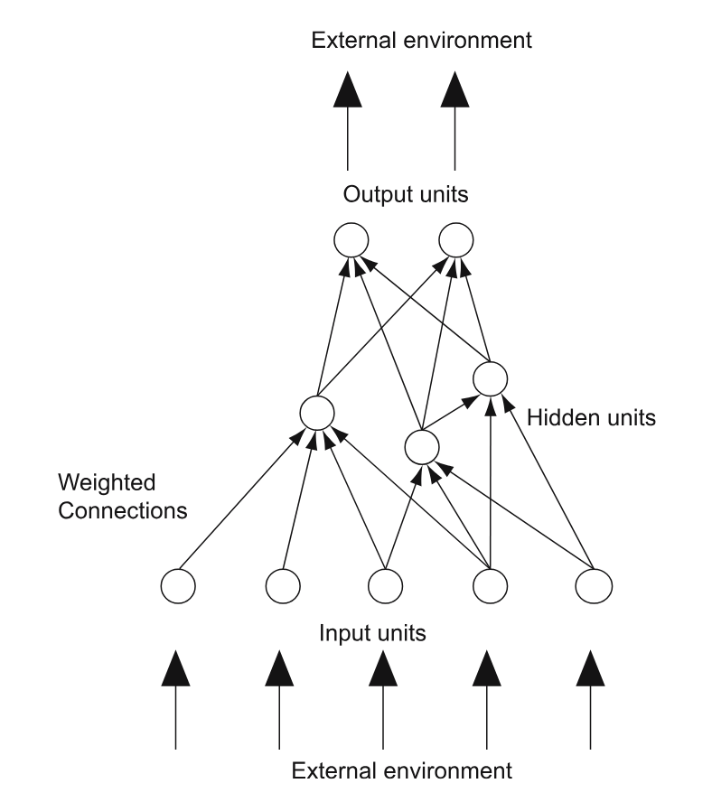
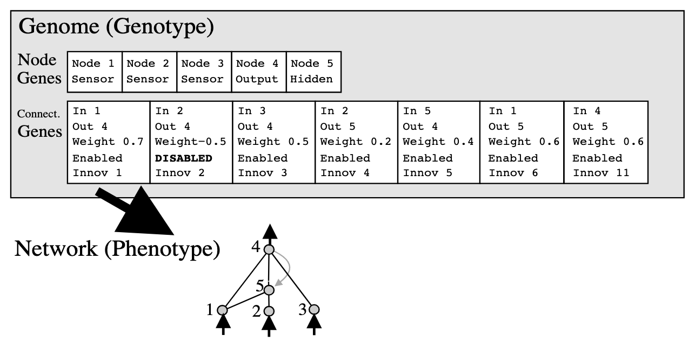
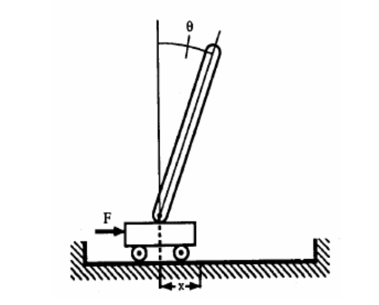

**************
Neuroevolution
**************

    A high-level representation of a GA using neuroevolution

Neuroevolution is an application of evolutionary computation, with the purpose of constructing *artificial neural networks*. 
This application takes inspiration from nervous systems found in biological lifeforms. In general, the goal is to create some network that can react effectively to some specified environment. 
Compared to other methods of artificial neural network construction, neuroevolution works well even with sparse feedback on what actions work best. 
There only needs to be a specified goal, and sequences leading to that goal successfully will evolve through generations.

Artificial Neural Networks
==========================

    An example of an artificial neural network

Artificial Neural Networks (ANNs) are the models used to essentially represent the agents "brain". The purpose is to create network like that of a biological nervous system.
In the context of neuroevolution, these are whats being evolved; they are the phenotype.

* The nodes in an ANN represent *neuron nodes*
* Nodes that represent the environment the agent exists in are the *input/output nodes*
* All other nodes between the input/output nodes are called *hidden nodes*
* The connection strengths of an edge between two neuron nodes are called *synaptic weights*
* In actuality, ANNs are really *weighted directed graphs*.

Based on whats being given in the input nodes, the neuron nodes and their synaptic weights will send some value to its output nodes depending on the application and implementation
    
    * Neuron nodes output a *weighted sum of values*, which may come from some input vector or other neuron nodes
    * The value of this weighted sum is processed with a *transfer function*, which detemines the output of the neuron

The mathematical model of an artificial neuron is described as such:
    
    * :math:`y = F(\sum_{i=0}^{m}w_{i}*x_{i}+b)`
    * :math:`y =` the output of the neuron
    * :math:`x_{i} =` the value of input i
    * :math:`w_{i} =` the weight of input i
    * :math:`b =` bias
    * :math:`F =` the transfer function of the neuron
    * Consider the neuron as two seperate parts. One part sums all inputs with their weights and bias. The second part returns an output based of the previously calculated sum.
    * The value returned by the *transfer function* is dependent of the application of the neural network
    
Implementation
==============

Framework
---------

Neuroevolution follows a step-by-step framework, which is described in the following steps:

#. Some given genome (whether from initialization or from a new generation) is decoded into its phenotype of which corresponds to a neural network.
#. The corresponding neural network, through interaction with its environment, generates a fitness value
#. If the neural network is not satisfactory, genetic operations are performed to evolve it. 

These three steps will repeat until some condition for termination is met. This process is pretty well the same as any other genetic algorithm.

Neuroevolution of Augmenting Topologies
---------------------------------------

There are a few ways to implement neuroevolution. Specifically, there are different encodings that may be used. Among these are done using:
    
    * Analog Genetic Encoding (AGE)
    * Neuroevolution of Augmenting Topologies (NEAT)
    * Symbiotic Adaptive Neuroevolution (SANE)

In this lecture, the implementation of neuroevolution will be described using Neuroevolution of Augmenting Topologies (NEAT).

.. note::
    
    To imply this is the best way to do neuroevolution would be inaccurate. Different implentations of neuroevolutions may or may not excel in differing ways. 
    These are **not** reasons why you should use this method, but reasons why you may want to use it.

* Topology sizes are minimized every generation
* The representation is easier to understand
* Yields good results in minimal generations
* Allows for contained evolution of structural niches. Gene innovations can be evolved before competing with the larger population.

    A depiction of the NEAT representation

* The genome (encoded network) contains two linear lists
    
    #. *Node Genes* - contains nodes that can be connected to other nodes. Whether they are an input, output, or hidden node is specified.
    #. *Connection Genes* - contains specifications for each edge in the network. These specifications include the nodes connected, the connection weight, whether the node is expressed (on/off), and an *innovation number*.

* Innovation numbers are essentially the chronological order of gene creation.
    
    * This number is made originally when an innovation is made
    * The global innovation number increments upon innovation
    * This comes in handy when implementing crossovers

Genetic Operations
------------------

* NEAT allows for two types for structural mutations
    
    * Node Mutation - Add a new node into the network
    * Connection Mutation - Add a new connection into the network

* Other types of possible genetic variations with NEAT are possible
    
    * Connection Genes may be toggled on/off 
    * Connection weight values may evolve

* New structures using parents with overlapping genes can be created
    
    * Genes that are matching are inherited randomly
    * Disjointed and excess genes are inhertied based in fitness

Applications
============
Neuroevolution is typically used for *reinforcement learning* problems within a wide range of different fields. This is because neuroevolution is a very general application, 
with no specific leanings toward any particular field.
    * It can also be used to create complex enemy AI in video games that can adapt in real-time
        
        * Kenneth O. Stanley, the coauthor of NEAT, demonstrated this with a real-time variation of NEAT for a game called NERO (Neuroevolving Robot Operatives)
    * Electronic circuits can be evolved through use of neuroevolution
        
        * Floreano, Claudio, and Mattiussi demonstrated this with AGE, where structures were evolved using resistors and transistors
    * The pole-balancing problem is a commmon benchmark for artificial neural networks
        
        * A pole is attached to a moving cart by a ball-bearing. The cart needs to learn the correct movements to make so the pole does not fall over
    * Neuroevolution is also used for problems in artificial life, specifically for finding conditions necessary for behavioral evolution
    * A program can be taught to play games like checkers or `Super Mario World <https://youtu.be/qv6UVOQ0F44?si=dLHkRDFCw40c6FYE&t=278>`_

    A depiction of the pole-balancing problem
    
References
==========

* Krenker, Andrej, Janez Bešter, and Andrej Kos. "Introduction to the artificial neural networks." Artificial Neural Networks: Methodological Advances and Biomedical Applications. InTech (2011): 1-18.
* Dürr, Peter, Claudio Mattiussi, and Dario Floreano. "Neuroevolution with analog genetic encoding." International Conference on Parallel Problem Solving from Nature. Berlin, Heidelberg: Springer Berlin Heidelberg, 2006.
* Mattiussi, Claudio, and Dario Floreano. "Analog genetic encoding for the evolution of circuits and networks." IEEE Transactions on evolutionary computation 11.5 (2007): 596-607.
* Floreano, Dario, Peter Dürr, and Claudio Mattiussi. "Neuroevolution: from architectures to learning." Evolutionary intelligence 1 (2008): 47-62.
* Lehman, Joel, and Risto Miikkulainen. “Neuroevolution.” Scholarpedia, www.scholarpedia.org/article/Neuroevolution. 
* Stanley, Kenneth O., and Risto Miikkulainen. "Evolving neural networks through augmenting topologies." Evolutionary computation 10.2 (2002): 99-127.
* Brownlee, Jason. "The pole balancing problem." A Benchmark Control Theory (2005).
