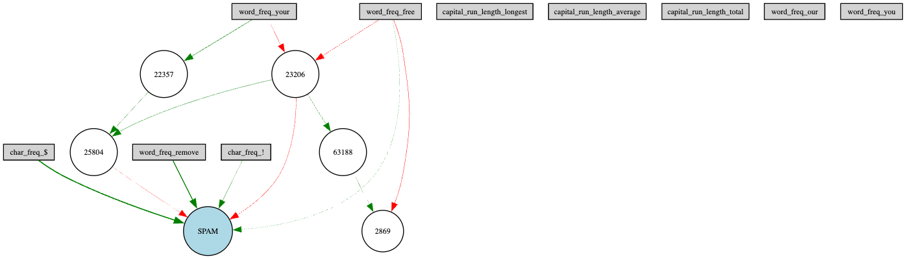
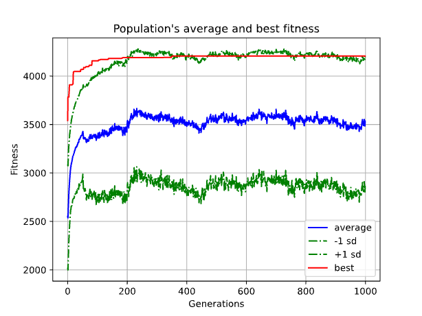
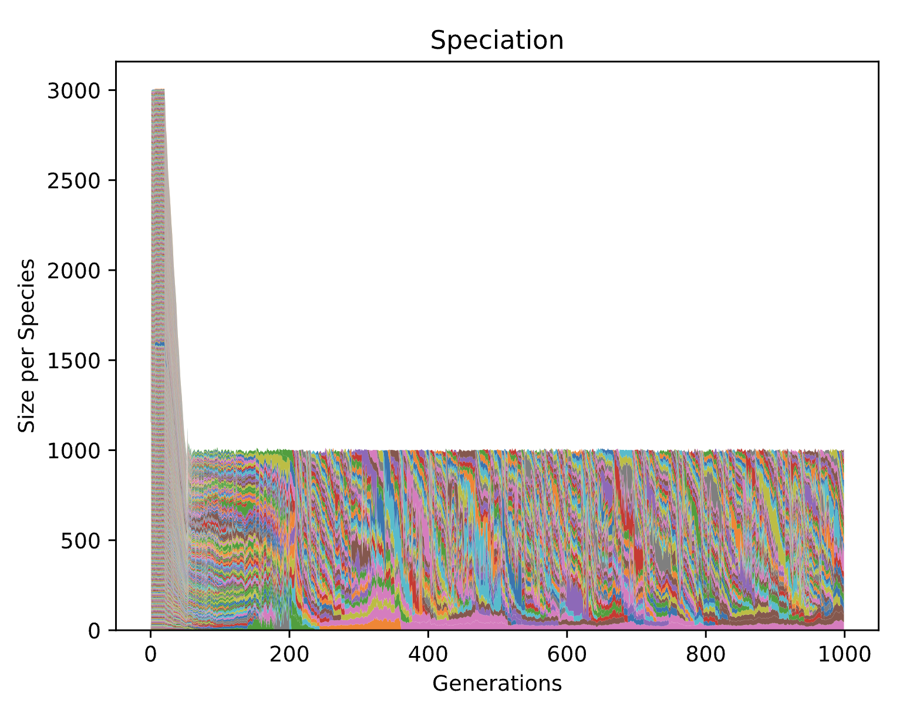

Neuroevolution with NEAT
========================

Introduction
------------
This lecture offers a look into neuroevolution in artificial intelligence. While beginning with an overview of fundamental neural network training concepts like backpropagation, loss functions, and optimization algorithms. By evolving both the structure and parameters of neural networks, NEAT and similar methods mark a shift from traditional neural network training techniques. 

Understanding Neural Networks
-----------------------------

**What is a Neural Network?**
   At its core, a neural network is a set of algorithms designed to recognize patterns. They interpret sensory data through a kind of machine perception, labeling, or clustering raw input. The patterns they recognize are numerical, contained in vectors, into which all real-world data, be it images, sound, text, or time series, must be translated.

**Inspiration from the Human Brain**
   Neural networks are loosely modeled on the human brain. Just as our brain uses neurons to process information, neural networks use artificial neurons or 'nodes' to process input data. However, it's important to note that neural networks aren't an exact replica of the human brain's functionality but are inspired by its ability to learn from experience.

**Basic Architecture**
   - *Neurons*: These are the basic units of a neural network. Each neuron performs a simple calculation and passes its result to the next layer.
   - *Layers*:
     - **Input Layer**: This is where the network receives its input data.
     - **Hidden Layers**: These layers perform computations using inputs from previous layers and pass their results to subsequent layers. They are termed 'hidden' because they are not exposed to the input or output directly.
     - **Output Layer**: This layer produces the final output of the network.
   - *Connections and Weights*: Each neuron in one layer is connected to neurons in the next layer. These connections have weights that are adjusted during the training process to improve the network's performance.

**Why are Neural Networks Important?**
   Neural networks are a cornerstone of machine learning and artificial intelligence. They enable computers to perform tasks that, until recently, only humans could do, such as recognizing speech, identifying images, and making predictions. Their ability to learn from data makes them incredibly versatile and powerful in handling a wide range of applications.

All networks learn through a process where they adjust their weights based on the error of their output compared to the expected result. This process, typically achieved through backpropagation and an optimization algorithm, enables the network to improve its performance over time.

How Does a Neural Network Learn?
--------------------------------

**Feeding the Network with Data**
   - The learning process starts with data. This data is fed into the neural network. It typically includes both 'input data' (like images, text, or numbers) and 'expected output data' (the correct answers or classifications).

**Forward Propagation**
   - Once the input data is fed into the network, it goes through the layers of neurons. Each neuron performs a simple calculation on the data and passes it on to the next layer. This process continues until the output layer produces a result. This result is the network's attempt to give the correct answer based on its current state of knowledge.

**Calculating the Error**
   - The network’s output is then compared to the expected output. The difference between these two is termed as the 'error'. The size of the error indicates how far off the network's prediction is from the actual answer. The error is computed for the collection of samples and the mean squared error is calculated. The goal of the network is to minimize this error. This is done by adjusting the weights of the network.

**Backpropagation**
   - To improve, the network needs to adjust its weights, which are the parameters defining the importance of inputs. This is done through a process called backpropagation. Backpropagation involves going backwards through the network (from output to input) and slightly adjusting the weights in a way that minimizes the error.

**Iterative Learning and Adjusting Weights**
   - This process of forward propagation, error calculation, and backpropagation is repeated many times. With each iteration, the network adjusts its weights. Over time, these adjustments lead the network to make fewer errors in its predictions.

**Convergence to Learning**
   - As the neural network goes through more data and keeps adjusting its weights, it gradually 'learns' and improves its accuracy. The network is said to have 'learned' when it can accurately predict or classify new, unseen data.

This learning process is fundamental to how neural networks gain the ability to perform complex tasks, making them a powerful tool in the field of artificial intelligence and machine learning.

   - **Greedy Learning Approach**: Neural networks often use a 'greedy' approach to minimize error, focusing on immediate improvements. This approach can sometimes lead to suboptimal long-term learning, as the network might get stuck in a local minimum - a state where it can no longer improve because any small change increases the error.

   - **Static Structure**: Unlike the human brain, which can form new connections and even new neurons, the structure of a neural network (its layers and connections) is typically fixed once it's created. The network learns by adjusting weights, not by changing its architecture. This limitation means that the network's ability to learn can be constrained by its initial design.

   - **Dissimilar to Brain's Learning Process**: While inspired by the human brain, neural networks are quite different in how they process information and learn:
     - *Simplistic Neurons*: Neurons in a neural network are much simpler than the human brain's neurons. They lack the complexity and diversity of biological neurons.
     - *Lack of Contextual and Conceptual Understanding*: Neural networks do not 'understand' data in the human sense. They can recognize patterns but lack the ability to comprehend context or abstract concepts.
     - *Data Dependency*: Neural networks require vast amounts of data to learn effectively, unlike the human brain, which can often learn from a few examples or experiences.

   - **Challenges in Generalization**: While neural networks are excellent at learning patterns, they sometimes struggle to generalize this learning to new, unseen data. This limitation is especially pronounced in networks that have been overfitted - trained too much on their training data, making them less effective at handling real-world, variable data.

These limitations highlight that while neural networks are powerful tools for pattern recognition and prediction, they are distinct from the human brain in structure and learning capabilities. Understanding these differences is crucial in appreciating the scope and application of neural networks in solving real-world problems.

NeuroEvolution: Evolving Neural Networks
----------------------------------------

**What is Neuroevolution?**
   Neuroevolution is a form of artificial intelligence that combines neural networks with evolutionary algorithms. It involves evolving the structure and parameters of neural networks through processes akin to biological evolution, such as mutation, crossover, and selection. This approach allows neural networks to adapt and optimize their structures dynamically, rather than just adjusting weights in a fixed architecture.

**Addressing Neural Network Limitations**
   - **Dynamic Network Architecture**: Unlike traditional neural networks with static structures, neuroevolution can evolve the architecture of networks over time. This dynamic adaptation allows the creation of networks that are better suited to the specific problem they are solving, potentially leading to more efficient and effective models.

   - **Overcoming Local Minima**: The evolutionary approach in neuroevolution can help networks avoid getting stuck in local minima—a common problem in traditional neural network training. By exploring a wider range of possible network configurations and parameters, neuroevolution can find better solutions that might be missed by gradient-based optimization methods.

   - **Reduced Dependency on Large Datasets**: Neuroevolution can be particularly advantageous in environments where large labeled datasets are not available. It can discover novel network architectures and solutions through exploration, rather than relying solely on learning from vast amounts of existing data.

**Neuroevolution and the Human Brain: A Parallel**
   - **Evolutionary Origins of the Brain**: Just as neuroevolution uses principles of biological evolution to develop more effective neural networks, the human brain itself is a product of millions of years of evolutionary processes. The brain's structure and capabilities have been shaped by natural selection, enabling humans to adapt and excel in diverse environments.

   - **Mimicking Evolutionary Principles**: In neuroevolution, algorithms mimic this natural process to a certain extent. By iteratively selecting and modifying network architectures based on performance (akin to 'survival of the fittest'), these algorithms can develop networks that are increasingly adept at specific tasks. This process parallels how evolutionary pressures have shaped the human brain's development, leading to complex cognitive abilities.

   - **Continuous Adaptation and Complexity**: The human brain's ability to adapt and evolve over generations reflects the continuous and dynamic nature of evolutionary processes. Neuroevolution attempts to capture this essence by allowing neural networks to evolve over time, potentially leading to more complex and capable AI systems.

**Applications and Potential**
   - Neuroevolution has shown promise in various applications, especially in areas where the optimal network architecture is not known in advance. It has been used in game playing, control tasks, robotics, and other domains where creative and adaptive solutions are beneficial.

NEAT: NeuroEvolution of Augmenting Topologies
---------------------------------------------

**Introduction to NEAT**
   NEAT, short for NeuroEvolution of Augmenting Topologies, is an evolutionary algorithm that creates neural networks. Developed by Ken Stanley, NEAT stands out for its ability to evolve both the weights and structure of a neural network. This approach allows NEAT to start with simple networks and gradually increase complexity as needed, making it efficient and effective for a variety of tasks.

**Key Features of NEAT**
   - **Evolving Network Topologies**: Unlike traditional neural networks with a fixed structure, NEAT evolves the topology of the network alongside the weights. This means it can dynamically adjust not just how the neurons are weighted, but also how they are connected and organized.
   - **Starting from Simplicity**: NEAT begins with minimalistic networks and progressively adds complexity through mutations. This enables the algorithm to find simple and efficient solutions that might be overlooked by methods starting with more complex architectures.
   - **Speciation**: To protect innovative structures, NEAT uses a concept called speciation, where similar networks are grouped together. This prevents the premature extinction of potentially promising, yet initially underperforming, topologies.
   - **Genetic Encoding**: The networks are encoded in a way that allows for effective crossover of genetic material between different networks. This crossover combines and propagates successful traits and structures.

**How NEAT Works**
   - **Initialization**: Starts with a population of simple networks with minimal connections.
   - **Mutation and Crossover**: Each network can undergo mutations (like adding neurons or connections) and crossover with other networks. These genetic operations introduce variations in the population.
   - **Evaluation and Selection**: Each network is evaluated based on a predefined fitness function. The most successful networks are selected for reproduction, passing their characteristics to the next generation.
   - **Speciation and Diversity**: Networks are grouped into species to preserve diversity and protect innovation. This ensures that new and unique structures have a chance to evolve without being immediately outcompeted.

Our Implementation of NEAT
--------------------------

**Our Dataset**
   For our demonstration of NEAT, we developed a neural network to identify spam emails. This application was selected for its broad relevance and the ease with which it can be compared to traditional neural networks using standard loss functions.

   Our chosen dataset for this project was specifically curated to effectively train and test the neural network in distinguishing spam from non-spam emails. It contained 10 features that are critical in identifying spam emails. The `dataset <https://archive.ics.uci.edu/dataset/94/spambase>`_ originally contained 57 features and had 4601 rows, but we reduced the number of features to 10 to help with the training process and they were chosen based on having the highest AUC scores. The features are as follows:

.. list-table:: Dataset Features
   :widths: 5 25 50
   :header-rows: 1

   * - Index
     - Feature Measurement
     - Description
   * - 51 
     - char_freq\_! 
     - Percentage of characters in email that are the character ‘!’
   * - 55
     - capital_run_length_longest
     - Longest consecutive length of capital letters in the email
   * - 54
     - capital_run_length_average
     - Average length of consecutive capital letters
   * - 20
     - word_freq_your
     - Percentage of words in email that are the word ‘your’
   * - 56
     - capital_run_length_total
     - Total number of capital letters
   * - 52
     - char_freq\_$
     - Percentage of characters in email that are the character ‘$’
   * - 15
     - word_freq_free
     - Percentage of words in email that are the word ‘free’
   * - 4
     - word_freq_our
     - Percentage of words in email that are the word ‘our’
   * - 18
     - word_freq_you
     - Percentage of words in email that are the word ‘you’
   * - 6
     - word_freq_remove
     - Percentage of words in email that are the word ‘remove’

The ability of the NEAT algorithm to evolve both the structure and parameters of the neural network makes it particularly suited for this task. It allows the network to adaptively emphasize the most relevant features for accurate spam detection, potentially leading to more effective results compared to traditional neural network approaches.

This implementation showcases the practical utility of NEAT in a real-world application, demonstrating its potential for creating sophisticated and efficient neural network models.

**NEAT Implementation**
   - **NEAT-Python**: We used the `NEAT Python <https://neat-python.readthedocs.io/en/latest/index.html>`_ library to implement NEAT. This library provides a simple and intuitive interface for creating and training neural networks using NEAT.

.. code-block:: python

   with open("Project/pruned.csv", "r", encoding="utf8") as file:
      reader = csv.reader(file)
      data = np.array(list(reader)).astype(float)
      inputs = data[:, :-1]
      outputs = data[:, -1]

The above code reads the data from the csv file and stores it in a numpy array. 

.. code-block:: python

   def eval_genomes(genomes, config):
      for genome_id, genome in genomes:
         genome.fitness = float(len(outputs))
         net = neat.nn.FeedForwardNetwork.create(genome, config)
         for xi, xo in zip(inputs, outputs):
               output = net.activate(xi)
               genome.fitness -= (output[0] - xo) ** 2

The above code evaluates the fitness of each genome in the population. The fitness is calculated as the mean squared error between the network's output and the expected output.

.. code-block:: python

   def run(config_file):
      # Load configuration.
      config = neat.Config(
         neat.DefaultGenome,
         neat.DefaultReproduction,
         neat.DefaultSpeciesSet,
         neat.DefaultStagnation,
         config_file,
      )

      # Create the population, which is the top-level object for a NEAT run.
      p = neat.Population(config)

      # Add a stdout reporter to show progress in the terminal.
      p.add_reporter(neat.StdOutReporter(True))
      stats = neat.StatisticsReporter()
      p.add_reporter(stats)

      # Run for up to 300 generations.
      winner = p.run(eval_genomes, 1000)

      # Display the winning genome.
      print("\nBest genome:\n{!s}".format(winner))

      # Show output of the most fit genome against training data.
      print("\nOutput:")
      winner_net = neat.nn.FeedForwardNetwork.create(winner, config)
      error_rate = 0
      for xi, xo in zip(inputs, outputs):
         output = winner_net.activate(xi)
         if round(output[0]) != xo:
               error_rate += 1
         print("input {!r}, expected output {!r}, got {!r}".format(xi, xo, output))
      print("Error rate: ", error_rate / len(outputs))

The above code runs the NEAT algorithm for 1000 generations, with a population size of 1000. The algorithm uses the above evaluation function to calculate the fitness of each genome in the population. The algorithm also uses the above config file to configure the algorithm.

**Pretty "NEAT" Results**

   The above image shows the final pruned network after training. The network has 10 input nodes, 1 output node, and 5 hidden nodes. The network was trained for 1000 generations, with a population size of 1000.

   The above graph shows the average fitness of the population over 1000 generations. The fitness is calculated as the mean squared error between the network's output and the expected output. The fitness increases over time as the network learns to better predict the correct output.

   The above graph shows the number of species and the number of genomes in each in the population over 1000 generations. The number of species decreases over time as the initial population species stagnates and gets removed.

**Sources**
[1] `NEAT - Wikipedia <https://en.wikipedia.org/wiki/Neuroevolution_of_augmenting_topologies>`_
[2] `Evolving Neural Networks through Augmenting Topologies <http://nn.cs.utexas.edu/downloads/papers/stanley.ec02.pdf>`_
[3] `NeuroEvolution of Augmenting Topologies (NEAT) in Python <https://www.geeksforgeeks.org/neuroevolution-of-augmenting-topologies-neat-in-python/>`_
[4] `NEAT-Python <https://github.com/CodeReclaimers/neat-python>`_
[5] `NEAT Implementations <https://github.com/NEAT-Implementations>`_
[6] `Neural Networks Research Group <http://nn.cs.utexas.edu/>`_
[7] `The Hundred-Page Machine Learning Book by Andriy Burkov <https://themlbook.com/>`_
[8] `what is a  Neural Network MIT <https://news.mit.edu/2017/explained-neural-networks-deep-learning-0414>`_
