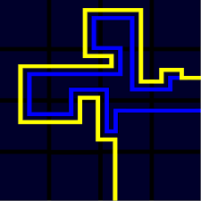
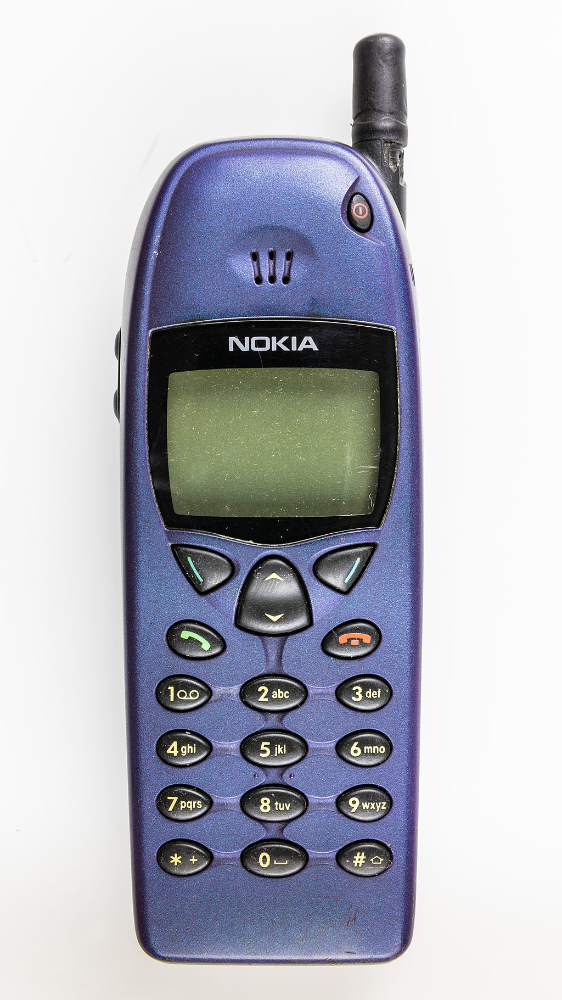
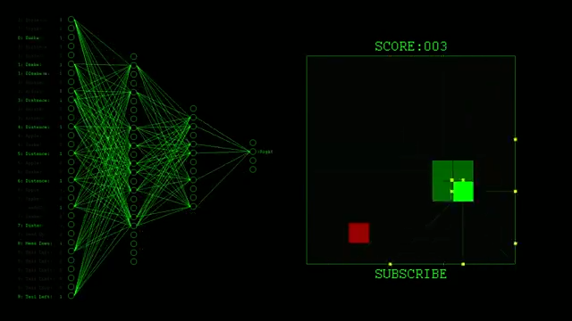
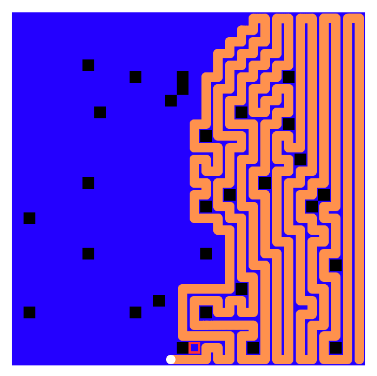

********************************
Snake
********************************

Introduction
============

**What is a Genetic Algorithm?**

We should all know by now that Evolutionary Computing is about applying evolving solutions to problems that require adaptive strategy.

Which is fancy for "Making solutions that change with the problem"

I can think of know better example for problems that change and require similar yet modified solutions than Video Games.

Today’s video games are beyond complex, but if we go back to 1976 in the very young days of video games we can find an arcade game called Blockade.

Blockade, created by Gremlin Industries, was the first of a kind of games called "Snake Games"

Many games spawned from Blockade, for example the 1982 game Tron and the most popular 1998 game Snake which was included on the Nokia 6110 cellphone.

"Snake Games" are the kind of game we are going to be teaching an Evolutionary Neural Network to play.

Snake games have very basic rules and inner workings:

* A snake exists in a bounded area
* Each frame the snake moves straight one unit
* Input can be used to turn the snake 90 degrees in either direction
* The snake gains length by collecting something in its path or simply by lengthening each frame
* The snake cannot run into itself, or it dies
* The snake cannot run into the walls defining its space or it dies
* The goal is to become as long as possible.

Related Works
=============
Many people have trained different evolutionary computational algorithms to play snake, for example these three videos by YouTuber Code Bullet:
`One, <https://www.youtube.com/watch?v=3bhP7zulFfY&pp=ygUYdXNpbmcgYSBnYSB0byBwbGF5IHNuYWtl>`_
`Two, <https://www.youtube.com/watch?v=-NJ9frfAWRo&pp=ygUYdXNpbmcgYSBnYSB0byBwbGF5IHNuYWtl>`_
and `Three <https://www.youtube.com/watch?v=tjQIO1rqTBE&t=278s&pp=ygUYdXNpbmcgYSBnYSB0byBwbGF5IHNuYWtl>`_

As is apparent from the fact that one person made three different implementations for a “Snake A.I.” as he put it, there are many ways to do this task.

Most seem to use a neural network, with the input data of what is on each of the four sides of the head of the snake and the four diagonals from the head.
This can clearly be seen here in this implementation by Ezra Anderson:

Project Topic Description
=========================

As opposed to the examples above using neural networks, I will be using a evolutionary neural network (ENN) that actively trains and improves.

In addition to that I will be changing some of the rules of a standard snake game:

* The walls will not kill the snake, instead they loop left to right and top to bottom similar to the paths on the sides of the screen in Pac-Man
* To balance the lack of walls, obstacles called bombs are added to the game

The goal of our snake ENN will remain mostly the same, maximise length and avoid death

Methodology
==============

This snake game implementation, originally created by `Christian Thompson <https://gist.github.com/wynand1004/ec105fd2f457b10d971c09586ec44900>`_, has been **HEAVILY** modified to include the new game rules described above and to improve the general function of the game.

Additional modifications were made to include edge cases like, fruits spawning on the snake, fruits spawning on bombs, bombs spawning at the snakes spawn position, etc.

In addition to that the size of the board the snake is in can be changed and will not always be a square
For our snake to know what it is doing we are tracking these things and feeding them to our ENN as input:

* Coordinates of snake head
* Coordinates of snake tail segments
* Coordinates of fruit
* Coordinates of bombs
* Dimensions of board

Our ENN will give key presses of W, A, S, and D as output to control the snake.

Prediction
============
As the implementation of this has not yet been completed, here are some predictions on what will happen.

Early Generations:

* Random moves
* Most snakes will die quickly as they don’t know what is killing them
* MAYBE a lucky run will get multiple fruits
* Portal walls cause extreme confusion

Middle Generations:

* Snakes learn basic survival behavior, bombs and its tail is what is killing it
* Start moving towards fruit
* Simple bomb avoidance, make it look like the snake is scared of the bombs
* Portal walls used scarcely due to previous confusions

Later Generations:

* Development of path planning
* Efficient fruit collecting
* Confidently navigating close to bombs
* Smart use of portal walls

There are multiple strategies that the ENN could use, standard games of snake benefit from zigzagging from top to bottom, or spiraling in and out from the centre.

Now due to the obstacles introduced by the bombs using a zigzag or spiral technique will almost never produce a perfect solution.

I predict that the best solution in this game of snake will resemble a zigzag solution with bombs wrapped by the snake.

Notice how I said best and not perfect as shown in the example bellow, a perfect run of snake is not possible based on the placement of bombs.

A perfect run is not possible here because of the placement of the bombs.

Similar placements of bombs may allow for all spaces to be occupied by the snake, however the position in which the snake enters and exits an area surrounding bombs play a huge part in whether or not it can “solve” the arrangement

Completion
==========

To complete this project my game of snake will be used to train the ENN to solve many different games of snake with different board dimensions and different number and location of bombs.

The project will be updated `here <https://github.com/DippyMcSkippy/Snake-ENN>`_ on GitHub,

Citations
===========
Anderson, Ezra. “A.I Learns Snake And Wins - Part 1.” YouTube, YouTube, 8 Oct. 2022,  https://www.youtube.com/watch?v=G8NEj5InvVA.

Code Bullet. “A.I. Learns to Play Snake Using Deep Q Learning.” YouTube, YouTube, 12 July 2019,  https://www.youtube.com/watch?v=-NJ9frfAWRo.

Code Bullet. “AI Learns to Play Snake Using Genetic Algorithm and Deep Learning.” YouTube, YouTube, 7 Dec. 2017,  https://www.youtube.com/watch?v=3bhP7zulFfY.

Code Bullet. “I Created a PERFECT SNAKE A.I.” YouTube, YouTube, 28 Nov. 2019,  https://www.youtube.com/watch?v=tjQIO1rqTBE&t=278s.

Goggin Gerard. Global Mobile Media. Taylor & Francis Group, 2010, ProQuest Ebook Central, https://ebookcentral.proquest.com/lib/stfx/detail.action?docID=958113, Accessed 25 Nov. 2024.

Thompson, Christian, et al. “A Simple Snake Game Made in Python 3.” GitHub Gist, 2 Sept. 2018,  https://gist.github.com/wynand1004/ec105fd2f457b10d971c09586ec44900.

