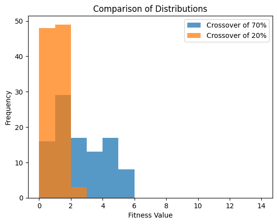

*********************************************************
Experimenting with the :math:`n` Queens Genetic Algorithm
*********************************************************

* It is time to tinker with the provided :math:`n` queens genetic algorithm implementation
* The purpose of this is to

    * Gain more hands on experience working with a genetic algorithm
    * Implement different operators and see the impact of the changes
    * Implement a different representation to see how it impacts results
    * See how to start comparing results

Run Multiple Times and Plot
===========================

.. note::

    The easiest way to get the code up and running is to
    `fork <https://docs.github.com/en/get-started/quickstart/fork-a-repo>`_
    the github `repository <https://github.com/jameshughes89/cs4XX-EvolutionaryComputation>`_, download it, and run the
    setup described in the "README".

    Alternatively, the scripts can be downloaded individually to ``/src``, but this may require some additional setup for
    the dependencies. It is recommended to make a `virtual environment <https://docs.python.org/3/library/venv.html>`_
    and `download any required dependencies with pip <https://pypi.org/project/pip/>`_.

#. Get the :math:`n` queens genetic algorithm running

    * Play around with the hyperparameters
    * Try to make the problem more difficult by increasing the value of :math:`n`

#. Create a learning curve plot

    * See the bitstring genetic algorithm for an example of how this was done

.. figure:: fitness_over_time_nqueens.png
    :width: 500 px
    :align: center

    Learning curve for some run of the :math:`n` queens genetic algorithm. This plot is for a run where
    :math:`n=20`, the population size was 100, the number of generations was 250, and a tournament size of 2. Since this
    is a minimization problem, lower fitness values are better.

Creating a Distribution
-----------------------

* Since genetic algorithms are stochastic processes, one should expect variability between runs

    * Every time the algorithm is run, different results will likely be obtained
    * This is to be expected given the amount of randomness involved

        * Initial population is created randomly
        * Selection is done randomly
        * Genetic operators are applied randomly
        * Genetic operators apply operations on random parts of the chromosomes

* This means it is not possible to run the algorithm once to truly measure its effectiveness

    * Learning curves are really only good for a quick eyeball test of the evolutionary learning process

* Instead, a distribution of results should be created along with summary statistics

#. Run the algorithm a total of :math:`100` times and save the best fitness result of each run

    * This will create a list of 100 fitness values

#. Calculate some simple summary statistics of the :math:`100` runs' results

    * Mean and/or median
    * Standard deviation and/or interquartile range
    * Anything else that could be interesting

#. Plot the fitness values in a histogram to see the distribution of results

    * `Use matplotlib's hist function <https://matplotlib.org/stable/api/_as_gen/matplotlib.pyplot.hist.html>`_

    .. figure:: distribution_of_results_nqueens.png
        :width: 500 px
        :align: center

        Distribution of the results of 100 runs of the :math:`n` queens genetic algorithm where :math:`n=20`, population
        size was 100, generations was 250, and a tournament size of 2.

#. To make the problem harder, repeat these questions for :math:`n=30`
#. When happy with the results, save them somewhere to be used later for comparisons 

Change Operators
================

* For the following, try to be as creative as possible and feel free to try multiple ideas

    * It's always good to explore and tinker
    * It really does not matter how good or bad the results are in the end
    * If stuck, look up existing popular ideas for the operators to implement

* Additionally, test each change in isolation to simplify the analysis of the impact of the change

    * In other words, revert the previous changes before moving on to the next task

* Finally, run each 100 times and generate the summary statistics and distributions

    * Be sure to save the results somewhere for later comparisons

#. Change out the crossover operator for something else and run the experiments again
#. Change out the mutation operator for something else and run the experiments again
#. Change out the selection operator for something else and run the experiments again

Change Representation
=====================

Comparing Results
=================

* The summary statistics of a distribution of results is a great way for a *quick* perspective of the results
* Often, people will compare the summary statistics of two distributions to make a conclusion of what is *better*

    * If the results when using crossover X has a better mean than the results of crossover Y, then X is better, right?
    * For example, from the data plotted in the below figure

        * The mean of the genetic algorithm with a crossover rate of 70% was :math:`2.1`
        * The mean of the genetic algorithm with a crossover rate of 20% was :math:`0.55`
        * It would seem that the crossover rate of 20% provided better results

* But in reality, this is a poor way to perform a comparison
* This is because, the goal is to compare the distribution of the results, not the summary statistics

* The simplest way to do this is to plot the distributions against each other and perform an eyeball test

    Comparison of two distribution of results of :math:`100` runs. These results were obtained by running the genetic
    algorithm as provided where :math:`n=20`, population size was 100, generations was 250, and a tournament size of 2.
    One run had a crossover rate of 70% and the other had a rate of 20%. It is clear, from this comparison, that using a
    crossover rate of 20% is superior.

Probability Value
-----------------

* Unfortunately, an eyeball test provides no quantitative data so it's difficult to truly compare results
* Instead, a mechanism for measuring the results of comparing distributions is used
* The measurement provides a value called a *probability value* (p-value)

    * It provides the *probability* that two distributions were created by the same *thing*
    * Simply, a big p-value means that it is likely that the two distributions are not too different
    * A small p-value means that it is likely that the two distributions are quite different

* Ideally, the best way to do the comparison is with something called a `permutation/randomization test <https://docs.scipy.org/doc/scipy/reference/generated/scipy.stats.permutation_test.html>`_

    * This test is an intuitive way to compare distributions
    * It provides a way to measure the difference between any statistic
    * This idea will discussed in more detail in a later topic to get a sense of what it *means*

* Unfortunately, a permutation/randomization test, although simple to do, is more work than other popular alternatives
* Instead, it is common to see a `t-test <https://docs.scipy.org/doc/scipy/reference/generated/scipy.stats.ttest_ind.html#scipy.stats.ttest_ind>`_  or a `Mann-Whitney U test <https://docs.scipy.org/doc/scipy/reference/generated/scipy.stats.mannwhitneyu.html#scipy.stats.mannwhitneyu>`_

    * A t-test requires assumptions that are often not true when comparing genetic algorithm results
    * As a result, Mann-Whitney U tests are more "powerful"
    * However, a t-test will often be sufficient

* When comparing the distributions shown above

    * The p-value obtained by an independent t-test was :math:`2.88 \times 10^{-17}`
    * The p-value obtained by a Mann-Whitney U test was :math:`2.97 \times 10^{-14}`

* Although the p-values differ, they are both very small
* Thus, one could conclude that there is a very small probability that these distributions are from the same *thing*
* In other words, the results of using a crossover rate of 20% is almost certainly better

Effect Size
-----------

* Finally, just because there is in fact a difference in the distributions, it doesn't really mean one should care

    * It only says if the distributions are different
    * It does not detail the strength or magnitude of the effect

* This is where *effect size* comes in
* Simply, the distributions are different, but does anyone care?

* The crudest way to think of this is to go back and compare the means

    * How different are the means?
    * Sure, the distributions are in fact different, but is the difference in the means tiny?

* This is commonly calculated with the standardized difference/Cohen's d between two means

    * :math:`\frac{\overline{x_1} - \overline{x_2}}{\sigma}`
    * Divide the difference between the grop means by the standard deviation of the aggregate of both groups

* The standard difference when comparing the above distributions is :math:`1.10`

* The bigger the number, the bigger the effect size
* Thus, the bigger, the more one would care

For Next Class
==============

* TBD

