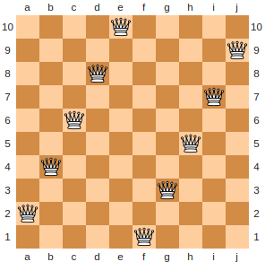
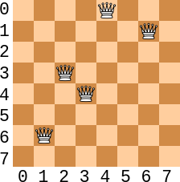
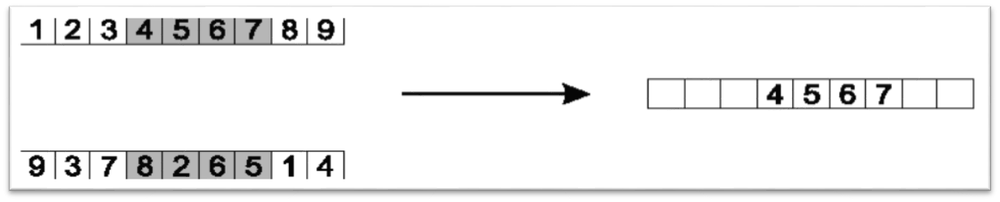
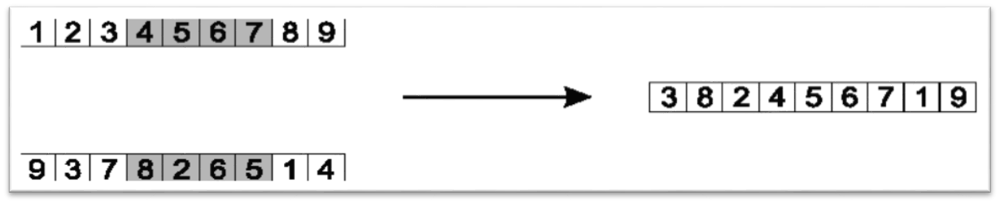
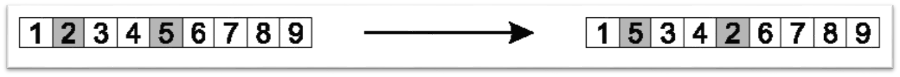

**********************************
:math:`n` Queens Genetic Algorithm
**********************************

* The purpose of this topic is to emphasize the similarities between genetic algorithm implementations
* Although the first genetic algorithm implementation was solving a different problem, much of the algorithm is the same

Problem
=======

* The optimization version of the :math:`n` queens problem is going to be used

    * Given an :math:`n \times n` chess board
    * Place :math:`n` queens on the chess board
    * While minimizing the number of conflicting/attacking queens

* In other words, minimize the number of queens in the same row, column, or diagonal

    A configuration of :math:`10` queens on a :math:`10 \times 10` chess board with zero conflicts. This would be an
    optimal solution where :math:`n=10`.

* The reason the optimization version of the problem is being used is because it has a gradient for the search to follow
* The all or nothing (valid configuration or not) version of the problem has no gradient

* The phenotype space (problem space) includes all possible configurations of the :math:`n` queens on an :math:`n \times n` board

    * Assuming queens are not allowed on the same square, this is :math:`n \times n \choose n`

* However, as previously discussed, by using a permutation encoding, the genotype space (search space) is only :math:`n!`

Initialization
==============

* Before evolution can begin, an initial population of candidate solutions

Representation
--------------

* The permutation representation previously discussed will be used

    * A chromosome will be a list of length :math:`n`
    * Each of the :math:`n` indices correspond to each of the :math:`n` queens
    * Each index will be the queen's respective column in the chess board
    * The elements within the list will be a permutation of the integers between :math:`0` and :math:`n-1`
    * The value at each index will be the queen's respective row in the chess board

* Since the values and indices are unique, no two queens can be in the same row or column

* An example chromosome when :math:`n=8` is

    ``<0, 5, 7, 6, 3, 2, 1, 4>``

Population
----------

* A population is a list of chromosomes

    .. code-block:: text

        [<0, 5, 7, 6, 3, 2, 1, 4>,
         <4, 5, 2, 3, 6, 7, 1, 0>,
         <0, 1, 2, 3, 4, 5, 6, 7>,
         ...
         ...
         <4, 3, 2, 7, 6, 1, 0, 5>]

* The chromosomes, and thus the population, will be randomly generated for this implementation of a genetic algorithm

.. literalinclude:: /../src/ga_n_queens.py
    :language: python
    :lineno-match:
    :start-after: # [begin-initialization]
    :end-before: # [end-initialization]

* The number of chromosomes within the population is defined by a hyperparameter called ``POPULATION_SIZE``
* The length of the chromosomes will match the number of queens, which is defined by the hyperparameter ``N_QUEENS``
* The chromosomes are permutations of the sequence of integers from :math:`0` to :math:`n-1`

* Note that ``sample`` is from Python's ``random`` library

    * `It returns a k length list of unique elements chosen from a population sequence <https://docs.python.org/3/library/random.html#random.sample>`_

Evaluation
==========

* The fitness function will count the number of conflicting queens
* Each pair of conflicting queens will only be counted once

* With the representation used, it's not possible for two queens to be in the same row or column
* Thus, only the diagonals need to be checked

.. literalinclude:: /../src/ga_n_queens.py
    :language: python
    :lineno-match:
    :pyobject: attacking_fitness

* For each queen, check the up and down diagonals to the right

    * There is no need to check to the left as any conflict to the left would already be counted

* The basic idea here is

    * Given a queen at index ``attacker_column`` with value ``attacker_row``
    * In order for a queen ``offset`` indices away with the value ``victim_row`` to be in the same diagonal
    * The value of ``victim_row`` **must** be equal to ``attacker_row - offset`` or ``attacker_row + offset``

    :math:`8 \times 8` chess board configuration with 4 conflicts. Only :math:`5` queens are shown here for
    demonstration purposes.

* Consider the above figure and the chromosome ``<?, 6, 3, 4, 0, ?, 1, ?>``

    * The question marks represent irrelevant values for this example

* When evaluating the queens from left to right

    * The queen at index ``1`` has a value of ``6`` and conflicts with two queens

        * It conflicts with the queen at index ``3``

            * The offset is ``2`` and the value at index ``1`` equals the value at index ``3`` minus the offset ``2``
            * ``6 - 2 == 4``

        * It also conflicts with the queen at index ``6``

            * The offset is ``5`` and the value at index ``6`` equals the value at index ``6`` minus the offset ``5``
            * ``6 - 5 == 1``

    * The queen at index ``2`` also has a conflict with the queen at index ``3``

        * The offset is ``1`` and the value at index ``2`` equals the vlaue at index ``3`` plus the offset ``1``
        * ``3 + 1 == 4``

    * Lastly, the queen at index ``3`` conflicts with the queen at index ``6``

        * ``4  - 3 == 1``

    * As mentioned above, there is no need to look to the left of any queen as those conflicts would already be counted

        * For example, the queen at index ``6``\s conflicts were already counted

* With this fitness function, the fitness of each candidate solution within the population can be calculated and stored

.. literalinclude:: /../src/ga_n_queens.py
    :language: python
    :lineno-match:
    :start-after: # [begin-evaluation]
    :end-before: # [end-evaluation]

Selection
=========

Variation Operators
===================

* Given the permutation representation, special considerations should be made when implementing the variation operators
* The operators should ensure the chromosome remain a permutation

    * Consider a one point crossover on permutations

    .. code-block:: text

               v                    v
        [0, 1, 2, 3, 4]      [0, 1, 2, 1, 0]
                         ->
        [4, 3, 2, 1, 0]      [4, 3, 2, 3, 4]
               ^                    ^

    * This crossover may destroy the fact that the chromosomes are permutations

Crossover
---------

* An *order crossover* is commonly used for permutation representations

* Keep all elements between two randomly selected indices

    Keep the segment of the chromosome between two arbitrarily selected indices. This only shows one of the two children
    that this crossover would produce.

* Then, copy the elements from chromosome :math:`A`, in order, if they do *not* appear in chromosome :math:`B`

    * Start copying from *after* the kept segment

    Copy the elements from the other parent, in order, starting after the kept segment. Only copy values that are not
    already contained within the child. Again, this only shows one of the two children this crossover would produce.

.. literalinclude:: /../src/crossover.py
    :language: python
    :lineno-match:
    :pyobject: order_crossover

Mutation
--------

* Similar to crossover, one must be careful with the choice of mutation when working with permutations
* Fortunately, swap mutation is a very simple mutation that is permutation safe

    * Select two indices and swap the values between them

    Swap mutation on some chromosome. The values at indices ``1`` and ``4`` are swapped in this example.

.. literalinclude:: /../src/mutation.py
    :language: python
    :lineno-match:
    :pyobject: swap_mutation

Termination Requirement
=======================

For Next Class
==============

* Download and look at

    * :download:`The Selection Script </../src/selection.py>`
    * :download:`The Crossover Script </../src/crossover.py>`
    * :download:`The Mutation Script </../src/mutation.py>`
    * :download:`n Queens GA </../src/ga_n_queens.py>`

