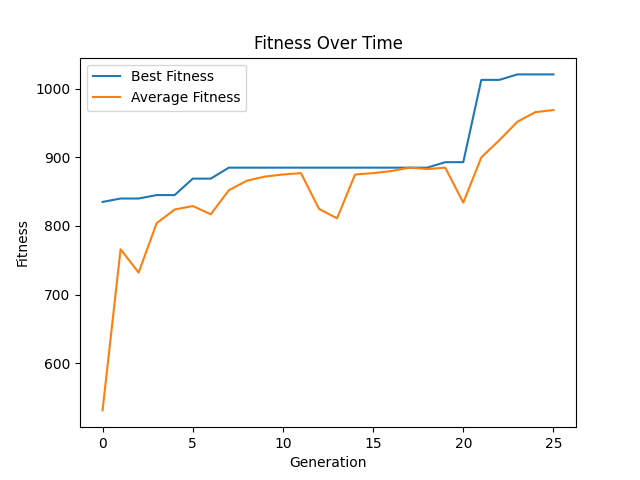

**************************************
Experimenting with a Genetic Algorithm
**************************************

* Having seen the GA, it is now time to tinker with one to see what happens

Plot
====

* Below is a plot of the *learning curve* of the evolutionary search
* One line shows the fitness of the best candidate solution within the population
* The other line shows the average fitness of the population

    Plot of a the GA's "learning curve" for the maximization of the integer value of an unsigned binary number.

* The evolutionary algorithm was run with the following settings

.. literalinclude:: /../src/ga_max_bitstring.py
    :language: python
    :lineno-match:
    :start-after: # [begin-hyperparameters]
    :end-before: # [end-hyperparameters]

Experiment
==========

* For all the following questions, take the time to run the GA with several values and plot the results

#. Increase the difficulty of the problem by increasing the bitstring length :math:`n` (``BIT_STRING_LENGTH``)
#. Change the number of generations (``GENERATIONS``) to see how it impacts the search
#. Change the population size (``POPULATION_SIZE``) to see how it impacts the search
#. Change the crossover rate (``CROSSOVER_RATE``) to see how it impacts the search

    * Be sure to include a value of ``0.0`` and ``1.0`` in your experimenting

#. Change the mutation rate (``MUTATION_RATE``) to see how it impacts the search

    * Be sure to include a value of ``0.0`` and ``1.0`` in your experimenting

#. Change the size of the tournament for selection (``TOURNAMENT_SIZE``) to see how it impacts the search
#. Set the size of the tournament for selection (``TOURNAMENT_SIZE``) to the population size

    * What does this *mean*?

#. Set the size of the tournament for selection (``TOURNAMENT_SIZE``) to ``1``

    * What does this *mean*?

#. What is the best settings of the hyperparameters found?

A Change of Perspective
=======================

* In the previous topic, the following candidate solutions were ranked by how close they are to the optimal solution

    * :math:`1111111111` (1023)
    * :math:`1011001001` (713)
    * :math:`0001111111` (127)
    * :math:`0000000000` (0)

* This ranks them based on what the candidate solutions mean in terms of the problem's objective --- their integer value

    * The bitstring that means 713 is better than the one that means 127 since it is closer to the optimal solution

* However, instead of thinking about their integer value, consider how close the *chromosome* is to the optimal solution
* The optimal chromosome would be ``[1, 1, 1, 1, 1, 1, 1, 1, 1, 1]`` where :math:`n=10`
* Which chromosome is better

    * ``[1, 0, 0, 0, 0, 0, 0, 0, 0, 0]`` (512)
    * ``[0, 1, 1, 1, 1, 1, 1, 1, 1, 1]`` (511)

* Before, the candidate solutions were ranked based on what they mean in the problem space

    * Phenotype space

* By counting the number of ones in he chromosomes, the solutions can be compared based on their encodings

    * Genotype space

* Below is an alternative fitness function that could be used

.. literalinclude:: /../src/ga_max_bitstring.py
    :language: python
    :lineno-match:
    :pyobject: ones_fitness

Experiment Again
================

#. Switch out the use of ``value_fitness`` for ``ones_fitness`` in the fitness calculation of each chromosome
#. Play with the hyperparameters and keep track of the best settings found

    * Are they different from before?

* The hyperparameters can be tuned, but so can the individual functional pieces of the GA

    * There is no rule saying the fitness function must work a certain way
    * There is no set way to do crossover or mutation
    * Selection can be done however one wants to
    * ...

* All that really matters is that it produces a working GA in the end that finds high-quality solutions to a problem
* The ideas of evolutionary computation are truly only rough frameworks
* The individual concrete pieces are flexible and can be whatever works

#. Try to create your own crossover function
#. Try to create your own mutation function
#. Try to create your own selection strategy
#. Did your changes improve the GA or not?

    * They do not need to
    * Just have fun and try to be creative

For Next Class
==============

* If not already done, `fork the course github repository <https://github.com/jameshughes89/cs4XX-EvolutionaryComputation>`_
