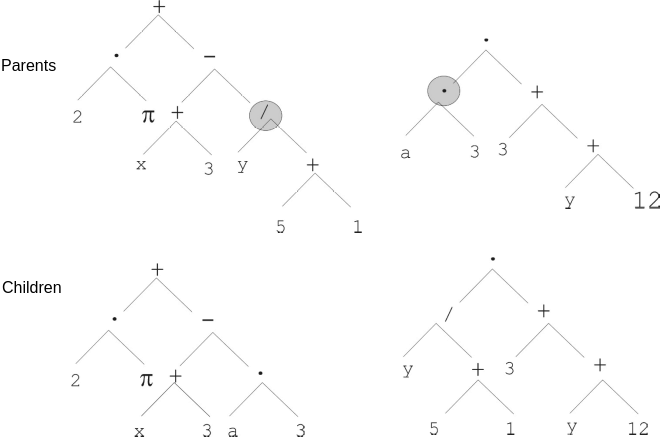
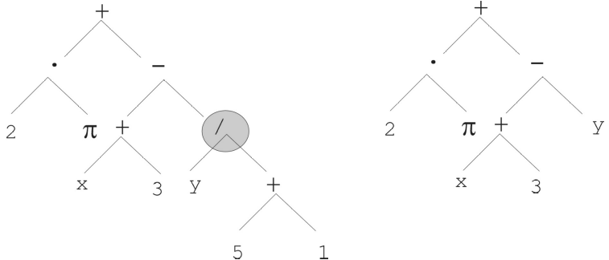

*****************
Genetic Operators
*****************

* Below is a collection of common genetic operators for broad types of representations

    * This is by no means exhaustive
    * Further, it should not be assumed that they are particularly effective
    * They are intended to provide foundational ideas 

* These operators focus on representations for genetic algorithms

    * The motivation for focusing on genetic algorithms is they are quite a general form of evolutionary computation

* Although common genetic operators are presented, being creative and trying to invent new operators is encouraged

Genetic Operators for Binary Representations
============================================

* Binary representations are those that only contain two values, which are typically 0s and 1s

Crossovers
----------

One Point Crossover
^^^^^^^^^^^^^^^^^^^

* Randomly select an index
* Exchange the elements between the chromosomes after that index
* This crossover is not particularly *destructive*

    * The amount in which the information within the chromosomes gets changed is low

* This crossover works well when element adjacency in the chromosome is important

.. figure:: one_point_crossover.png
    :width: 450 px
    :align: center

    Result of applying one point crossover on two chromosomes. This example has index 5 as the randomly selected
    crossover point, thus, all elements after index 5 are exchanged between the parent chromosomes. Although this
    example shows one parent containing only 0s and the other containing only 1s, this is not a requirement;
    the parents could contain both 0s and 1s.

:math:`n` Point Crossover
^^^^^^^^^^^^^^^^^^^^^^^^^

* Randomly select :math:`n` indices
* Exchange the elements between every other pair of indices the indices

    * If an odd number of indices, exchange the elements from the last index to the end

* This is a generalization of one point crossover
* :math:`n=2` is popular (two point crossover)

.. figure:: n_point_crossover.png
    :width: 450 px
    :align: center

    Result of applying :math:`n` point crossover where :math:`n=3`. The randomly selected indices in this example are
    5, 8, and 14. All elements between indices 5 and 8 (exclusively) are exchanged along with all
    the elements from index 14 to the end of the chromosome.

Uniform Crossover
^^^^^^^^^^^^^^^^^

* Select some random number of indices at random
* Exchange the elements at those indices
* Often implemented by giving each index a 50/50 chance to be selected for crossover

* This crossover is relatively *destructive*
* Not particularly effective on chromosomes where element adjacency is important

    Result of applying uniform crossover where the a total of 8 values were exchanged.

Mutations
---------

Bit Flip Mutation
^^^^^^^^^^^^^^^^^

* Select some number of bits and *flip* them

    * Change 0s to 1s and 1s to 0s

* The number of bits that get flipped is arbitrary

    * Could be hard coded
    * Could be randomly selected each time

* Similar to uniform crossover, but instead of exchanging elements between parents, just change the binary symbol

* As the number of bits that are flipped increases, so does the level of *destruction* this mutation causes

.. figure:: bit_flip_mutation.png
    :width: 450 px
    :align: center

    Result of applying a bit flip mutation to some chromosome. Here, a total of 10 bits were flipped during the
    mutation, which is a rather high number of bits to flip. Although this example shows the parent chromosome
    containing only 1s, this is not a requirement; it could have contained 0s that got changed to 1s.

Genetic Operators for Integer Representations
=============================================

* Integer representations are those that consist of integer values

Crossover
---------

* The crossovers used for binary representations are typically also used for integer representations

Mutations
---------

Single Point Mutation
^^^^^^^^^^^^^^^^^^^^^

* Sometimes called "Random Resetting"

* Similar to the bit flip mutation

* Select an index at random
* Replace the value at the selected index with some other valid integer

* A single point mutation can be generalized to an :math:`n` point mutation by selecting multiple indices to change

* This mutation is helpful in situations where the values within the chromosome represent cardinal attributes

    * Where the order of the possible integer values *do not* necessary matter

        * For example, the amount of values within a set

* This mutation is also helpful in situations where each possible integer is equally likely to be within the chromosome

Swap Mutation
^^^^^^^^^^^^^

* Select two indices at random
* Swap the values at the selected indices

* Can be generalized to a rotation mutation where many indices are selected and the values are rotated among them

* This mutation preserves what information is within the chromosome

    * Now new information is added

Creep Mutation
^^^^^^^^^^^^^^

* Select an index at random
* Change the value at that index to one relatively *close to* the current value

    * For example, if the value at the selected index is 7, replace it with an 8

* What *close to* means will depend on the context

* This mutation is often used in situations where the values within the chromosome represent ordinal attributes

    * Where the order of the possible integer values matter

Genetic Operators for Permutation Representations
=================================================

* Permutation representations are those that consist of different orderings of values from some predefined set/multiset

* For example

    * The representation used for the :math:`n` queens problem was a permutation representation
    * Typically a permutation representation is used for TSP

* Many of the previously discussed genetic operators are problematic since they may destroy the permutation property

Crossovers
----------

Mutations
---------

* The swap mutation discussed above is simple and works well

    * Same with the generalized rotation mutation

Insertion Mutation
^^^^^^^^^^^^^^^^^^

* Select two indices at random
* Insert/move the value at one index before/after the value at the other index

.. figure:: insert_mutation.png
    :width: 450 px
    :align: center

    Result of applying insertion mutation on a chromosome where indices 1 and 4 are selected. The value at index 4 was
    inserted after the value at index 1.

Genetic Operators for Floating Point/Real Number Representations
================================================================

* Floating point/real number representations are those that consist of continuous values

    * They are bound by the computer's ability to represent real numbers as floating point numbers

* There are many complex genetic operators for floating point/real number representations
* Only a few of the relatively simple popular ones are discussed here
* In practice, there are other forms of evolutionary computation that perform better with these representations

Crossovers
----------

* Two broad ideas

    * Discrete --- offspring have values from parents

        * These would be those that were discussed for the binary representation

    * Intermediate --- offing have values *between* the two parents

* Select intermediate crossovers are discussed below

Single Arithmetic Crossover
^^^^^^^^^^^^^^^^^^^^^^^^^^^

* Randomly select an index
* Average the values between the parents at that index

    Result of single arithmetic crossover where the selected index was 7. The values of 0.8 and 0.2 in the two parents
    are replaced with 0.5, the average of the values.

Simple Arithmetic Crossover
^^^^^^^^^^^^^^^^^^^^^^^^^^^

* Similar to single point crossover
* Randomly select an index
* Average the values between the parents after that index

* This crossover can be generalized to an :math:`n` point version

    Result of simple arithmetic crossover where the selected index was 6. All values are averaged between the parents
    from index 6 to the end.

Whole Arithmetic Crossover
^^^^^^^^^^^^^^^^^^^^^^^^^^

* Average the values between the parents across all indices
* This would be a special case of simple arithmetic crossover where the selected index was 0

.. figure:: whole_arithmetic_crossover.png
    :width: 550 px
    :align: center

    Result of whole arithmetic crossover. All values are averaged between the parents.

Mutations
---------

Uniform Mutation
^^^^^^^^^^^^^^^^

* Randomly select an index
* Replace the value at the selected index by a value from a continuous uniform distribution within some range

.. figure:: continuous_uniform_distribution.png
    :width: 400 px
    :align: center
    :target: https://en.wikipedia.org/wiki/Continuous_uniform_distribution

    A continuous uniform distribution of values between :math:`a` and :math:`b`.

Gaussian Mutation
^^^^^^^^^^^^^^^^^

* Sometimes called *non uniform mutation*

* Randomly select an index
* Replace the value at the selected index by a value from a continuous normal/Gaussian distribution

    * The mean of the distribution is the original value at the selected index

* This mutation is more likely to make small incremental changes
* This mutation is particularly popular

.. figure:: continuous_normal_distribution.png
    :width: 400 px
    :align: center
    :target: https://en.wikipedia.org/wiki/Normal_distribution

    Three continuous normal/Gaussian distribution of values with different mean and variance values. The red curve is a
    "standard" normal distribution --- has a mean of 0 and a standard deviation of 1. 

Self Adapted Mutation
^^^^^^^^^^^^^^^^^^^^^

* A non uniform mutation, but the value of the variance of the normal/Gaussian distribution is part of the chromosome

    * The value of the variance is also evolved

* This means the evolutionary search is also modifying the value of one of it's parameters

Genetic Operators for Tree Representations
==========================================

* Tree representations are typically for genetic programming
* However, genetic programming is really just a genetic algorithm where

    * The representation is a tree
    * The goal is to evolve some function/program

* The generic operators can become tricky when working with *typed* genetic programming

    * This is discussed in a future topic

Crossover
---------

* Randomly select a node within each tree
* Swap the subtrees between the parents

    Swapping the subtrees rooted at the divide (:math:`/`) and multiplication (:math:`\cdot`).

Mutation
--------

* Randomly select a node within the tree
* Replace the subtree at that node with a newly generated subtree
* Typically the newly generated subtree will be of some bound depth

    The subtree with the root of divide (:math:`/`) is replaced by the subtree of only the variable :math:`y`. Although
    the subtree is replaced with a new tree with only a root node, this is not a requirement.

Additional Notes
================

* As stated above, this list is in no way exhaustive

    * It simply contains some common examples of genetic operators for various representations

* The above are shown to give an idea of what is out there and what works
* However, throughout this course, being creative and inventive with genetic operators is strongly encouraged

Destructive Operators
---------------------

* The word *destructive* was used above when referring to genetic operators
* This term is not particularly well defined

    * Used to communicate how much the chromosomes change and/or how much the information within the chromosomes change

* How destructive something is will depend on the representation and the problem

* For example, a single point crossover on an integer representation for a robot navigating a maze

    * On average it changes half the chromosome, but the information in the chromosomes is preserved and transferred
    * The part of the chromosome that is transferred represents a sub-path that will move to the other chromosome
    * This is not particularly destructive

* On the other hand, a uniform crossover on the same problem can be quite destructive

    * Since the integer adjacent is important for paths, changing out multiple single directions can have a large impact

Exploration vs. Exploitation
----------------------------

* Consider the following population for a genetic algorithm maximizing the integer value with a single point crossover

    * This example was already discussed in an earlier topic

    .. code-block:: text

        [[1, 0, 1, 1, 1],
         [1, 0, 0, 0, 1],
         [0, 0, 1, 1, 1],
         [1, 0, 1, 1, 1],
         [0, 0, 0, 1, 0]]

* Notice how there exists no ``1`` in any of the chromosomes' index 1
* No matter how much the search *exploits* the information in the population, it cannot possibly add a ``1`` to index 1

    * Exploit in this context means making use of what is already known to be good

* Because of this, it is not possible to find the optimal solution with single point crossover alone
* This is where the bit flip mutation came in

    * It added new information to the population; it *explored* the search space
    * In this context, the bit flip was relatively destructive compared to the one point crossover

* Thus, sometimes a destructive operator is very beneficial

    * It can improve the search's ability to explore other areas of the search space

* Further, consider a population that has converged on some local optimum

    * No matter how much the information in the local optimum is exploited, the search will likely remain stuck
    * By increasing the exploration, perhaps the search can work itself out of the local optimum

.. note::

    These ideas are just high-level guidelines. Crossover is not always exploitative, nor is mutation always
    explorative. A destructive genetic operator is not always explorative nor is a less destructive one more
    exploitative.

    These all depend on the context of the problem, representation, and how the operators are being used. In other
    words, use these ideas as a starting point for high-level decision making.

For Next Class
==============

* TBD
