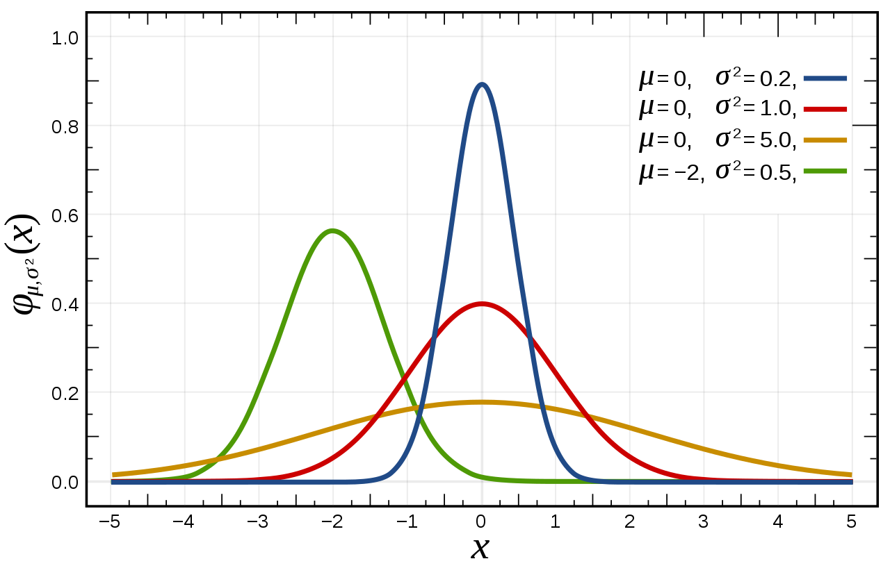

*****************
Genetic Operators
*****************

* Below is a collection of common genetic operators for broad types of representations

    * This is by no means exhaustive
    * Further, it should not be assumed that they are particularly effective
    * They are intended to provide foundational ideas 

* These operators focus on representations for genetic algorithms

    * The motivation for focusing on genetic algorithms is they are quite a general form of evolutionary computation

* Although common genetic operators are presented, being creative and trying to invent new operators is encouraged

Genetic Operators for Binary Representations
============================================

* Binary representations are those that only contain two values, which are typically 0s and 1s

Crossovers
----------

One Point Crossover
^^^^^^^^^^^^^^^^^^^

* Randomly select an index
* Exchange the elements between the chromosomes after that index
* This crossover is not particularly *destructive*

    * The amount in which the information within the chromosomes gets changed is low

* This crossover works well when element adjacency in the chromosome is important

.. figure:: one_point_crossover.png
    :width: 450 px
    :align: center

    Result of applying one point crossover on two chromosomes. This example has index 5 as the randomly selected
    crossover point, thus, all elements after index 5 are exchanged between the parent chromosomes. Although this
    example shows one parent containing only 0s and the other containing only 1s, this is not a requirement;
    the parents could contain both 0s and 1s.

:math:`n` Point Crossover
^^^^^^^^^^^^^^^^^^^^^^^^^

* Randomly select :math:`n` indices
* Exchange the elements between every other pair of indices the indices

    * If an odd number of indices, exchange the elements from the last index to the end

* This is a generalization of one point crossover
* :math:`n=2` is popular (two point crossover)

.. figure:: n_point_crossover.png
    :width: 450 px
    :align: center

    Result of applying :math:`n` point crossover where :math:`n=3`. The randomly selected indices in this example are
    5, 8, and 14. All elements between indices 5 and 8 (exclusively) are exchanged along with all
    the elements from index 14 to the end of the chromosome.

Uniform Crossover
^^^^^^^^^^^^^^^^^

* Select some random number of indices at random
* Exchange the elements at those indices
* Often implemented by giving each index a 50/50 chance to be selected for crossover

* This crossover is relatively *destructive*
* Not particularly effective on chromosomes where element adjacency is important

.. figure:: uniform_crossover.png
    :width: 450 px
    :align: center

    Result of applying uniform crossover where the a total of 8 values were exchanged.

Mutations
---------

Bit Flip Mutation
^^^^^^^^^^^^^^^^^

* Select some number of bits and *flip* them

    * Change 0s to 1s and 1s to 0s

* The number of bits that get flipped is arbitrary

    * Could be hard coded
    * Could be randomly selected each time

* Similar to uniform crossover, but instead of exchanging elements between parents, just change the binary symbol

* As the number of bits that are flipped increases, so does the level of *destruction* this mutation causes

.. figure:: bit_flip_mutation.png
    :width: 450 px
    :align: center

    Result of applying a bit flip mutation to some chromosome. Here, a total of 10 bits were flipped during the
    mutation, which is a rather high number of bits to flip. Although this example shows the parent chromosome
    containing only 1s, this is not a requirement; it could have contained 0s that got changed to 1s.

Genetic Operators for Integer Representations
=============================================

Genetic Operators for Permutation Representations
=================================================

Genetic Operators for Floating Point/Real Number Representations
================================================================

* Floating point/real number representations are those that consist of continuous values

    * They are bound by the computer's ability to represent real numbers as floating point numbers

* There are many complex genetic operators for floating point/real number representations
* Only a few of the relatively simple popular ones are discussed here
* In practice, there are other forms of evolutionary computation that perform better with these representations

Crossovers
----------

* Two broad ideas

    * Discrete --- offspring have values from parents

        * These would be those that were discussed for the binary representation

    * Intermediate --- offing have values *between* the two parents

Single Arithmetic Crossover
^^^^^^^^^^^^^^^^^^^^^^^^^^^

* Randomly select an index
* Average the values between the parents at that index

.. figure:: single_arithmetic_crossover.png
    :width: 550 px
    :align: center

    Result of single arithmetic crossover where the selected index was 7. The values of 0.8 and 0.2 in the two parents
    are replaced with 0.5, the average of the values.

Simple Arithmetic Crossover
^^^^^^^^^^^^^^^^^^^^^^^^^^^

* Similar to single point crossover
* Randomly select an index
* Average the values between the parents after that index

* This crossover can be generalized to an :math:`n` point version

.. figure:: simple_arithmetic_crossover.png
    :width: 550 px
    :align: center

    Result of simple arithmetic crossover where the selected index was 6. All values are averaged between the parents
    from index 6 to the end.

Whole Arithmetic Crossover
^^^^^^^^^^^^^^^^^^^^^^^^^^

* Average the values between the parents across all indices
* This would be a special case of simple arithmetic crossover where the selected index was 0

    Result of whole arithmetic crossover. All values are averaged between the parents.

Mutations
---------

Uniform Mutation
^^^^^^^^^^^^^^^^

* Randomly select an index
* Replace the value at the selected index by a value from a continuous uniform distribution within some range

.. figure:: continuous_uniform_distribution.png
    :width: 400 px
    :align: center
    :target: https://en.wikipedia.org/wiki/Continuous_uniform_distribution

    A continuous uniform distribution of values between :math:`a` and :math:`b`.

Non Uniform Mutation
^^^^^^^^^^^^^^^^^^^^

* Randomly select an index
* Replace the value at the selected index by a value from a continuous normal/Gaussian distribution

    * The mean of the distribution is the original value at the selected index

* This mutation is more likely to make small incremental changes
* This mutation is particularly popular 

    Three continuous normal/Gaussian distribution of values with different mean and variance values. The red curve is a
    "standard" normal distribution.

Self Adapted Mutation
^^^^^^^^^^^^^^^^^^^^^

Genetic Operators for Tree Representations
==========================================

For Next Class
==============

* TBD
