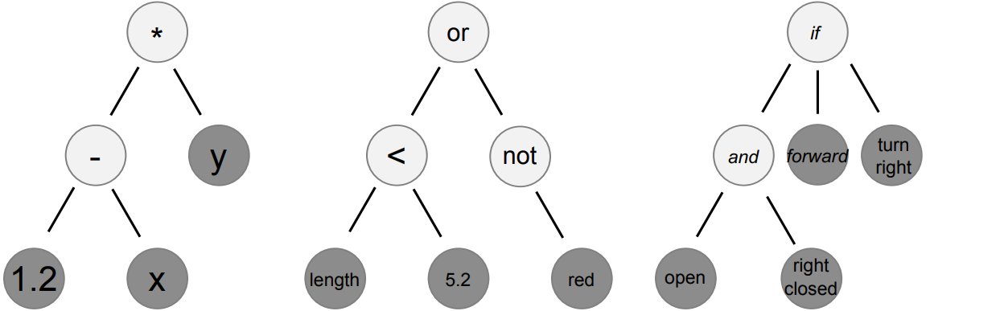
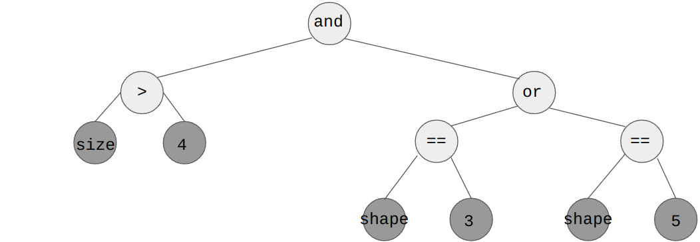
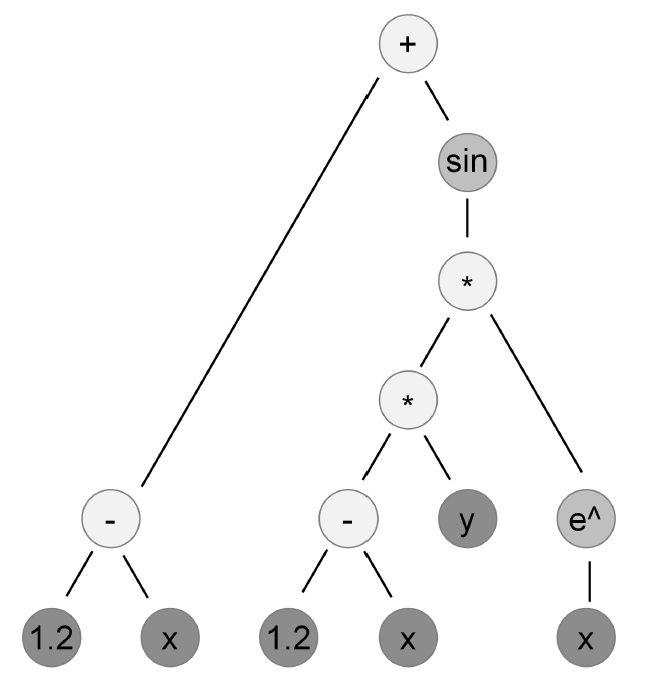
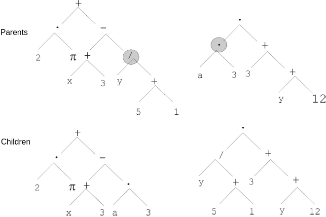
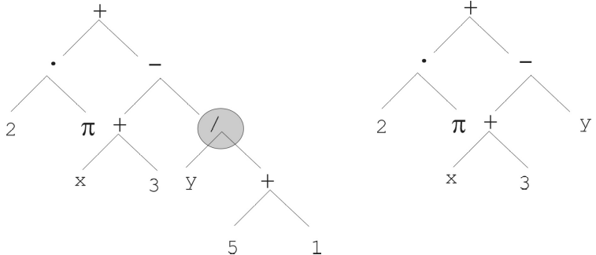

*******************
Genetic Programming
*******************

* Genetic programming is using a genetic algorithm for evolving programs/functions
* The genotype is typically a tree structure representing the program/function phenotype
* Genetic operators that work on the tree encoding are used

* Ultimately, it's a genetic algorithm that searches the space of programs/functions

Example Problem --- Breast Cancer Identification
================================================

* Consider the problem of determining if an individual has breast cancer [#]_

.. list-table:: Observations of Patients Tested for Breast Cancer
    :widths: 25 25 25 25 25 25 25
    :header-rows: 1

    * - ID
      - Thickness
      - Size
      - Shape
      - Bare Nuclei
      - Mitosis
      - Class
    * - 1000025
      - 5
      - 1
      - 1
      - 1
      - 1
      - Benign
    * - 1002945
      - 5
      - 4
      - 4
      - 10
      - 1
      - Benign
    * - 1017122
      - 8
      - 10
      - 10
      - 10
      - 1
      - Malignant
    * - 1018099
      - 1
      - 1
      - 1
      - 10
      - 1
      - Benign
    * - 1041801
      - 5
      - 3
      - 3
      - 3
      - 1
      - Malignant
    * - 1043999
      - 1
      - 1
      - 1
      - 3
      - 1
      - Benign
    * - 1044572
      - 8
      - 7
      - 5
      - 9
      - 4
      - Malignant
    * - ...
      - ...
      - ...
      - ...
      - ...
      - ...
      - ...

* The goal is to build a classifier to determine if a patient has breast cancer based on the observations

* What should the classifier be?

    * ``If size > 4 and (shape == 3 or shape == 5) then malignant else benign``?
    * ``If thickness > 4 and thickness < 9 then malignant else benign``?
    * ``If mitosis == 1 then malignant else benign``?

* It would take careful study and a deep understanding of the problem to build a classifier manually
* However, AI and Machine Learning are often used to automate the process of building a classifier

    * The AI and Machine Learning would try to generalize trends that exists in the observations within the data

* Unfortunately, most evolutionary computation algorithms are not particularly designed to find models like this

    * Often they are used for combinatorial or real number optimization

* This is where genetic programming comes in

    * With the use of a clever representation, genetic programming optimizes programs/functions

Representation
==============

* S-expressions (symbolic expressions) are commonly used as the representation for genetic programming
* S-expressions are used to represent nested instructions and data

* These s-expressions are commonly visualized as tree structures

    Three s-expressions shown as trees representing three different programs/functions. The left tree represents
    the s-expression ``((1.2 - x) * y)``, the centre tree represents ``((length < 5.2) or not(red))``, and the
    right tree represents ``if((open and right_closed)) then(forward) else(turn_right)``. The light coloured nodes
    represent operators while the darker nodes represent operands, both constants and variables.

* Consider the above program/function for the breast cancer identification problem

    * ``If size > 4 and (shape == 3 or shape == 5) then malignant else benign``?

* If ``TRUE`` means malignant and ``FALSE`` benign, the program/function can be written as the following s-expression

    * ``((size > 4) and ((shape == 3) or (shape == 5)))``

* This s-expression can also be represented as the following tree

    The program/function ``If size > 4 and (shape == 3 or shape == 5) then malignant else benign`` represented as a tree
    structure.

Language
--------

* The set of available operators and operands use for creating and modifying the trees is called the *language*
* The operators and operands are something that can be adjusted as needed

* With the breast cancer example, the language could be a collection of arithmatic and boolean operators and operands

    * Operators

        * Binary Operators

            * :math:`+`
            * :math:`-`
            * :math:`\times`
            * :math:`/`
            * :math:`<`
            * :math:`>`
            * :math:`==`
            * and
            * or

        * Unary Operators

            * :math:`sin`
            * :math:`cos`
            * :math:`e`
            * not

    * Operands

        * Constants (e.g. :math:`4`, True, False)
        * Variables (e.g. size and shape)

    S-expression for the mathematical expression :math:`(1.2 - x) + sin((1.2 - x) \times y \times e^{x})`. This tree
    contains arithmatic operators and operands (constants and variables).

* When working with mathematical expressions, the language could be a collection of arithmatic operators and operands

    * Like the numerical operators and operands discussed above

Types vs. Untyped
-----------------

* Notice that the mathematical expression example above only worked with numerical values

    * All the operators acted on numbers
    * All the operands, either constant or variable, would be numbers

* However, the breast cancer example had multiple different types available

    * Some operators act on numbers to produce a number (e.g. :math:`+`)
    * Some operators act on numbers to produce a boolean (e.g. :math:`<`)
    * Some operators act on booleans to produce a boolean (e.g. and)
    * The operands may be either numbers or booleans

* When using a language with only one type, like the mathematical expression, it is called *untyped* genetic programming
* When using a language that has more than one type, it is called *typed* genetic programming

* There is added complexity when working with typed genetic programming since the s-expressions must be admissible
* Generating an s-expression that applies an operator to the wrong type would be a problem

    * For example, ``(shape == 4) + 7`` is an inadmissible statement

* With untyped genetic programming, this will not be a problem
* Fortunately, most modern genetic programming systems will manage this complexity

Typical Genetic Programming Setup
=================================

* A genetic programming algorithm is setup very similar to an ordinary genetic algorithm

    * Initialize a population
    * Evaluation
    * Selection
    * Genetic Operators
    * Termination

* The key differences are around the tree representation
* For example, the genetic operators must work with the trees

    One point crossover on a tree structure. The two randomly selected subtrees are exchanged.

    One point mutation on a tree structure. A randomly selected node in the tree is replaced with a randomly generated
    subtree. In this example, the subtree was replaced with a variable, but it could be been a more complex subtree.

* Typically, for genetic programming, mutation rates are kept very low (less than 5%)

    * But ultimately, the value to use is a value that works well

* Populations are also typically very large

Bloat
=====

* With genetic programming, during evolution, the average number of nodes in the trees increase quickly
* And it is common that this happens with no significant improvement in fitness
* This is problematic since

    * The trees take up more space
    * They take longer to evaluate
    * They tend to overfit and generalize poorly
    * The trees are difficult to interpret
    * The variation operators become less effective

* There are three explanations for this phenomenon

#. Replication accuracy theory

    * Parents are selected for having a good fitness
    * Children with a function similar to their parents will also be relatively good
    * Larger trees are functionally impacted less by genetic operators
    * Thus, large and bloated trees are more likely to be similar to their parents

#. Removal bias theory

    * Useless subtrees with no meaningful function may exist within the tree
    * With larger trees, there is a higher chance to have useless subtrees
    * Applying genetic operators to useless subtrees has no impact on the fitness of the chromosome

    .. figure:: removal_bias_theory.png
        :width: 200 px
        :align: center

        A tree that always evaluates to true, regardless of what is contained within the left subtree, which may be
        arbitrarily large.

    .. note::

        In evolutionary computation, "useless" information may not be useless over the course of evolution. This
        *vestigial* information within the chromosome may have been useful at some time, but became not represented in
        the phenotype.

        It is also possible that this information reemerges as useful. For example, consider some subtree within the
        "useless" subtree in the above figure. Although it may not be expressed in the phenotype of this tree, it may
        end up expressed in some other tree's phenotype via crossover.

#. Nature of program space theory

    * With a fixed language, there are more larger programs
    * The number of larger programs with a given function is greater than the number of short programs with the same function

    .. figure:: nature_of_program_space_theory.png
        :width: 333 px
        :align: center

        A tree with seven nodes that evaluates to 4. Consider the number of trees of size one that would also return 4
        and then consider the number of trees of size three that would return 4.

* Like everything, there is no *right* answer, but there are popular strategies to manage bloat

    * Set tree depth limits
    * Set tree node limits
    * Set special genetic operator rules
    * Add tree size to part of the fitness measure of the chromosomes

For Next Class
==============

* `Read up on DEAP <https://deap.readthedocs.io/en/master/>`_

    * It is an evolutionary computation system/framework

* `Have a look at DEAP's API <https://deap.readthedocs.io/en/master/api/>`_

----------------------

.. [#] `Data based on data from the UCI Machine Learning Repository <http://archive.ics.uci.edu/dataset/15/breast+cancer+wisconsin+original>`_
