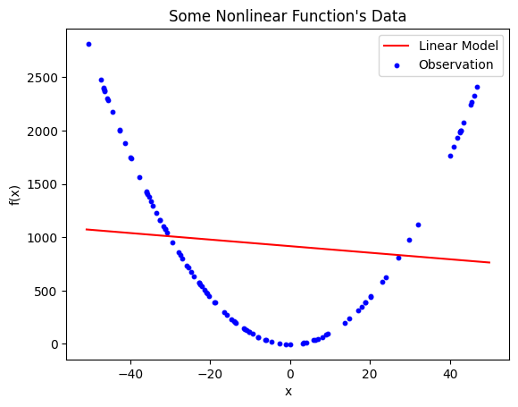
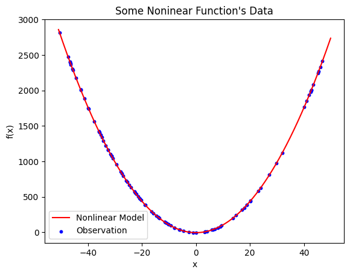

********************************************
Symbolic Regression with Genetic Programming
********************************************

* The purpose of this topic is to perform symbolic regression with genetic programming
* The genetic programming system being used is DEAP (Distributed Evolutionary Algorithms in Python)
* Much of the heavy lifting required to implement a genetic programming algorithm is managed by DEAP

Problem --- Regression Analysis
===============================

* Regression is finding the relationships between dependent and independent variables given some observations
* A common and simple form of regression is *linear regression*

    * Find a *linear* relationship between some dependent and independent variables

.. figure:: regression_linear_data.png
    :width: 500 px
    :align: center

    Observations of some phenomenon plotted in two dimensions. The dependent variable is plotted along the y-axis and
    the independent variable is along the x-axis. From a quick glance, this data clearly has some linear relationship.

* Given the above observations, the goal is to draw a *line of best fit*

    * Which should look a lot like :math:`y = mx + b`

* The mathematics behind finding this line is interesting, but outside the scope of this course
* `Fortunately, scikit-learn provides a way to find this line <https://scikit-learn.org/stable/modules/generated/sklearn.linear_model.LinearRegression.html>`_

.. figure:: regression_linear_data_linear_model.png
    :width: 500 px
    :align: center

    Linear model plotted on top of the observations. The resulting model is :math:`\hat{y} = 0.999885x + 0.997937` and
    has an :math:`R^{2}` value of :math:`0.9999885`.

* The linearly regressed model for the above observations is :math:`\hat{y} = 0.999885x + 0.997937`

    * Note that :math:`\hat{y}` denotes that it is not :math:`y`, but only a prediction/estimation of :math:`y`

* This particular model has an :math:`R^{2}` of :math:`0.9999885`

    * This is a measure of *goodness*
    * The closer to 1.0, the better the fit

Linear Regression on Nonlinear Relationships
--------------------------------------------

* With linear regression, trouble arises when the observed data has nonlinear relationships
* It is still possible to find a high-quality model, but it would require several assumptions and a lot of guesswork

.. figure:: regression_nonlinear_data.png
    :width: 500 px
    :align: center

    Observed data with clear nonlinear relationships. The data appears to be parabolic or hyperbolic, but may be neither
    depending on which segment of the function was observed. It is not possible to effectively fit a straight line to
    describe the relationship between the dependent and independent variable.

* Nevertheless, looking for a linear model for such nonlinear data is doomed to fail

    Linear model generated with linear regression on the nonlinear data. The resulting model is
    :math:`\hat{y} = -3.070395x + 916.550675`, which has an :math:`R^{2} = 0.010924`. Although this is the best possible
    straight line that fits this data, it is clear that it is not effectively fitting the data due to the limitation of
    the modelling strategy.

Symbolic Regression
-------------------

* An alternative strategy is something called *symbolic regression*
* It is a form of regression analysis that requires fewer assumptions and works with nonlinear data

* By using symbolic regression, the underlying nonlinear relationships may be found

    Nonlinear model found with symbolic regression. The model is :math:`\hat{y} = 1.100511x^{2} - 4.439578` and has
    a mean squared error of :math:`0.162087`.

* It is clear that :math:`\hat{y} = 1.100511x^{2} - 4.439578` effectively describes the relationships in the data
* The *mean squared error* is :math:`0.162087`

    * This is not the same as :math:`R^{2}`
    * With mean squared error, a value closer to 0.0 is better

.. note::

    In reality, symbolic regression produced ``add(add(protected_divide(mul(x, x), 9.949161), mul(x, x)), -4.439578)``,
    which was simplified to :math:`\hat{y} = 1.100511x^{2} - 4.439578`.

DEAP
====

* Due to the complexity, it is not common to implement genetic programming from scratch
* Instead, a genetic programming system will be used, which does much of the heavy lifting for the user
* Many systems exist in various programming languages

* `DEAP is a framework for evolutionary computation algorithms in Python <https://deap.readthedocs.io/en/master/>`_

    * Distributed Evolutionary Algorithms in Python --- DEAP
    * It's a package for implementing evolutionary computation algorithms

* DEAP is not only for genetic programming, but many evolutionary computation algorithms
* It includes algorithm and tools for implementing multiple types of algorithms, enhancements, and analysis

* Although any genetic program could be used, DEAP will be used here

    * `The GitHub page is available here <https://github.com/deap/deap>`_
    * It is encouraged to contribute to the repository if possible

* It is strongly recommended to have a look at DEAP's documentation

    * `It includes a description of genetic programming with DEAP <https://deap.readthedocs.io/en/master/tutorials/advanced/gp.html>`_
    * `It also has a guided tutorial on how to perform symbolic regression with DEAP <https://deap.readthedocs.io/en/master/examples/gp_symbreg.html>`_
    * `Further, additional and more advanced tutorials can be found here <https://github.com/DEAP/deap/tree/master/examples/gp>`_

Data
====

* The data being used will be tabular

    * Rows of observations
    * Columns of variables

* Below is an example of how the data would look

.. list-table:: Arbitrary Example Data for Regression Analysis
    :widths: 25 25 25
    :header-rows: 1

    * - ARG1 (:math:`X_1`)
      - ARG2 (:math:`X_2`)
      - ARG3 (:math:`y`)

    * - -3.16833493e+01
      - 3.63253949e+01
      - -5.75550374e+02

    * - -3.59771849e+01
      - 1.63633781e+01
      - -2.94238014e+02

    * - 4.35235243e+01
      - -1.54189209e+01
      - -3.35451435e+02

    * - 4.19705508e+01
      - 1.25491733e+01
      - 2.63416737e+02

    * - ...
      - ...
      - ...

* For this example, the data is provided in CSV files
* The data is formatted such that the last column is always the dependant variable

    * Thus, all proceeding columns are independent variables

* This data was generated by some phenomenon
* The goal is to find a model that effectively describes the relationships between the data
* Loading this data can be done as follows

.. literalinclude:: /../src/gp_symbolic_regression.py
    :language: python
    :lineno-match:
    :start-after: # [begin-data]
    :end-before: # [end-data]

* The above code loads the data specified in some constants
* The independent variables will be stored in a two dimensional list

    * Rows are observations
    * Columns are different independent variables

* The dependent variable is stored in a one dimensional list

    * Each value corresponds to the independent variables at the same index

* Following the example data in the above table, the values would be stored as follows

.. code-block:: python

    independent_variables = [[-3.16833493e+01, 3.63253949e+01],
                            [-3.59771849e+01, 1.63633781e+01],
                            [4.35235243e+01, -1.54189209e+01],
                            [4.19705508e+01, 1.25491733e+01],
                            ... ]

    dependant_variable = [-5.75550374e+02, -2.94238014e+02, -3.35451435e+02, 2.63416737e+02, ...]

Evaluation
==========

* A common mechanism for evaluating genetic programming performing symbolic regression is *mean squared error*

    * :math:`\frac{1}{n}\sum_{i}^{n}(y_{i} - \hat{y_{i}})^{2}`

* A mean squared error of zero is perfect

* Any metric could be used, but mean squared error is very popular
* One of the reasons it is used is because it *punishes* bigger errors more

    * If the difference between the observed and estimated value is 1, the squared error is 1
    * If the difference is 2, the error is 4
    * If it's 3, the error is 9
    * ...
    * In other words, it's much worse to be very wrong than it is to be a little wrong

.. literalinclude:: /../src/gp_symbolic_regression.py
    :language: python
    :lineno-match:
    :pyobject: mean_squared_error

Language
========

* With symbolic regression, genetic programming will be searching the space of mathematical expressions
* This includes both the operators and operands
* The language is the set of operators and operands that the genetic programming system can use in the search
* The trouble is, it's not always clear which operators and operands should be included
* Thus, the design of the language may need to be tuned for evolution like other hyperparameters

* Fortunately, with symbolic regression, there is a common set to start with

    * Typical arithmatic operators
    * Maybe some trigonometry functions
    * Maybe logarithm and exponentials or even natural log and Euler's number

* However, there is a potential problem with divide as the evolutionary search may try to divide by zero
* For this reason, it is common to see a *protected divide* used instead

    * If attempting to divide by zero, return infinity

.. literalinclude:: /../src/gp_symbolic_regression.py
    :language: python
    :lineno-match:
    :pyobject: protected_divide

* Setting up the language with DEAP is then done like below

.. literalinclude:: /../src/gp_symbolic_regression.py
    :language: python
    :lineno-match:
    :start-after: # [begin-language]
    :end-before: # [end-language]

* The first line, creating the ``PrimitiveSet`` object, is where the language operators and operands will be added

    * It also specifies the number of independent variables the function will have as the second argument
    * As discussed above, the independent variables are stored in some list called ``independent_variables``

* Each operator is added to the primitive set object along with the number of operands that operator requires

    * The operator is the first argument, and is passed as a function
    * Most of the added operators in this example are taken from the ``operator`` library
    * The protected divide, described above, is also added
    * The ``neg`` operator is the negation (multiply by -1) and only requires one operand

* Finally, the constant values are added with ``addEphemeralConstant``

    * In this example, integers between -10 and 10 are eligible

.. warning::

    There is no guarantee or suggestion that this is a *good* language, but it is at least a reasonable place to start.

DEAP Setup
==========

* Below is an example of a setup for a DEAP algorithm
* It effectively defines what each part of the algorithm will be

.. literalinclude:: /../src/gp_symbolic_regression.py
    :language: python
    :lineno-match:
    :start-after: # [begin-setting-hyperparameters]
    :end-before: # [end-setting-hyperparameters]

* This code

    * Sets the problem to be a minimization problem
    * Says how the individuals (chromosomes) will be encoded
    * Defines how the individuals and population will be generated
    * It defines the evaluation metric

        * Note that ``mean_squared_error_fitness`` is not the function described above
        * More on this below

    * It also sets the selection strategy and genetic operators

* DEAP requires that the fitness function return a tuple of results
* However, the above ``mean_squared_error`` function returns only a single value
* Thus, another function, ``mean_squared_error_fitness``, is created that calls ``mean_squared_error``
* This function also

    * Checks if exceptions should be thrown
    * *Compiles* the trees into something that can be functionally evaluated
    * Wraps the mean squared error in a tuple to be returned

.. literalinclude:: /../src/gp_symbolic_regression.py
    :language: python
    :lineno-match:
    :pyobject: mean_squared_error_fitness

Bloat Control
-------------

* As mentioned in the previous topic, genetic programming suffers from *bloat*

    * The trees tend to grow larger with no improvement in fitness
    * This negatively impacts the algorithm's performance

* DEAP provides simple ways to control bloat

.. literalinclude:: /../src/gp_symbolic_regression.py
    :language: python
    :lineno-match:
    :start-after: # [begin-bloat-control]
    :end-before: # [end-bloat-control]

* The above sets limits on how deep and how many nodes a tree may have after a genetic operator is applied
* These values may need to be adjusted to improve performance

    * If they are allowed to get too big, the search may take too long
    * If they are not allowed to get big enough, it may not be possible to model the data

Bookkeeping
-----------

.. literalinclude:: /../src/gp_symbolic_regression.py
    :language: python
    :lineno-match:
    :start-after: # [begin-bookkeeping]
    :end-before: # [end-bookkeeping]

Running and Results
===================

For Next Class
==============

* Check out the following script

    * :download:`Symbolic Regression with Genetic Programming </../src/gp_symbolic_regression.py>`

* `Read DEAP's sample symbolic regression implementation <https://deap.readthedocs.io/en/master/tutorials/advanced/gp.html>`_
* `Read through DEAP's various genetic programming examples <https://deap.readthedocs.io/en/master/examples/index.html#genetic-programming-gp>`_

