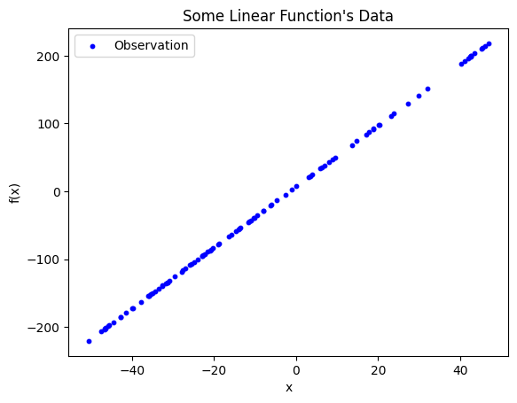
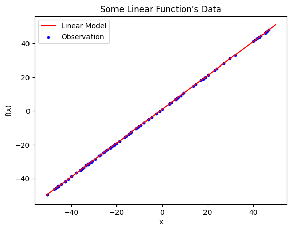
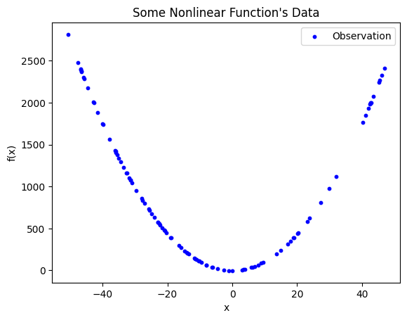

********************************************
Symbolic Regression with Genetic Programming
********************************************

* The purpose of this topic is to perform symbolic regression with genetic programming
* The genetic programming system being used is DEAP (Distributed Evolutionary Algorithms in Python)
* Much of the heavy lifting required to implement a genetic programming algorithm is managed by DEAP

Problem --- Regression Analysis
===============================

* Regression is finding the relationships between dependent and independent variables given some observations
* A common and simple form of regression is *linear regression*

    * Find a *linear* relationship between some dependent and independent variables

    Observations of some phenomenon plotted in two dimensions. The dependent variable is plotted along the y-axis and
    the independent variable is along the x-axis. From a quick glance, this data clearly has some linear relationship.

* Given the above observations, the goal is to draw a *line of best fit*

    * Which should look a lot like :math:`y = mx + b`

* The mathematics behind finding this line is interesting, but outside the scope of this course
* `Fortunately, scikit-learn provides an easy way to find this line <https://scikit-learn.org/stable/modules/generated/sklearn.linear_model.LinearRegression.html>`_

    Linear model plotted on top of the observations. The resulting model is :math:`\hat{y} = 0.999885x + 0.997937` and
    has an :math:`R^{2}` value of :math:`0.9999885`.

* The linearly regressed model for the above observations is :math:`\hat{y} = 0.999885x + 0.997937`

    * Note that :math:`\hat{y}` denotes that it is not :math:`y`, but only a prediction of :math:`y`

* This particular model has an :math:`R^{2}` of :math:`0.9999885`

    * This is a measure of *goodness*
    * The closer to 1.0, the better the fit

Linear Regression on Nonlinear Relationships
--------------------------------------------

* With linear regression, trouble arises when the observed data has nonlinear relationships

    Observed data with clear nonlinear relationships. The data appears to be parabolic or hyperbolic, but may be neither
    depending on which segment of the function was observed. It is not possible to effectively fit a straight line to
    describe the relationship between the dependent and independent variable.

Nonliear
0.010924289363573592 (R^2)
[-3.07039458]
916.5506746535088

SR
0.16208662410178923 MSE

1.10051099017284868*X**2 -4.4395784214070755
add(add(protected_divide(mul(ARG0, ARG0), 9.949160766203782), mul(ARG0, ARG0)), -4.4395784214070755)

DEAP
====

Language
========

DEAP Setup
==========

Bloat Control
-------------

Bookkeeping
-----------

Running and Results
===================

For Next Class
==============

* Check out the following script

    * :download:`Symbolic Regression with Genetic Programming </../src/gp_symbolic_regression.py>`

* `Read DEAP's sample symbolic regression implementation <https://deap.readthedocs.io/en/master/tutorials/advanced/gp.html>`_
* `Read through DEAP's various genetic programming examples <https://deap.readthedocs.io/en/master/examples/index.html#genetic-programming-gp>`_

