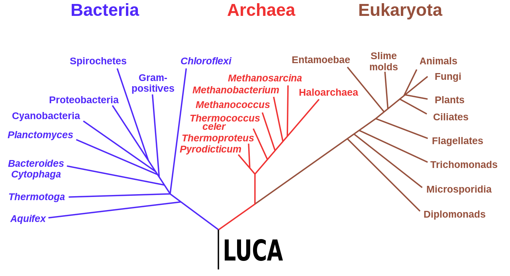

******
Origin
******

* Evolutionary computation is inspired by the natural process of evolution
* However, although it uses jargon from biological evolution, it is important to not focus too much on living organisms

Inspiration from Biology
========================

    Phylogenetic tree of three life domains: Bacteria, Archaea, and Eukaryota. The root of the tree is the "Last
    Universal Common Ancestor" (LUCA).

* The power of biological evolution is evident by the diversity of the living things on Earth
* Environments are filled with *populations* of individuals that strive for persistence

    * Survival
    * Reproduction

* The *fitness* of an individual is a measure of its ability to persist
* The fitness is determined by the individual's interactions with the environment and other individuals

    * Other individuals are often thought of as part of the environment

* With evolutionary computation, populations of *candidate solutions* are evolved
* The fitness of the candidate solution is a measure of how *good* it is at addressing the problem at hand
* The candidate solutions' fitness dictates its probability of survival and reproduction

* persistence is important... somewhere say this

* Population, but think system

* Systems

* Get more general
* Cellular automata (rule 30)

    * https://www.wolframalpha.com/input?i=rule+0

* Game of life

    * http://www.cuug.ab.ca/dewara/life/life.html

* Turing Complete

    * https://nicholas.carlini.com/writing/2020/digital-logic-game-of-life.html

* Game of life in Game of life

    * There exists a configuration...

* Particles interacting

For Next Class
==============

* TBD
