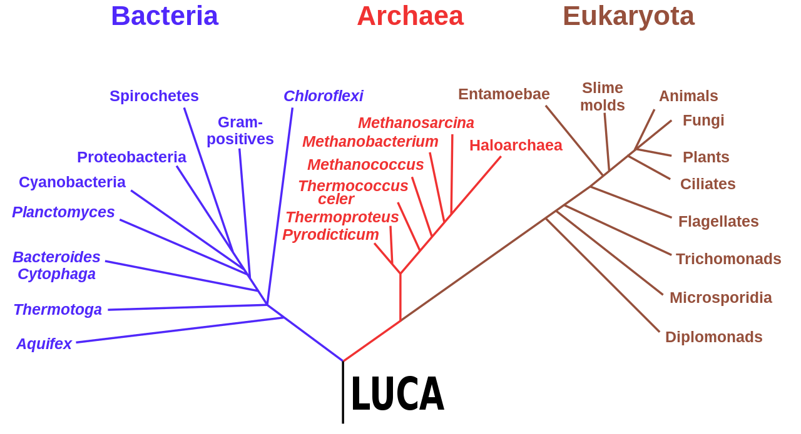

******
Origin
******

* Evolutionary computation is inspired by the natural process of evolution
* However, although it uses jargon from biological evolution, it is important to not focus too much on living organisms

Inspiration from Biology
========================

    Phylogenetic tree of three life domains: Bacteria, Archaea, and Eukaryota. The root of the tree is the "Last
    Universal Common Ancestor" (LUCA).

* The power of biological evolution is evident by the diversity of the living things on Earth
* Environments are filled with *populations* of individuals that strive for persistence

    * Survival
    * Reproduction

* The *fitness* of an individual is a measure of its ability to persist
* The fitness is determined by the individual's interactions with the environment and other individuals

    * Other individuals are often thought of as part of the environment

* With evolutionary computation, populations of *candidate solutions* are evolved
* The fitness of the candidate solution is a measure of how *good* it is at addressing the problem at hand
* The candidate solutions' fitness dictates its probability of survival and reproduction

Diversity
---------

* Reproduction creates imperfect copies of individuals
* Sexual reproduction incorporates genetic information from both parents
* Mutations occur in both sexual and asexual reproductions

* Sometimes these changes are harmful
* Sometimes these changes are neutral
* Sometimes these changes are beneficial

Competition
-----------

* Given that

    * Environments have limited resources
    * Individuals often have an intrinsic interest in persisting

* Competition and selection becomes inevitable
* Natural selection favours individuals that compete more effectively

Individual vs. Population
-------------------------

* The ideas of diversity and competition exist within the *population*
* It is often helpful to think of the population evolving instead of the individuals themselves
* Having a balance of competition and diversity is important for populations

    * Having too much competition often lowers diversity
    * Having too little competition can increase diversity
    * Having too much diversity may stagnate specialization
    * Having too little diversity can limit a population's ability to adapt to changes

Systems
=======

The Invisible Hand
==================

For Next Class
==============

* TBD
