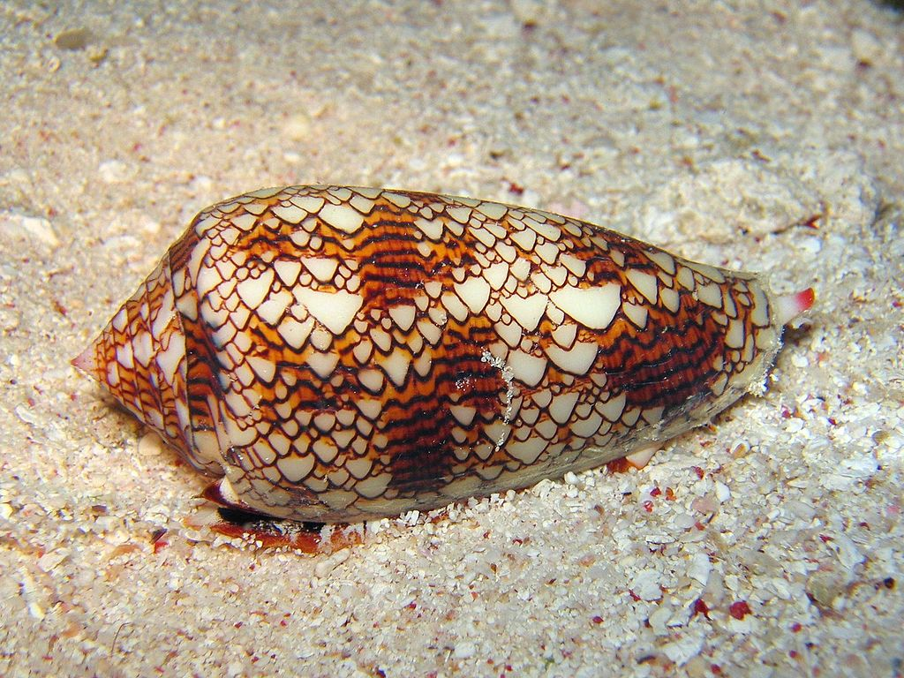

******
Origin
******

* Evolutionary computation is inspired by the natural process of evolution
* However, although it uses jargon from biological evolution, it is important to not focus too much on living organisms

Inspiration from Biology
========================

    Phylogenetic tree of three life domains: Bacteria, Archaea, and Eukaryota. The root of the tree is the "Last
    Universal Common Ancestor" (LUCA).

* The power of biological evolution is evident by the diversity of the living things on Earth
* Environments are filled with *populations* of individuals that strive for persistence

    * Survival
    * Reproduction

* The *fitness* of an individual is a measure of its ability to persist
* The fitness is determined by the individual's interactions with the environment and other individuals

    * Other individuals are often thought of as part of the environment

* With evolutionary computation, populations of *candidate solutions* are evolved
* The fitness of the candidate solution is a measure of how *good* it is at addressing the problem at hand
* The candidate solutions' fitness dictates its probability of survival and reproduction

Diversity
---------

* Reproduction creates imperfect copies of individuals
* Sexual reproduction incorporates genetic information from both parents
* Mutations occur in both sexual and asexual reproductions

* Sometimes these changes are harmful
* Sometimes these changes are neutral
* Sometimes these changes are beneficial

Competition
-----------

* Given that

    * Environments have limited resources
    * Individuals often have an intrinsic interest in persisting

* Competition and selection becomes inevitable
* Natural selection favours individuals that compete more effectively

Individual vs. Population
-------------------------

* The ideas of diversity and competition exist within the *population*
* It is often helpful to think of the population evolving instead of the individuals themselves
* Having a balance of competition and diversity is important for populations

    * Having too much competition often lowers diversity
    * Having too little diversity can limit a population's ability to adapt to changes
    * Having too little competition can increase diversity
    * Having too much diversity may stagnate specialization

Systems
=======

* Populations of living things evolve
* But a population of living things is just some system
* And a system exists within some environment, which is a system
* And the population is made up individuals, which are themselves systems
* Each individual is made up of many more systems
* Each of those smaller systems are made up of more systems
* ...

.. figure:: turtles_turtles.png
    :width: 250 px
    :align: center
    :target: https://en.wikipedia.org/wiki/Turtles_all_the_way_down

    It's turtles all the way down.

* Systems can evolve, not just biological systems
* It really only needs mechanisms for persisting and changing

* Systems evolve as a consequence of it's relationship with it's environment

    * Sometimes the environment has some intention behind it
    * Sometimes it's aimless

Cellular Automate
-----------------

* An elementary cellular automata is a very simple system of rules

    * Given a one-dimensional (linear) sequence of binary values (cells)
    * Create the sequence's next *generation* based on each cell's current state and state of its neighbours

.. figure:: rule_30.gif
    :width: 500 px
    :align: center
    :target: https://en.wikipedia.org/wiki/Elementary_cellular_automaton

    Example of rule 30 being applied to some arbitrary sequence.

* Since each cell's value is determined by three cells' previous state, there are a total of eight (8) patterns

    * Three since it's based on the current cell and its neighbours

* Each of the eight patterns can produce either a 0 or a 1, meaning there are a total of 256 possible rules
* The above rule is named "Rule 30" since :math:`00011110` is the pattern, which has a decimal value of 30

* By repeatedly applying these very simple rules to each new sequence, interesting and complex patterns may emerge

    Example of Rule 22 being applied 200 times. This was created with the initial condition of a single cell being
    active.

#.  Visit `Wolfram Alpha <https://www.wolframalpha.com/input?i=rule+0>`_ and create the patterns for some rules

    * The above link is the result of running Rule 0

#. Take the time to generate the patterns for a few dozen rules and keep track of the most interesting ones found
#. What makes the patterns interesting?

    A conus textile, a small venomous sea snail. The shell of the snail has a naturally occurring interesting pattern.

The Invisible Hand
==================

For Next Class
==============

* TBD
