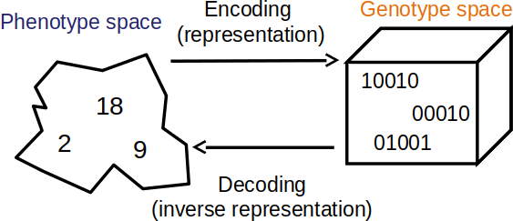
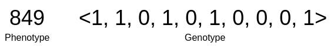

********
Overview
********

Types of Evolutionary Algorithms
================================

Components
==========

* Evolutionary computation algorithms are remarkably modular so they can have as many components as desired
* The *core* components are discussed below at a high-level

Representation
--------------

* The representation is how the problem is encoded
* The **genotype** is the encoding
* The **phenotype** is what the encoding means in the context of the problem

    Visualization of the genotype and phenotype spaces. In this example, the phenotype space consists of integers while
    the genotype space encodes integers as unsigned binary numbers.

* Candidate solution, phenotype, and individual are words used to describe a possible solution to a problem
* Genotype and chromosome are words used to describe an encoding of a possible solution to a problem

    * However, chromosomes are themselves candidate solutions
    * "Candidate solution" is often used as a catch-all term

* Locus, position, gene, and allele are words used to describe a part of the chromosome

    * Although, this jargon is not commonly used in practice

    Example phenotype and genotype for the unsigned binary number maximization problem discussed previously. The
    Phenotype is the actual integer and the genotype is the binary string. Here, the binary string is shown as a vector.
    An locus/position/gene/allele would be a single value within the vector (genotype).

* It is often ideal to ensure all possible valid solutions can be represented in the genotype space
* Constraining the search space by eliminating inadmissible solutions can greatly improve performance

* What the encoding for a given problem should is is not always obvious
* A clever encoding can drastically improve the results of the algorithm
* These ideas are discussed further in a future topic

Fitness and Fitness Function
----------------------------

* The fitness is the measure of how *good* a given candidate solution is
* The fitness function is a mechanism for measuring a given candidate solution's *goodness*

* This is what the population is trying to adapt to

* What the fitness function should be is not always straightforward

    * Like representation, the choice of fitness function can drastically impact the performance of the algorithm

* Consider the unsigned binary number problem discussed in a previous topic
* Two different fitness functions were used

    #. The actual integer value of the unsigned binary number
    #. The number of ones in the unsigned binary number

* Although both fitness functions worked on the same representation, the fitness function impacted the performance

    * It altered how the population traversed the genotype space

Population
----------

* A population is a collection of chromosomes

    * A multiset

* Each chromosome would have a fitness value associated with it

* The population typically has a fixed size, which is the limited resource for the candidate solutions to compete for
* Over time, the population's average fitness should improve
* Diversity is a measure of how different the candidate solutions are within the population

* It is often helpful to think of the population evolving rather than individual candidate solutions

    Example population for the unsigned binary number maximization problem discussed previously. The population is a
    collection of chromosomes.

Selection
---------

* Selection is a mechanism for selecting candidate solutions for reproduction and/or entering to the next generation
* Selection is stochastic, but probabilistic

    * More fit candidate solutions have a higher chance to be selected

* There are many ways to perform selection, but two popular strategies are:

    * Roulette Wheel
    * Tournament

* These strategies will be discussed further in a later topic

Generational vs. Steady State
^^^^^^^^^^^^^^^^^^^^^^^^^^^^^

* There are two popular strategies for running the evolutionary computation algorithms

    * Generational
    * Steady State

* Generational will have discrete generations where selection occurs to fill a whole new population for each generation

    * The previously discussed unsigned binary number maximization problem's GA was generational

* Steady state does not have discrete generations
* Instead, these operate continuously on the same single population
* They select candidate solutions for reproduction *and* selects candidates for replacement
* The offspring will replace the candidate solutions selected for replacement

.. figure:: ../representation/steady_state.png
    :width: 500 px
    :align: center

    Example of a round of selection occurring in a steady state evolutionary algorithm. The list represents a population
    and the individual letters represent individual chromosomes. Here, chromosomes B and E (green) are selected for
    reproduction and chromosomes E and I (red) are selected for replacement. The offspring chromosomes of B and E,
    denoted as X and Y (blue), replace E and I within the same population.

Genetic Operators
-----------------

Examples
========

Typical Behaviour
=================

Final Notes
===========

For Next Class
==============

* TBD