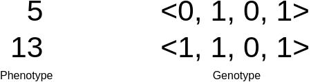
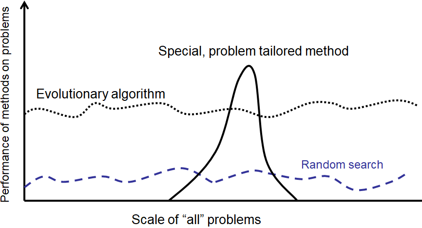

********
Overview
********

* Given a population of individuals within an environment with limited resources
* Competition for those resources occurs
* This competition causes natural selection
* This causes the overall fitness of the population to rise

    * An evolutionary "arms race"

* In the context of Evolutionary Computation (EC)

    * Given some problem and a mechanism for measuring solution quality

        * The problem is the environment

    * Generate a fixed size population of solutions to the problem

        * The fixed sized population is the limited resource

    * Apply the quality measure to the solutions
    * More fit solutions reproduce to fill the next generation's population

        * More fit individuals compete better

.. figure:: ../intro/ec_idea.png
    :width: 500 px
    :align: center

    High-level idea of most evolutionary computation algorithms.

* There are two big forces at play

    #. Variation

        * Genetic operators like mutation and crossover
        * Increases population diversity
        * Pushes the population towards novelty

    #. Selection

        * Surviving within the population
        * Decreases population diversity
        * Pushes the population towards quality

Types of Evolutionary Computation
=================================

* Given how flexible the framework of EC is, there is a large and growing list of *types*
* Their differences often come down to specific details, their encodings, and types of problems they are designed for
* But they are all population-based iterative processes with selection and variation mechanisms

* Common popular EC algorithms are

    * Genetic Algorithms

        * Typically have a string or array/list encoding

    * Evolutionary Strategies

        * Works well with real numbers

    * Differential Evolution

        * Works well with real numbers
        * Does not use a gradient/problem does not need to be differentiable

    * Particle Swarm Optimization

        * Works well with real numbers

    * Evolutionary Programming

        * Evolves finite state machines

    * Genetic Programming

        * Evolves *programs*
        * Typically encoded as a tree structure

Components
==========

* Evolutionary computation algorithms are remarkably modular so they can have as many components as desired
* The *core* components are discussed below at a high-level

Representation
--------------

* The representation is how the problem is encoded
* The **genotype** is the encoding
* The **phenotype** is what the encoding means in the context of the problem

.. figure:: ../representation/genotype_phenotype_space.png
    :width: 500 px
    :align: center

    Visualization of the genotype and phenotype spaces. In this example, the phenotype space consists of integers while
    the genotype space encodes integers as unsigned binary numbers.

* Candidate solution, phenotype, and individual are words used to describe a possible solution to a problem
* Genotype and chromosome are words used to describe an encoding of a possible solution to a problem

    * However, chromosomes are themselves candidate solutions
    * "Candidate solution" is often used as a catch-all term

* Locus, position, gene, and allele are words used to describe a part of the chromosome

    * Although, this jargon is not commonly used in practice

    Two phenotypes and genotypes for the unsigned binary number maximization problem discussed previously. In this
    example, the binary number being maximized is 4 bits. The phenotype is the actual integer and the genotype is the
    binary string. Here, the binary string is shown as a vector. An locus/position/gene/allele would be a single value
    within the vector (genotype).

* It is often ideal to ensure all possible valid solutions can be represented in the genotype space
* Constraining the search space by eliminating inadmissible solutions can greatly improve performance

* What the encoding for a given problem should is is not always obvious
* A clever encoding can drastically improve the results of the algorithm
* These ideas are discussed further in a future topic

Fitness and Fitness Function
----------------------------

* The fitness is the measure of how *good* a given candidate solution is
* The fitness function is a mechanism for measuring a given candidate solution's *goodness*

* This is what the population is trying to adapt to

* What the fitness function should be is not always straightforward

    * Like representation, the choice of fitness function can drastically impact the performance of the algorithm

* Consider the unsigned binary number problem discussed in a previous topic
* Two different fitness functions were used

    #. The actual integer value of the unsigned binary number
    #. The number of ones in the unsigned binary number

* Although both fitness functions worked on the same representation, the fitness function impacted the performance

    * It altered how the population traversed the genotype space

Population
----------

* A population is a collection of chromosomes
* Each chromosome would have a fitness value associated with it

* The population typically has a fixed size, which is the limited resource for the candidate solutions to compete for
* Over time, the population's average fitness should improve
* Diversity is a measure of how different the candidate solutions are within the population

* It is often helpful to think of the population evolving rather than individual candidate solutions

    Population for the unsigned binary number maximization problem discussed previously. In this example, the binary
    number being maximized is 10 bits. The population is a collection of chromosomes.

Selection
---------

* Selection is a mechanism for selecting candidate solutions for reproduction and/or entering to the next generation
* Selection is stochastic, but probabilistic

    * More fit candidate solutions have a higher chance to be selected

* There are many ways to perform selection, but two popular strategies are:

    * Roulette Wheel
    * Tournament

* These strategies will be discussed further in a later topic

Generational vs. Steady State
^^^^^^^^^^^^^^^^^^^^^^^^^^^^^

* There are two popular strategies for running the evolutionary computation algorithms

    * Generational
    * Steady State

* Generational will have discrete generations where selection occurs to fill a whole new population for each generation

    * The previously discussed unsigned binary number maximization problem's GA was generational

* Steady state does not have discrete generations
* Instead, these operate continuously on the same single population
* They select candidate solutions for reproduction *and* selects candidates for replacement
* The offspring will replace the candidate solutions selected for replacement

    Example of a round of selection occurring in a steady state evolutionary algorithm. The list represents a population
    and the individual letters represent individual chromosomes. Here, chromosomes "B" and "E" (green) are selected for
    reproduction and chromosomes "E" and "I" (red) are selected for replacement. The offspring chromosomes of "B" and
    "E", denoted as "X" and "Y" (blue), replace "E" and "I" within the same population.

Variation Operators
-------------------

* Variation operators are used to create new, but different, individuals based on old ones
* Depending on the representation, some variation operators may be more helpful than others
* Although it depends on the specific type of evolutionary computation algorithm used, there are typically two types

    * Mutation
    * Crossover

Mutation
^^^^^^^^

* Acts on a single chromosome
* Small changes
* Stochastic changes
* Stochastic chance to happen
* Typically distinctive

    Example single point mutation. The vector is some integer encoding that represents the blue stick figure phenotype.
    A single element in the vector is changed which causes the phenotype to change slightly; the arms of the stick
    figure changed colour to become orange.

Crossover
^^^^^^^^^

* Acts on two chromosomes

    * The idea is, if both parents are *good*, then perhaps their offspring will also be good, but different

* Stochastic change
* Stochastic chance to happen

    Example single point crossover. The top vectors represent the chromosomes and their corresponding stick figure
    phenotypes selected for crossover. The last four elements within the vectors are exchanged to produce the offspring.
    This caused the children to inherit traits from both parents.

Initialization and Termination
------------------------------

* The initial population is often randomly generated
* Sometimes the initial population can be seeded with already known high-quality solutions

    * However, this can have a negative impact as the search may get stuck in a local optimum due to lack of diversity

* Termination can be done however the user wants

    * After a predetermined number of generations
    * After a debited fitness value is achieved
    * After some diversity threshold is met
    * If fitness has not improved for some time

Examples
========

Typical Settings
================

* Evolutionary computation algorithms have several hyperparameters to set
* How many there are will depend on the specific type

* For a generational GA using tournament selection that will run for some number of generations

    * Number of generations

        * As big as it needs to be
        * Could be in the hundreds or the billions

    * Population size

        * Could be a few dozen or in the thousands

    * Crossover rate

        * Usually around 80%

    * Mutation rate

        * Usually around 10%

    * Tournament size

        * Usually around 2 to 5, but depends on the population size

* Although some specific values are mentioned above, all settings determined with some trial runs

* The above examples are numerical parameters
* But it's not just the numbers associated with certain parameters
* Given the modularity of evolutionary computation algorithms, there is a lot of choice in what is used

    * For example, the generic operators, representation, and selection strategy used

* These are called symbolic parameters and often have numerical parameters associated with them

    * For example, tournament size for tournament selection

Typical Behaviour
=================

* With a randomly generated starting population, the population will be spread throughout the search space
* Over time, the population will start to converge on relatively good areas of the search space
* As more time passes, the population will ideally converge to even better areas of the search space

    Typical distribution of populations over the course of evolution. This example is of a one dimensional problem with
    the search space defined by the curve. All possible values for the problem are along the x-axis and the
    corresponding fitness values are along the y-axis. Candidate solutions within the population are represented as
    points on the curve.

* The fitness of the population will improves over time
* But as time goes on, the rate in which the fitness improves will slow

    Typical learning curve of an evolutionary computation algorithm. Early in the search, rapid improvements to fitness
    will happen, but as time goes on the improvements will slow and the search will begin to converge.

* Changing the values of the parameters will often impact the shape of the learning curve
* Learning curves are helpful for tuning the hyperparameters

Final Notes
===========

* Realistically, when trying to solve a problem, it is not idea to use evolutionary computation

    * It is computationally expensive
    * Overfits
    * Hard to understand why it came up with what it did
    * Will often not find the best solution to a problem

* However, it is widely accepted that some problems have no tractable solution
* If finding the *best* solution is not practical, a *good* solution will work

* Thus, sometimes, when all else fails, it's one of the best tools available

* Further, evolutionary computation algorithms are population based, meaning at the end, a suite of results are obtained
* They tend to work well on noisy data
* They tend to work well on large and noncontinuous search spaces
* They often require minimal expertise in a subject area to find good results

    High-level idea of evolutionary computation algorithms' performance on arbitrary problems. Although they perform
    well in general, a well designed algorithm for a particular problem will typically perform much better.

* The point is, if an effective and tractable algorithm for a problem exists, use it
* If all out of ideas, give evolutionary computation a try

For Next Class
==============

* TBD