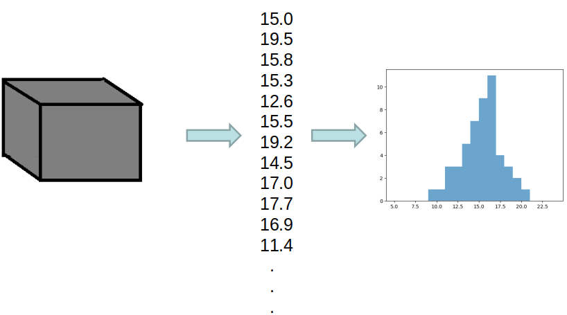
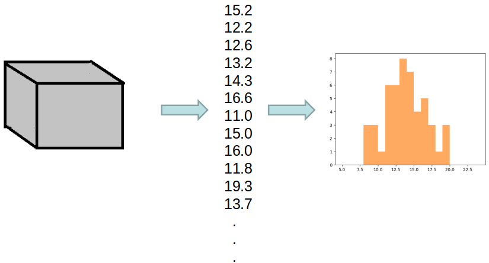
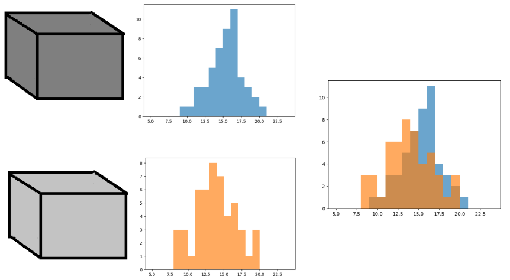
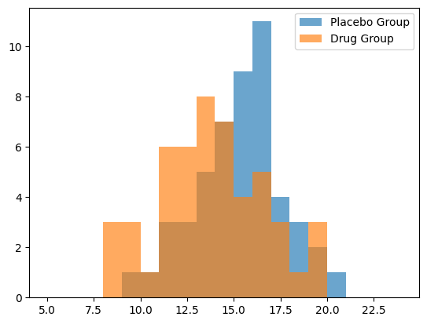
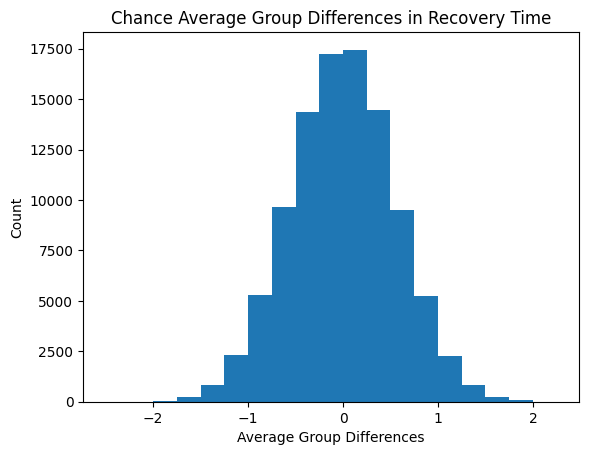
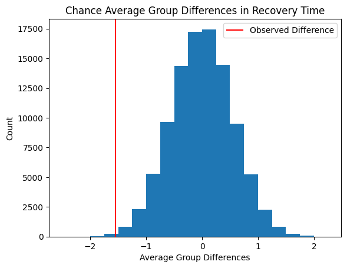

************************************
What Comparing Distributions *Means*
************************************

* Given two evolutionary computation instances, how does one determine which is *better*?

Random Variables
================

.. warning::

    The content within this topic is kept at a high level and deliberately skips some formalisms and rigor. For the
    purpose of this course, the level of detail provided should be sufficient.

* Consider a random variable as some phenomenon that can be observed
* When observing the random variable, some quantitative measurement can be taken

    * The time it takes to recover from the flu
    * The amount of nuts a squirrel buries a day
    * The number of people with blond hair that walk by this building between 10am -- 11am on Tuesdays
    * The best fitness value of a genetic algorithm run

* Whatever the measurement is, they can be recorded and represented as distributions
* Consider the following two random variables

    Output of some random variable represented as a box. The data is shown as a list of numbers and as a distribution.
    A total of 50 data points were observed and recorded.

    Output of another random variable represented as a box. The data is shown as a list of numbers and as a
    distribution. A total of 50 data points were observed and recorded.

* Regardless of what these random variables are, one may wonder, *are these random variables actually different*?

    * If considering the flu recovery time

        * The random variables may be recovery times of two different groups of people
        * Does one group recover faster?

    * With the squirrels, does one squirrel bury more nuts in a day than the other?
    * Does one year have more blond people walking past the building on Tuesdays from 10am -- 11am?
    * Does one evolutionary computation algorithm implementation perform better than another?

    The two random variables' measurements plotted against each other.

* When visually analyzing the above comparison of the two random variables, there does appear to be a difference

    * But the data is clearly noisy
    * A range of values are obtained for each random variable
    * And there are only 50 observations of each random variable

* It is difficult to say if these random variables are truly producing different distributions

    * They may effectively be the same
    * The two groups do not take different amounts of time to recover from the flu
    * The squirrel I named Jimbo does not actually bury more nuts than the squirrel I named Sir Lora
    * There really isn't more blond people this year vs. last
    * My algorithm isn't really performing better than the next persons'

Example --- Drug Trial
======================

* Consider a drug trial
* A group of 50 people is given a new drug that is intended to reduce the recovery time of the flu
* Another group is given a placebo
* No one in either group knows if they are given the new drug or the placebo

* Here, the random variables are the two groups and the observations are the recovery times of the people in each group

    Distributions of group recovery times for individuals in the placebo group and drug group.

* With the above example

    * The average recovery time for the placebo group was roughly 15.4 days
    * The average recovery time for the drug group was roughly 13.8 days
    * The drug group recovered, on average, 1.6 faster

* One may be tempted to conclude that the drug clearly works
* However, the average recovery time is a summary statistic of a distribution
* When observing the distributions, it is clear that there is more nuance

* Additionally, there were only 50 observations fro each group
* Every individual is different and every observation is different
* If I were to do this again, the distributions would look different
* What are the odds that this result just happened by chance?

Null Hypothesis
---------------

* Always start by assuming that there is no real difference
* This is called the *Null Hypothesis*

* It may feel like an arbitrary position to take, but with this assumption, it allows one to start to form an argument

#. Assume the drug has no actual impact on the recovery time
#. If the drug has no impact, then it would be like both groups had the placebo
#. If both groups had the placebo, it really would not have mattered which person was assigned to which group
#. Thus, it should be possible to assign each individual and their corresponding recovery time to one of the two groups randomly
#. Therefore, the difference in the average recovery times between the two randomly assigned groups would be an example of what one would get by dumb luck

Permutation/Randomization Test
------------------------------

* Assuming the null hypothesis
* Shuffling the groups once and calculating the difference between the group averages will give one example of a *chance* difference

* It is possible to generate all possible combinations of assigning the 100 people to two groups
* If all possible combinations are generated, all possible average *by chance* differences can be calculated

    * Although, in this example, there are a lot
    * A total of :math:`1.01 \times 10^{29}` combinations of splitting 100 people into two groups of 50
    * In cases where it is intractable to generate all combinations, simply generate some large number of combinations
    * Here, :math:`1,000,000` combinations will be generated

    Distribution of the "by chance" average group differences after 1,000,000 shuffles of the two groups. This
    distribution is **not** the recovery times like in the above distributions.

Interpreting Results
--------------------

* The key question to ask now is, *how likely is it that the original observation actually happened by chance?*

    Original observed average group difference in recovery time between the drug group and the placebo group shown on
    the distribution of the chance average group differences. The number of chance observations with the same or lower
    recovery times than the originally observed will inform how likely our observation could happen by chance.

* Of the :math:`1,000,000` combinations randomly generated
* There were :math:`205` with a by chance recovery time the same or better than what was originally observed
* In other words, there is a 0.205% chance that the original observation happened by dumb luck

    * :math:`\frac{205}{1000000} = 0.00205 = 0.205\%`
    * There is a roughly one in 5,000 chance this would have happened by dumb luck

* This is where the idea of a probability value (p-value) comes in
* There is a 0.00205 probability that the drug's improved recovery time happened by chance

T-Tests and Mann-Whitney U tests
^^^^^^^^^^^^^^^^^^^^^^^^^^^^^^^^

* The permutation test is explained to provide the intuition into what p-values actually mean
* In practice, using a t-test or Mann-Whitney U test is sufficient for this course

For Next Class
==============

* Although not entirely related, `check out 3 Blue 1 Brown's video on Bayes' Rule <https://www.youtube.com/watch?v=lG4VkPoG3ko>`_