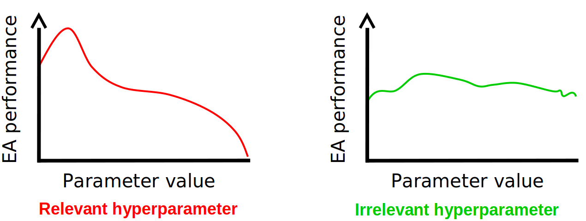
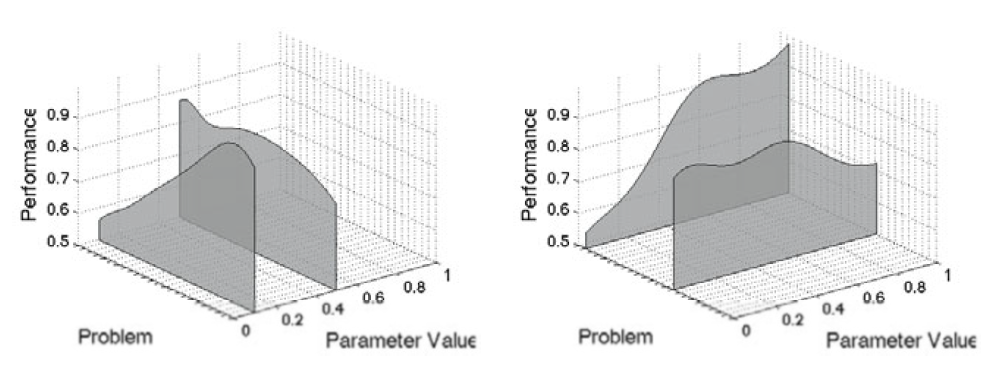

**********************
Tuning Hyperparameters
**********************

* All the evolutionary computation algorithms used require some form of hyperparameter tuning
* Further, given the modular nature of these algorithms, each part of the algorithm is itself a hyperparameter

    * These may also come with additional hypermarkets that require some tuning

* There exists no best way to perform parameter tuning, but there are some common strategies

Symbolic vs. Numeric Hyperparameters
====================================

* Symbolic hyperparameters are the modular portions of the algorithms

    * Crossover operator
    * Selection strategy

* Numeric hyperparameters are the numerical values that can be tuned

    * Crossover rate
    * Tournament size

* Regardless of the hyperparameter type, their values need to be set

    * A crossover rate needs to be set
    * A decision needs to be made on which selection to use

        * Symbolic hyperparameters may introduce additional numeric hyperparameters
        * For example, if tournament selection is selected, the tournament size needs to be specified

* Typically, symbolic hyperparameters are more high-level

    * They make up the evolutionary computation algorithm

* The numerical hyperparameters are low-level

    * Specifies the details of the algorithm's implementation 

* An *evolutionary computation algorithm instance* is one that has all the necessary hyperparameters set

Tuning Hyperparameters
======================

* There is no silver bullet strategy strategy for finding the best hyperparameters
* Often, some reasonable starting values are selected and then tuned based on the algorithm's results

Starting Places
---------------

* There is no *correct* starting values for any hyperparameters

    * With experience, a general intuition will form on what is *reasonable*

* Additionally, what one may argue is typical will differ between evolutionary computation algorithms
* For a genetic algorithm, common values for variation operators to start with are

    * Crossover of 80%
    * Mutation rage of 20%

* However, for genetic programming, a mutation rate of 20% would be considered shockingly high

* Some symbolic hyperparameter choices may have numerical hyperparameters that need to be set

    * For example, tournament selection requires a tournament size
    * A safe starting value for tournament selection is 2

* For population size and number of generations, it's difficult to say as this depends heavily on the problem

    * For example, was 1,000 generations enough to converge?
    * If not, try 10,000 generations
    * If that was not enough, try 100,000
    * ...

* Further, some hyperparameter values may need to be adjusted as other hypermarkets are changed

    * Consider population size
    * It is reasonable to increase the population size if results improve as it grows
    * However, depending on the selection strategy used, as population sizes grow, selection pressure may decrease
    * Thus, if the population size grows, the size of the tournament for tournament selection may need to increase

Empirical Tinkering
-------------------

* Once the hyperparameters are initially set, the algorithm should be run to get a sense of performance
* Based on the performance, the hyperparameter values need to be adjusted

    Changing the value of hyperparameters may or may not have an impact. When tuning the hyperparameter values, focus on
    those that appear to make a difference. Note, however, that some hyperparameters may appear to be irrelevant but
    do matter once other hyperparameter values are changed.

* The difficulty here is that the hyperparameters have complex interactions with one another

    * Increasing population size may require increasing tournament size
    * Increasing mutation rate may require more generations
    * Suddenly the crossover rate matters once mutation rate grew past a certain value

* To make matters worse, *good* hyperparameter settings is highly problem dependant

    Certain hyperparameter values may work well on one problem, but not other. All tuning must be done per problem.

* It is foolish to search for the "best" hyperparameter configuration

    * There are literally uncountably infinite configurations
    * It's a pipe dream

* The trick is to run the algorithm repeatedly and tune the hyperparameters until adequate results are obtained

    * With experience, this process gets easier

.. note::

    Automated algorithms for tuning hyperparameters do exist, but they tend to not be overly popular. Feel free to
    explore these, but do not be surprised if they end up being less helpful than desired.

For Next Class
==============

* TBD