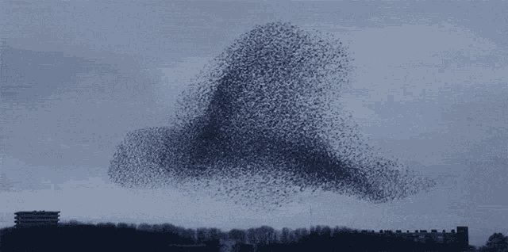
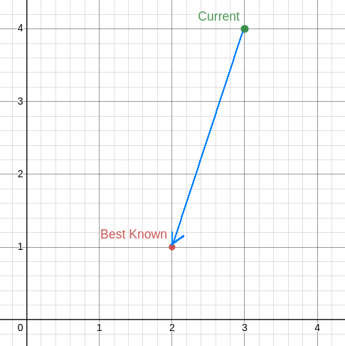

***************************
Particle Swarm Optimization
***************************

* Particle Swarm Optimization (PSO) is a stochastic population based optimization technique

    * Like many forms of evolutionary computation

* It consists of *particles* that all act independently, but are influenced by the population
* PSO is particularly well designed for real/floating point number optimization

    A flock of birds. Each bird is making decisions independently that are informed by other birds around them. As a
    result, it appears as if the flock is moving in some well coordinated way.

Particles
=========

* PSO consists of a population of *particles* that represent points in some search space

    * Like candidate solutions from a genetic algorithm

* Unlike chromosomes, these particles do not have the traditional variation operators of mutation and crossover
* Instead, the particles have a propensity to more towards areas that the particles *likes*
* However, these particles are also influenced by the population of particles

    * They also have a propensity to move towards areas that the population *likes*

* In terms of an optimization problem

    * Each particle has a propensity to move towards the best area of the search space it has encountered
    * While also having a propensity to move to the best part of the search space the population has encountered

* Each particle also has velocity and inertia

.. figure:: particles_moving.gif
    :width: 500 px
    :align: center
    :target: https://en.wikipedia.org/wiki/Particle_swarm_optimization

    Particles moving through a three-dimensional space represented in two-dimensions with the third dimension being
    represented by colour. Arrows associated with each particle represents the particle's velocity. Over time, the
    particles, although acting independent, while also being influenced by particles within the population, cluster
    around the global minimum.

Representation
--------------

* POS is often used for real/floating point number optimization
* Thus, each particle is typically represented as an :math:`n` dimensional vector encoding its position in space

    * Where :math:`n` is the dimensionality of the problem
    * For example, in the above figure, each particle would be represented as a three-dimensional vector
    * ``<1.42345478, 4.334678, 3.31345786555567>``

* Each particle has a

    * Position in space, represented as an :math:`n` dimensional vector containing a position in space

        * :math:`\vec{x}(t)` --- Position at time :math:`t`

    * Velocity, which is also represented as an :math:`n` dimensional vector containing deltas

        * :math:`\vec{v}(t)` --- Velocity at time :math:`t`

    * Best visited position (:math:`n` dimensional vector)

        * :math:`\vec{p}_{best}` --- Particle's best known position

    * Access to the swarm's best known position in space (:math:`n` dimensional vector)

        * :math:`\vec{g}_{best}` --- Global best known position

Velocity
========

* The velocity determines where the particle will be for the next iteration of the algorithm
* In other words, the velocity :math:`\vec{v}(t)` is used to determine the position of particle :math:`\vec{x}(t+1)`

Velocity Calculation
--------------------

* Velocities are typically initialized with some random values within some range
* But as the algorithm executes, the velocity of the particles change as they become influenced by

    * The *particles'* best known position in space
    * The *population's* best known position in space

Inertia Term: :math:`\omega\vec{v_{i}}(t)`
^^^^^^^^^^^^^^^^^^^^^^^^^^^^^^^^^^^^^^^^^^

* Each particle has some velocity
* When particles' velocities are being updated, the changes are applied to an already moving particle
* These particles *want* to continue moving the way they are

    * They resist change

* Thus, the first part of a velocity update takes into consideration the current velocity of the particle

    * :math:`\omega\vec{v_{i}}(t)`

* Where

    * :math:`i` is some particle
    * :math:`\vec{v_{i}}(t)` is the particle's velocity at time :math:`t`
    * :math:`\omega` is some coefficient use to control how much the particles want to resist change

        * :math:`\omega \in [0, 1]`

Cognitive Term: :math:`c_{1}\vec{r_{1}}(\vec{p_{i}}_{best} - \vec{x_{i}}(t))`
^^^^^^^^^^^^^^^^^^^^^^^^^^^^^^^^^^^^^^^^^^^^^^^^^^^^^^^^^^^^^^^^^^^^^^^^^^^^^

* Each particle *wants* to move towards the area of the search space it prefers

    * The best known location for that particle

* Thus, part of the velocity update alters the velocity such that it will move the towards this part of the space

    * :math:`c_{1}\vec{r_{1}}(\vec{p_{i}}_{best} - \vec{x_{i}}(t))`

* Where

    * :math:`i` is some particle
    * :math:`c_{1}` is some coefficient used to control how much the particle is influenced by its best known position

        * :math:`c_{1} \in [0, 2]`
        * The higher the :math:`c_{1}`, the more the particle is influenced by its best known position

    * :math:`r_{1}` is some stochastic vector discussed below
    * :math:`\vec{p_{i}}_{best}` is the particle's best known position within the search space
    * :math:`\vec{x_{i}}(t)` is the particle's position at time :math:`t`

* The difference between the particle's best known position and current position dictates where the particle needs to go

    * :math:`\vec{p_{i}}_{best} - \vec{x_{i}}(t)`

* :math:`c_{1}` and :math:`r_{1}` scale the vector

    Vector (blue) showing the difference between the particle's best known position (red) and its current position
    (green). The vector :math:`(-1, -3)` is shown starting at the current position :math:`(3, 4)`. If the particle
    were to have exactly this velocity for one time step, it would return to the best known position.

Social Term: :math:`c_{2}\vec{r_{2}}(\vec{g}_{best} - \vec{x_{i}}(t))`
^^^^^^^^^^^^^^^^^^^^^^^^^^^^^^^^^^^^^^^^^^^^^^^^^^^^^^^^^^^^^^^^^^^^^^

* Similarly, each particle is influenced by the population's best known position

    * :math:`c_{2}\vec{r_{2}}(\vec{g}_{best} - \vec{x_{i}}(t))`

* Where

    * :math:`i` is some particle
    * :math:`c_{2}` is some coefficient used to control how much the particle is influenced by the population's best

        * :math:`c_{2} \in [0, 2]`

    * :math:`r_{2}` is some stochastic vector discussed below
    * :math:`\vec{g}_{best}` is the population's best known position within the search space
    * :math:`\vec{x_{i}}(t)` is the particle's position at time :math:`t`

Random/Stochastic Components: :math:`\vec{r_{1}}` and :math:`\vec{r_{2}}`
^^^^^^^^^^^^^^^^^^^^^^^^^^^^^^^^^^^^^^^^^^^^^^^^^^^^^^^^^^^^^^^^^^^^^^^^^

* The cognitive and social portions of the velocity update included the vectors :math:`\vec{r_{1}}` and :math:`\vec{r_{2}}` respectively
* These vectors have values between :math:`[0, 1]` that are stochastically determined

    * Randomly determined for each velocity update calculation for each particle

* These random/stochastic vectors are important as they add a chance for novelty
* Further, they have been empirically shown to improve the search and prevent premature convergence

Putting the Velocity Update Together
^^^^^^^^^^^^^^^^^^^^^^^^^^^^^^^^^^^^

* The velocity update is the sum of the parts of the update

    * Inertia term + cognitive term + social term

* Velocity update for some particle :math:`i`

.. math::

    \vec{v_{i}}(t+1) = \omega\vec{v_{i}}(t)
        + c_{1}\vec{r_{1}}(\vec{p_{i}}_{best} - \vec{x_{i}}(t))
        + c_{2}\vec{r_{2}}(\vec{g}_{best} - \vec{x_{i}}(t))

* As discussed, there are three coefficients that need to be tuned for the algorithm
* As a starting place, `van den Bergh <https://repository.up.ac.za/bitstream/handle/2263/24297/00thesis.pdf?sequence=1>`_ suggests

    * :math:`\omega = 0.729844`
    * :math:`c_{1} = c_{2} = 1.496180`

* However, one should always aim to tune these values for their needs

Position Update
===============

Algorithm
=========

Simple Enhancements
===================

For Next Class
==============

* TBD
