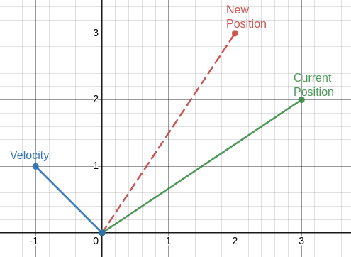

***************************
Particle Swarm Optimization
***************************

* Particle Swarm Optimization (PSO) is a stochastic population based optimization technique

    * Like many forms of evolutionary computation

* It consists of *particles* that all act independently, but are influenced by the population
* PSO is particularly well designed for real/floating point number optimization

.. figure:: birds_flying.gif
    :width: 500 px
    :align: center

    A flock of birds. Each bird is making decisions independently that are informed by other birds around them. As a
    result, it appears as if the flock is moving in some well coordinated way.

Particles
=========

* PSO consists of a population of *particles* that represent points in some search space

    * Like candidate solutions from a genetic algorithm

* Unlike chromosomes, these particles do not have the traditional variation operators of mutation and crossover
* Instead, the particles have a propensity to more towards areas that the particles *likes*
* However, these particles are also influenced by the population of particles

    * They also have a propensity to move towards areas that the population *likes*

* In terms of an optimization problem

    * Each particle has a propensity to move towards the best area of the search space it has encountered
    * While also having a propensity to move to the best part of the search space the population has encountered

* Each particle also has velocity and inertia

.. figure:: particles_moving.gif
    :width: 500 px
    :align: center
    :target: https://en.wikipedia.org/wiki/Particle_swarm_optimization

    Particles moving through a three-dimensional space represented in two-dimensions with the third dimension being
    represented by colour. Arrows associated with each particle represents the particle's velocity. Over time, the
    particles, although acting independent, while also being influenced by particles within the population, cluster
    around the global minimum.

Representation
--------------

* POS is often used for real/floating point number optimization
* Thus, each particle is typically represented as an :math:`n` dimensional vector encoding its position in space

    * Where :math:`n` is the dimensionality of the problem
    * For example, in the above figure, each particle would be represented as a three-dimensional vector
    * ``<1.42345478, 4.334678, 3.31345786555567>``

* Each particle has a

    * Position in space, represented as an :math:`n` dimensional vector containing a position in space

        * :math:`\vec{x}(t)` --- Position at time :math:`t`

    * Velocity, which is also represented as an :math:`n` dimensional vector containing deltas

        * :math:`\vec{v}(t)` --- Velocity at time :math:`t`

    * Best visited position (:math:`n` dimensional vector)

        * :math:`\vec{p}_{best}` --- Particle's best known position

    * Access to the swarm's best known position in space (:math:`n` dimensional vector)

        * :math:`\vec{g}_{best}` --- Global best known position

Velocity
========

* The velocity determines where the particle will be for the next iteration of the algorithm
* In other words, the velocity :math:`\vec{v}(t)` is used to determine the position of particle :math:`\vec{x}(t+1)`

Velocity Calculation
--------------------

* Velocities are typically initialized with some random values within some range
* But as the algorithm executes, the velocity of the particles change as they become influenced by

    * The *particles'* best known position in space
    * The *population's* best known position in space

* Velocity update for some particle :math:`i`

.. math::

    \vec{v_{i}}(t+1) = \omega\vec{v_{i}}(t)
        + c_{1}\vec{r_{1}}(\vec{p_{i}}_{best} - \vec{x_{i}}(t))
        + c_{2}\vec{r_{2}}(\vec{g}_{best} - \vec{x_{i}}(t))

* The above may seem intimidating, but it can be explained in parts

Inertia Term: :math:`\omega\vec{v_{i}}(t)`
^^^^^^^^^^^^^^^^^^^^^^^^^^^^^^^^^^^^^^^^^^

Cognitive Term: :math:`c_{1}\vec{r_{1}}(\vec{p_{i}}_{best} - \vec{x_{i}}(t))`
^^^^^^^^^^^^^^^^^^^^^^^^^^^^^^^^^^^^^^^^^^^^^^^^^^^^^^^^^^^^^^^^^^^^^^^^^^^^^

Social Term: :math:`c_{2}\vec{r_{2}}(\vec{g}_{best} - \vec{x_{i}}(t))`
^^^^^^^^^^^^^^^^^^^^^^^^^^^^^^^^^^^^^^^^^^^^^^^^^^^^^^^^^^^^^^^^^^^^^^

Random/Stochastic Components: :math:`\vec{r_{1}}` and :math:`\vec{r_{2}}`
^^^^^^^^^^^^^^^^^^^^^^^^^^^^^^^^^^^^^^^^^^^^^^^^^^^^^^^^^^^^^^^^^^^^^^^^^

Position Update
===============

* After the particle's velocity is calculated, the particle's new position can be determined
* The new position is the sum of its current position and its current velocity

.. math::

    \vec{x_{i}}(t+1) = \vec{x_{i}}(t) + \vec{v_{i}}(t+1)

* Consider the below figure

    * The particle's current position :math:`\vec{x_{i}}(t)` is represented as the green vector
    * The particle's velocity :math:`\vec{v_{i}}(t+1)` is represented as the blue vector
    * The particle's new position is represented as the red dashed vector

        * The sum of the particle's current position and velocity
        * :math:`(3, 2) + (-1, 1) = (2, 3)`

    The summation of the particle's current position (green) and its velocity (blue) results in the particle's new
    position within the search space (red). One could also visualize this by having the velocity vector start at the end
    of the current position vector (instead of the origin, as it is currently shown).

Algorithm
=========

Simple Enhancements
===================

For Next Class
==============

* TBD
