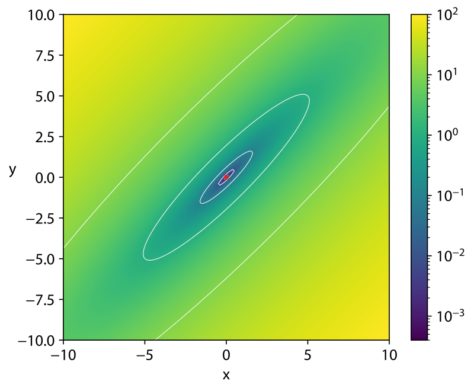

****************
Implementing PSO
****************

* The purpose of this topic is to see an implementation of particle swarm optimization (PSO)
* It is a simple implementation that incorporates no enhancements
* The problem PSO is being applied to in this example is some arbitrary benchmark real number optimization problem
* Despite how simple the implementation is, it will still perform well

Problem
=======

* PSO is often used for real/floating point number optimization
* Any real number optimization problem would work, but there there exist several benchmark test functions

    * `Wikipedia has a list of popular test functions <https://en.wikipedia.org/wiki/Test_functions_for_optimization>`_

* The goal is

    * Given some :math:`n` dimensional real/floating point number function

        * The function takes :math:`n` real/floating point numbers as arguments
        * The function returns a single real/floating point number

    * Find the arguments for the function that produces the smallest/largest output

        * Depending on if it is a minimization or maximization problem

Matyas Function
---------------

* Here, the Matyas function is used

    * :math:`f(x, y) = 0.26(x^{2} + y^{2}) - 0.48xy`
    * The optimal values for the function's arguments are :math:`(0, 0)`
    * This function was arbitrary selected

    Three-dimensional representation of the Matyas function. The function's arguments (:math:`x, y`) are represented in
    a two-dimensional Cartesian space and the function's output, the third dimension, is represented by colour.

* The Matyas function is used as a minimization problem that takes two arguments
* Thus, the goal is to find the values of those arguments that result in the smallest value

    * Although it is known *pre hoc* that the optimal solution is :math:`(0, 0)`
    * The point is to see if PSO can find this solution

.. literalinclude:: /../src/pso.py
    :language: python
    :lineno-match:
    :pyobject: matyas_function

Initialization
==============

Evaluation
==========

Update Velocity & Speed
=======================

Termination Requirement
=======================

For Next Class
==============

* TBD