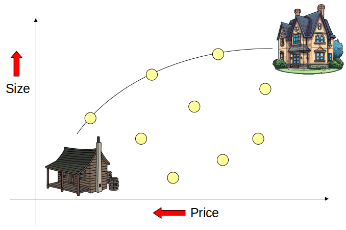

************************
Multi-Objective Problems
************************

* For the most part, all problems looked at have been single objective problems
* However, it is not uncommon to have multiple objectives to optimize
* Sometimes these objectives compliment each other, and sometimes they are in conflict with one another

* Consider buying a house

    * Low price
    * Want at least 4 bedrooms
    * Want to have a small commute distance
    * Proximity to amenities
    * Style

* Some of these features are subjective

    * Style
    * The amenities one cares about

* Some complement one another

    * Small commute and amenities are probably related

* Some are in conflict

    * At least 4 bedrooms and close to amenities
    * Low price

    One may want a large house but to pay as little as possible. These objectives are in conflict with one another. Each
    point represents a potential house. 

Scalarization
=============

Distance from Ideal
-------------------

Weighted Sum
------------

Dominance
=========

Pareto Sets
-----------

For Next Class
==============

* TBD
