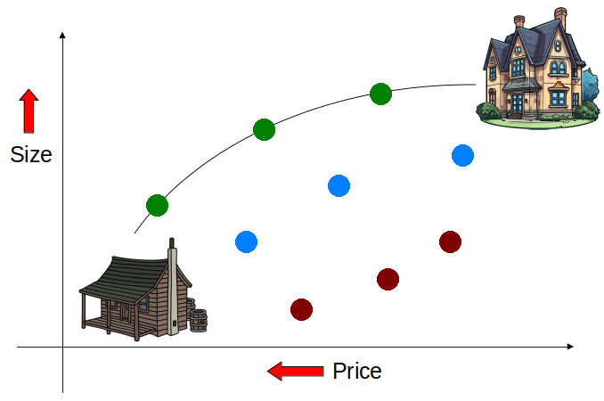
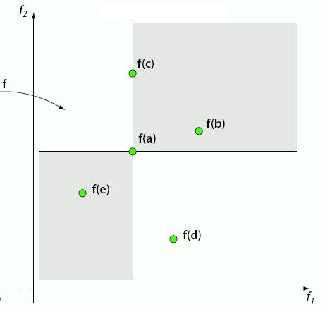
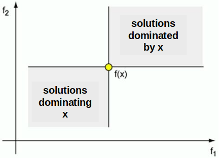
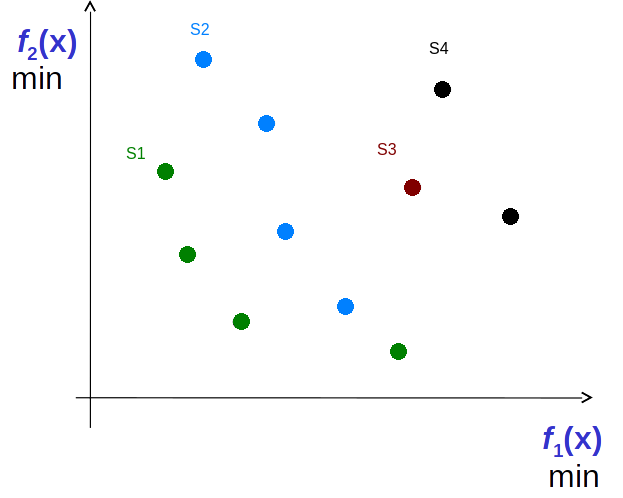

************************
Multi-Objective Problems
************************

* For the most part, all problems looked at have been single objective problems
* However, it is not uncommon to have multiple objectives to optimize
* Sometimes these objectives compliment each other, and sometimes they are in conflict with one another

* Consider buying a house

    * Low price
    * Want at least 4 bedrooms
    * Want to have a small commute distance
    * Proximity to amenities
    * Style

* Some of these features are subjective

    * Style
    * The amenities one cares about

* Some complement one another

    * Small commute and amenities are probably related

* Some are in conflict

    * At least 4 bedrooms and close to amenities
    * Low price

.. figure:: house_multiobjective_plot.png
    :width: 500 px
    :align: center

    One may want a large house but to pay as little as possible. These objectives are in conflict with one another. Each
    point represents a potential house. 

Scalarization
=============

* Scalarization is the process of *scaling* the various features to be optimized and combining them into a single value

    * It is a way to turn multi-objective problems into a single objective problem

* It is an *a priori* process, meaning the decisions about the scaling must be done before the search starts

Weighted Sum
------------

* The simplest strategy is a *weighted sum*
* Scale each individual objective being optimized and add them together to make a single value

    :math:`w_{1}f_{1}(x) + w_{2}f_{2}(x) + w_{3}f_{3}(x) + ... + w_{m}f_{m}(x)`

    Or

    :math:`\sum_{i}^{m}w_{i}f_{i}(x)`

* Where

    * :math:`x` is some chromosome
    * :math:`m` is the number of objectives being optimized
    * :math:`f_{i}(x)` is a function returning the :math:`i^{th}` objective's fitness on chromosome :math:`x`
    * :math:`w_i` is the weight/scale of objective :math:`i`

* If one objective is more important than another, assign it a stronger weight
* Use negative weights to account for objectives that are to be minimized/maximized

* Unfortunately, however, weighted sums do not work too well beyond two or three objectives
* Further, it's not always easy to assign the weights

Dominance
=========

    Given the goal of buying the largest house for as little as possible, it is difficult to pick a data point on the
    plot that is the "best" option. This is because it may be difficult to compare data points across dimensions (price
    vs. size). However, although it is difficult to select the "best" option, it may be simple to identify options that
    are better than others.

* Sometimes it is not possible to truly select the *best* option

    * If one house has a lower price than another, then that's good
    * And if one house is bigger than another, then that's good
    * But, how does one compare price to size?

* However, it may be clear that some options are better/worse than others

    * If a house is bigger *and* cheaper than another, then that's good

    Five data points (a, b, c, d, e) for some two-dimensional minimization problem. Each dimension represents some
    objective to be minimized. Some data points are difficult to compare, but data points are "dominated" by other
    points.

* In the above example,

    * Point `a` is better than `b` in both dimensions
    * Point `a` is better than `c` in one dimension, but equal in another
    * Point `a` is worse than `e` in both dimensions
    * It is difficult to compare points `a` and `d` since one is better in one dimension but worse in the other

* Here, one would say point `a` *dominates* points `b` and `c`

    * Although `a` and `c` are equal along the x-axis, `a` is still better in the y-axis
    * Thus, one would still choose `a` as the better data point

* Further, point `a` is dominated by point `e`

    Portions of a two-dimensional space dominated by some data point x (top right --- worse than x in both dimensions)
    and dominating data point x (bottom left --- points that are better than x in both dimensions). The other portions
    of the space (top left/bottom right) are difficult to compare to x as they are better than x in one dimension but
    not the other.

Pareto Sets
-----------

* Given the set of solutions :math:`S` and some subset of solutions :math:`Q \subset S`
* A data point :math:`x \in S` is *non-dominated* by the set :math:`D` if no solution :math:`y \in D` dominates :math:`x`

* A set of non-dominated solutions :math:`N \subset S` defines the *Pareto-Optimal Set*

    * It is possible to create multiple Pareto Sets by repeatedly applying this process on the set difference :math:`S - N`

    Data points in some two-dimensional minimization problem. Four Pareto Sets exist --- S1, S2, S3, and S4. All
    solutions in S1 are non-dominated by any other solutions. All solutions in S2 are non-dominated by solution other
    than those in S1. Similarly for S3 and S4.

Evolutionary Algorithms and Pareto Style Multi-Objective Optimization
---------------------------------------------------------------------

* Since EC algorithms are typically population based, they work well with Pareto style multi-objective optimization
* The population can be ranked into Pareto Sets
* The Pareto-Optimal set will contain all *good* solutions

* Consider the issue with weighted sum and selecting weights for difficult to quantify and compare feature

    * With a Pareto-Optimal Set, there is no need to decide on the weights
    * A set of solutions is presented in the end which can then be selected from
    * It may still be difficult to select a single solution from this Pareto-Optimal set
    * But at least that's not something the algorithm is trying to figure out for the user

For Next Class
==============

* TBD
