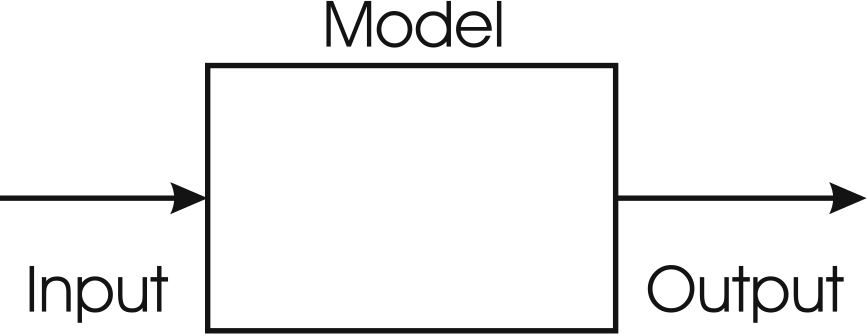
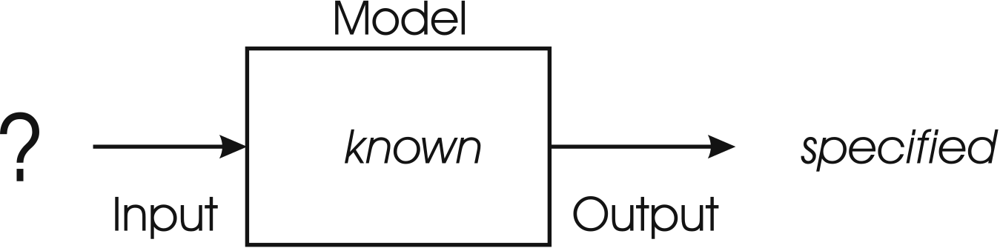
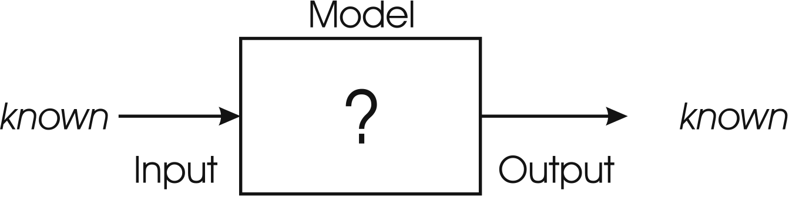
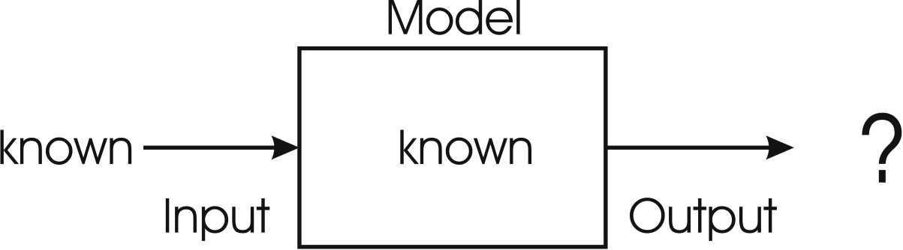

********
Problems
********

* The maximization of the decimal integer value of an unsigned binary number was a *toy problem*

    * It is a trivial problem that, in practice, one would not use evolutionary computation for

* Evolutionary computation is typically used for problems with no known reasonable approach to address

    * It's a strategy to be used as a last resort
    * It is computationally expensive
    * It's often harder to understand compared to other algorithms
    * Depending on the problem, it is notorious for overfitting

* For learning purposes, classic toy problems will be used in this course
* But it is important to know which types of problems evolutionary computation is appropriate for

Systems
=======

    Abstract representation of a general system. Systems typically receive some input, perform some function, and
    produce some form of output.

* Above is a simple black-box representation is a system
* The system receives some number of inputs
* The system performs some operation on the input
* The system produces some form of output

* Thinking of a system in this way helps distinguish the three important components

* For concrete examples, consider

    * Calculating a grocery bill

        * Input --- Prices of the items being purchased
        * Model --- Sum the prices plus a sales tax calculation
        * Output --- A grocery bill

    * Designing an aircraft wing

        * Input --- Shape of the wing
        * Model --- Equations of complex fluid dynamics
        * Output --- Estimates of drag and lift

    * Photosynthesis

        * Input --- Light, carbon dioxide, and water
        * Model --- Light reactions and the Calvin Cycle
        * Output --- Oxygen and sugar

    * Calculating the time it takes to drive to work

        * Input --- Route taken
        * Model --- Spacetime
        * Output --- Time taken

* As computer scientists, we often like to think of the model as some function
* Take some real world thing (*in vivo*) and try to model it with a computer (*in silico*)
* With a known model, the output can be computer for any valid input

Optimization
============

    Given a system, if the goal is to find the best set of inputs, then it is called an optimization problem.

* Optimization takes place when the model and output objectives are known, but the input is not

    * The **search space** is the set of all possible inputs

* For example, finding the path to work that results in the smallest amount of time possible

    * The search space would be all possible paths to work
    * Though, most of the paths would be terrible, so it is common to constrain the search space
    * For example, do not consider paths that go out of town

Travelling Salesman Problem
---------------------------

* The *Travelling Salesman Problem* (TSP) is a classic optimization problem

    TSP can be modelled as an undirected weighted graph, such that cities are the graph's vertices, paths are the
    graph's edges, and a path's distance is the edge's weight. It is a minimization problem starting and finishing at a
    specified vertex after having visited each other vertex exactly once [#]_.

.. [#] `From Wikipedia <https://en.wikipedia.org/wiki/Travelling_salesman_problem#Description>`_

* Effectively, the problem is to find the shortest **Hamiltonian cycle** within the graph

    Example of a small TSP instance with four cities (vertices). In this example, each city has a path (edge) to all
    other cities that has an associated weight.

* To think of this in terms of the three parts of a system

    * Given a Hamiltonian cycle (input)
    * Sum the edges of the weights in the cycle (model)
    * Return the total cycle length (output)

* But this is just a description of the system, not the description of an optimization problem
* To frame this as an optimization problem, find the Hamiltonian cycle that produces the smallest possible cycle length

* There is a trivial algorithm to solve any instance of this problem

    * Find the length of all possible Hamiltonian cycles
    * Pick the path with the smallest cycle length

* Given a set of vertices :math:`V`, the computational complexity of calculating a cycle length is :math:`O(|V|)`
* Thus, it's only a matter of applying a linear time algorithm to each cycle

How Many Cycles Are There?
^^^^^^^^^^^^^^^^^^^^^^^^^^

* The starting/ending city is always fixed
* Given the four city example above and a set starting city, how many cities are there that could be visited next?

    * :math:`3`

* After the next city is picked, how many possible cities are there to visit next?

    * :math:`2`

* After that, there is only :math:`1` city remaining
* Therefore, there should be a total of 6 possible cycles (:math:`3 \times 2 \times 1 = (4 - 1)!`)

    #. :math:`A \rightarrow B \rightarrow C \rightarrow D \rightarrow A`
    #. :math:`A \rightarrow B \rightarrow D \rightarrow C \rightarrow A`
    #. :math:`A \rightarrow C \rightarrow B \rightarrow D \rightarrow A`
    #. :math:`A \rightarrow D \rightarrow C \rightarrow B \rightarrow A`
    #. :math:`A \rightarrow C \rightarrow D \rightarrow B \rightarrow A`
    #. :math:`A \rightarrow D \rightarrow B \rightarrow C \rightarrow A`

* Half of these cycles are just the reverse of another cycles, so they can be ignored
* To generalize this, the number of possible cycles is :math:`\frac{(|V|-1)!}{2}`

* How many possible cycles are there for an instance of :math:`100` cities then?

    * :math:`\frac{(100-1)!}{2} = \frac{99!}{2} = 4.666311\times10^{155}`
    * For a point of reference, there are about :math:`2.4\times10^{67}` atoms in the Milky Way

Modelling
=========

    Given a system, if the goal is to define the functionality and processes to produce the output, then it is called
    modelling.

* Writing software

Simulation
==========

    Given a system, if the goal is to know the output of applying some input to a model, then it is called simulation.

* Aircraft wing design

    * Can kinda' depend though as optimization could be just a bunch of simulations
    * Maybe a warning?

Search Problems
===============

Optimization vs Constraints
===========================

Hardness
========

Continuous vs Discrete
----------------------

What to Know About Hardness
---------------------------

For Next Class
==============

* TBD