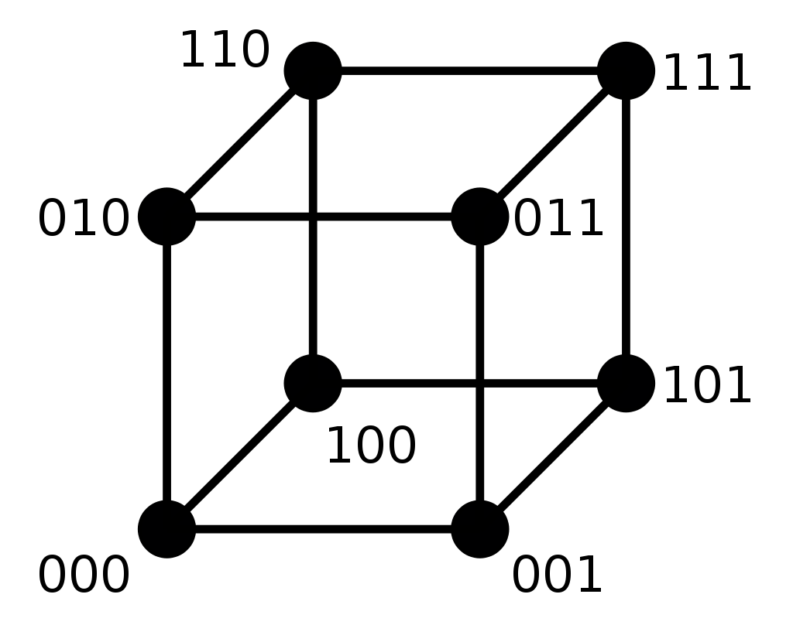
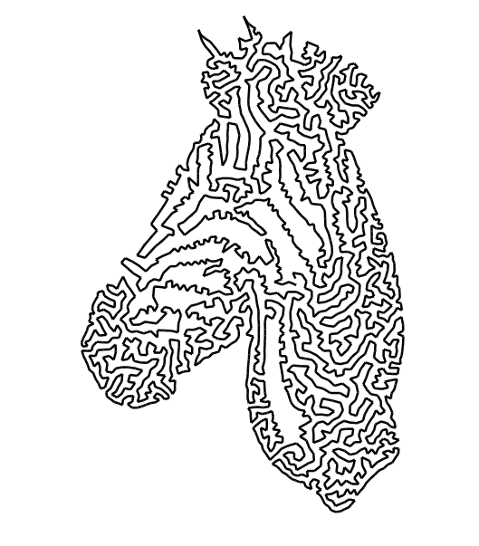
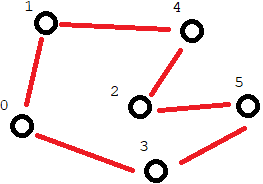
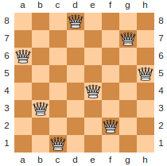

**************
Representation
**************

* The representation is how the problem is encoded
* How exactly a problem is encoded is one of the first things to consider when using evolutionary computation
* A problem can be encoded however one wants, but the choice can impact the quality of the evolutionary search

* There are many different types of encodings

    * Binary
    * Integer
    * Real value/floating point numbers
    * permutations
    * Tree structures
    * Finite state machines
    * ...

* Certain forms of evolutionary computation are designed to work with certain encodings
* However, given the nature of these algorithms, any encoding can be used as long as it produces the desired results

Genotype vs. Phenotype
======================

* As previously discussed

    * The phenotype is a solution to a problem
    * The genotype is an encoded solution to a problem

.. figure:: ../representation/genotype_phenotype_space.png
    :width: 500 px
    :align: center

    Visualization of the genotype and phenotype spaces. In this example, the phenotype space consists of integers while
    the genotype space encodes integers as unsigned binary numbers.

* The choice of representation can have a large impact on the performance of the evolutionary computation algorithm
* Further, the difference between solutions in the phenotype space can differ from the difference in the genotype space

    * For example, consider the unsigned binary number maximization problem
    * The number :math:`7` is ``0111`` in the genotype space
    * The number :math:`8` is ``1000`` in the genotype space
    * The difference in the phenotype space (:math:`8 - 7`) is :math:`1`
    * The difference in the genotype space, if using *Hamming distance*, is :math:`4`

        * The number of bits that would need to change to get from ``0111`` to ``1000`` is :math:`4`

    Graph representing the Hamming distance between the binary numbers 0 to 7. Each vertex represents a binary number
    and each edge between vertices represents one unit of distance. The minimum distance between vertices is the
    Hamming distance between the binary numbers. For example, ``000`` and ``101`` has a minimum distance of two edge
    between them and have a Hamming distance of two from each other.

TSP Example
-----------

* Consider the TSP example previous discussed

    A solution to a large TSP instance where high-quality solutions depict a horse, or maybe a zebra? Who knows. Credit
    Twentylemon.

Integer Encoding
^^^^^^^^^^^^^^^^

* One possible encoding is an ordered list of integers representing each city

    * Given :math:`n` cities
    * Assign each city a unique integer
    * An ordered list of :math:`n` integers would define a cycle

        * The last city, at index :math:`n-1`, would return to the first city, at index :math:`0`

* Since the ordered list has a total of :math:`n` indices
* And the number of possible integers (cities) that could exist in each index is :math:`n`
* The search space has a size of :math:`n^{n}`

    * :math:`n` multiplied by itself :math:`n` times

* Consider the following possible chromosomes

    * :math:`<0, 0, 0, ..., 0, 0>`
    * :math:`<0, 0, 0, ..., 0, 1>`
    * :math:`<0, 0, 0, ..., 0, 2>`
    * :math:`...`
    * :math:`<0, 0, 0, ..., 0, (n-1)>`
    * :math:`<0, 0, 0, ..., 1, 0>`
    * :math:`<0, 0, 0, ..., 1, 1>`
    * :math:`<0, 0, 0, ..., 1, 2>`
    * :math:`...`
    * :math:`<(n-1), (n-1), (n-1), ..., (n-1)>`

* There is nothing *wrong* with the integer encoding

    * It includes all possible Hamiltonian cycles

* But the integer encoding allows inadmissible solutions to be included in the search space
* For TSP, with the exception of the starting city, each city is to be visited once and only once
* But with the integer encoding, it's possible to have a chromosome where some cities are visited more than once

    * Which necessarily means that some cities are not visited at all

Permutation Encoding
^^^^^^^^^^^^^^^^^^^^

* Given the requirement that each city is visited once and only once

    * Except the starting city

* The search space can be constrained such that it only includes admissible solutions

    * Solutions where each city is visited once and only once

* A *permutation* encoding where the ordered list is a permutation of the integers between :math:`0` and :math:`n-1`
* This would ensure that each exists once and only once in the ordered list

* Since the ordered list has a total of :math:`n` indices
* And the number of cities available for index :math:`0` is :math:`n`
* Index :math:`1` is :math:`n-1`
* Index :math:`2` is :math:`n-2`
* ...
* Index :math:`n-1` is :math:`1`

* The search space has size :math:`n!`
* This is still a very large, but it is an improvement over :math:`n^{n}`

Permutation Encoding v2
^^^^^^^^^^^^^^^^^^^^^^^

* The search space can be further constrained

    Small TSP instance with some arbitrary Hamiltonian cycle shown.

* In the above figure, consider the following ordered lists

    * :math:`<0, 3, 5, 2, 4, 1>`
    * :math:`<2, 4, 1, 0, 3, 5>`

* Both permutations define the same Hamiltonian cycle

    * In fact, there are a total of :math:`n` permutations that define the exact same cycle
    * This would be true for each Hamiltonian cycle

* A way to eliminate the duplicates is by fixing the starting city

    * Either remove it entirely from the chromosome but include it in the fitness calculation
    * Or have it always at index :math:`0`

* This means that there only :math:`n-1` remaining cities to place into the ordered list
* After one is selected for visiting, there are :math:`n-2` remaining cities
* ...

* This means the search space has a size of :math:`(n-1)!`
* This is still very large, but an improvement over :math:`n!`

The Gap
^^^^^^^

* The second permutation representation had a search space of :math:`(n-1)!`
* But what is the smallest the search space could be while still including all valid solutions?

    Small TSP instance with some arbitrary Hamiltonian cycle shown.

* In the above figure, consider the following ordered lists

    * :math:`<0, 3, 5, 2, 4, 1>`
    * :math:`<0, 1, 4, 2, 5, 3>`

* Once again, both permutations define the same Hamiltonian cycle

    * The second is the reverse of the first
    * For every permutation, there is a reverse of it

* This means it could be possible to eliminate half of the permutations
* This would result in a search space of :math:`\frac{(n-1)!}{2}`

* But, how could the representation be updated address this?

:math:`n` Queens Example
------------------------

* Consider the :math:`n` queen problem

    * Place :math:`n` queens on an :math:`n \times n` chess board such that none can attack any other

* The phenotype is the :math:`n \times n` chess board configuration of :math:`n` queens

.. figure:: ../representation/10_queens.png
    :width: 300 px
    :align: center
    :target: https://en.wikipedia.org/wiki/Eight_queens_puzzle

    A valid configuration of :math:`10` queens on a :math:`10 \times 10` chess board. This particular configuration is
    called a "staircase solution".

2D Genotype
^^^^^^^^^^^

* For the genotype, a 2D list encoding could be used

    * It would require an :math:`n \times n` list
    * :math:`n` cells in the list would be filled, representing the queen locations

* This would be a very *direct* representation

    * The *translation* from the genotype to phenotype trivial

* With this encoding, there would be a search space of size :math:`n \times n \choose n`

    * For :math:`8` queens, this is :math:`{64 \choose 8} = 4,426,165,368`

* This search space includes all possible valid board configurations
* However, it also includes a lot more invalid board configurations

1D List of Coordinates
^^^^^^^^^^^^^^^^^^^^^^^

* 2D encodings can be tricky to work with
* Perhaps a 1D list of :math:`(x, y)` coordinates would work

    * It would require a list of length :math:`n`
    * Each value in the list would be a queen's :math:`(x, y)` coordinate

* This representation is a little less direct than the 2D list

    * There would need to be some translation to get to the phenotype
    * This is not a problem though

* This encoding can also represent all possible configurations

* For the size of the search space

    * There are :math:`n` queens to be placed
    * Each queen has a :math:`(x, y)` coordinate
    * There are :math:`n \times n` possible positions for each queen

* Therefore, with this encoding, the search space has a size of :math:`(n \times n)^{n}`

    * For :math:`8` queens, this is :math:`64^{8} = 2.815 \times 10^{14}`

* Although a 1D encoding may be easier to work with, this encoding is worse in terms of the size of the search space

    * It's worse since it's possible for queens to be placed in the same :math:`(x, y)` coordinate

Integer and Permutation
^^^^^^^^^^^^^^^^^^^^^^^

* Since the queens are not to attack one another, they can't be in the same row or column

    * Otherwise it will be an invalid configuration

* Since each column can only have one queen in it, an integer encoding could be used

    * Have a list of size :math:`n`
    * The index in the list corresponds to the queen's :math:`x` coordinate
    * The value at the index corresponds to the queen's :math:`y` coordinate

* This can be taken a step further --- use a permutation representation
* This would ensure that the values in each index are unique

    * This would mean no two queens could be in the same row

* In other words, with the permutation encoding

    * Each queen must be in a different column as the columns are defined by the index of the list
    * Each queen must be in a different row since the rows are defined by the values in the list, which are unique

    A valid configuration for the :math:`8` queens problem. The permutation encoding of this solution would be
    :math:`<2, 5, 7, 0, 4, 6, 1, 3>`.

* This representation eliminates all configurations where queens conflict in the rows or columns
* The only way a permutation would not be a valid configuration is if any queens conflict along the diagonals

* The size of the search space with this encoding is :math:`n!`

    * For :math:`8` queens, this is :math:`8! = 40,320`

Common Representations
======================

* Below a collection of common encodings are discussed

    * However, the representation can be whatever one needs or wants it to be
    * For example, consider the 2D list encoding for :math:`n` queens discussed above

* Some of these encodings fit well with a particular type of evolutionary computation algorithm
* Some of these encodings are effectively what defines a class of evolutionary computation algorithm

Binary Representation
---------------------

* A collection of :math:`0`\s and :math:`1`\s

    * Like the representation used for the maximization of an unsigned binary number previously discussed
    * For example, :math:`<0, 1, 1, 0, 1, 1, 1, 0, 0, 0, 0, 1>`

* Commonly used for binary decisions
* Can be used to represent virtually anything as long as there is a sufficient encoding/decoding method

    * This representation is often very *indirect*

Integer Representation
----------------------

* A collection of integers
* Could be any integer or integers taken from a predefined set of integers
* For example

    * Allow all integers representable in Python
    * Allow only :math:`0, 1, 2` and :math:`3` to mean North, South, East, West

* The ordering of the integer values may or may not matter

    * Although :math:`0` comes before :math:`1`, North is not less than South

* The order of the elements in the collection may or may not matter

    * The fact that one integer is at index :math:`7` and another is in index :math:`8` may not matter

* The encoding could be used to represent whatever, as long as there is a sufficient encoding/decoding method

* Consider the problem of programming a robot to traverse a maze
* The set of possible integers could be :math:`\{0, 1, 2, 3\}` meaning North, South, East, and West
* The robot needs to take :math:`10` steps
* A valid chromosome could be :math:`<0, 0, 0, 1, 0, 2, 3, 0, 2, 2>`

Permutation Representation
--------------------------

* An ordering of values in a set/multiset

    * An arrangement of values in some sequence

* Useful for situations where each value in an encoding must be unique, or have a fixed number of occurrences
* For example, TSP

    * Each Hamiltonian cycle is defined by a permutation of cities

* Does not need to be numerical
* Order of elements in the chromosome matters

* Consider the problem of finding English words form a given multiset of letters

    * Given the multiset of letters :math:`\{A, A, E, G, M, N, T\}`
    * Below is a list of possible chromosomes

        * :math:`<A, A, E, G, M, N, T>`
        * :math:`<G, A, T, E, M, A, N>`
        * :math:`<M, A, G, E, N, T, A>`
        * :math:`<M, A, G, N, A, T, E>`
        * :math:`<N, A, M, E, T, A, G>`

Real Value Representation
-------------------------

* A collection of real/floating point numbers
* Consider the problem of encoding the weights for an artificial neural network
* Or finding the :math:`(x, y)` coordinates to find the minimum value of some function

.. figure:: ../particle-swarm-optimization/ackley_function.png
    :width: 500 px
    :align: center
    :target: https://www.sfu.ca/~ssurjano/ackley.html

    Ackley function shown in 3D where the plotted value is the result of the function. This function is a common "toy
    problem" used to test optimization algorithms that work with real numbers [#]_.

* Certain forms of evolutionary computation work well with real/floating point numbers

    * Evolutionary strategies, differential evolution, and particle swarm optimization work well with real numbers

Tree Representation
-------------------

* Tree representations are typically used in genetic programming
* The tree representation is used to encode a program/function

.. figure:: ../genetic-programming/tree_examples.png
    :width: 666 px
    :align: center

    Example of three different tree encodings for three different problems. The left tree encodes some mathematical
    expression, the centre tree encodes a boolean expression, and the right tree is some conditional program.

* The above figure shows three different tree encodings that would be used for different problems
* The left most tree represents the mathematical expression :math:`(1.2 - x) \times y`

    * This could be used for a regression problem

* The centre tree represents the boolean expression ``length < 5.2 or not(red)``

    * This could be used for programming a classifier

* The right most tree represents the conditional program ``if(open and right closed) then (forward) else (turn right)``

    * This could be used for programming a robot to traverse a maze

For Next Class
==============

* TBD

----------------------

.. [#] `From the "Virtual Library of Simulation Experiments" <https://www.sfu.ca/~ssurjano/index.html>`_