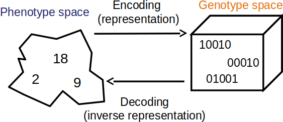

**************
Representation
**************

Genotype vs. Phenotype
======================

* As previously discussed

    * The phenotype is a solution to a problem
    * The genotype is an encoded solution to a problem

    Visualization of the genotype and phenotype spaces. In this example, the phenotype space consists of integers while
    the genotype space encodes integers as unsigned binary numbers.

* The choice of representation can have a large impact on the performance of the evolutionary computation algorithm
* Further, the difference between solutions in the phenotype space can differ from the difference in the genotype space

    * For example, consider the unsigned binary number maximization problem
    * The number :math:`7` is ``0111`` in the genotype space
    * The number :math:`8` is ``1000`` in the genotype space
    * The difference in the phenotype space (:math:`8 - 7`) is :math:`1`
    * The difference in the genotype space, if using *Hamming distance* is :math:`4`

        * The number of bits that would need to change to get from ``0111`` to ``1000`` is :math:`4`

    Graph representing the Hamming distance between the binary numbers 0 to 7. Each vertex represents a binary number
    and each edge between vertices represents one unit of distance. The minimum distance between vertices is the
    Hamming distance between the binary numbers. For example, ``000`` and ``101`` has a minimum distance of two edge
    between them and have a Hamming distance of two from each other.

TSP Example
-----------

* Consider the TSP example previous discussed

Integer Encoding
^^^^^^^^^^^^^^^^

* One possible encoding is an ordered list of integers representing each city

    * Given :math:`n` cities
    * Assign each city a unique integer
    * An ordered list of :math:`n` integers would define a cycle

        * The last city, at index :math:`n-1`, would return to the first city, at index :math:`0`

* Since the ordered list has a total of :math:`n` indices
* And the number of possible integers (cities) that could exist in each index is :math:`n`
* The search space has a size of :math:`n^{n}`

    * :math:`n` multiplied by itself :math:`n` times

* There is nothing *wrong* with the integer encoding

    * It includes all possible Hamiltonian cycles

* But the integer encoding allows inadmissible solutions to be included in the search space
* With TSP, with the exception of the starting city, each city is to be visited only once
* But with the integer encoding, it's possible to have a chromosome where some cities are visited more than once

    * Which necessarily means that some cities are not visited at all

Permutation Encoding
^^^^^^^^^^^^^^^^^^^^

* Given the requirement that each city is visited once and only once

    * Except the starting city

* The search space can be constrained such that it only includes admissible solutions

    * Solutions where each city is visited once and only once

* A permutation encoding where the ordered list is a permutation of the integers between :math:`0` and :math:`n-1`
* This would ensure that each exists once and only once in the ordered list

* Since the ordered list has a total of :math:`n` indices
* And the number of cities available for index :math:`0` is :math:`n`
* Index :math:`1` is :math:`n-1`
* Index :math:`2` is :math:`n-2`
* ...
* Index :math:`n-1` is :math:`1`

* The search space has size :math:`n!`
* This is still a very large, but it is an improvement over :math:`n^{n}`

Permutation Encoding v2
^^^^^^^^^^^^^^^^^^^^^^^

* The search space can be further constrained

    Small TSP instance with some arbitrary Hamiltonian cycle shown.

* In the above figure, consider the following ordered lists

    * :math:`<0, 3, 5, 2, 4, 1>`
    * :math:`<2, 4, 1, 0, 3, 5>`

* Both permutations define the same Hamiltonian cycle

    * In fact, there are a total of :math:`n` permutations that define the exact same cycle
    * This would be true for each Hamiltonian cycle

* A way to eliminate the duplicates is by fixing the starting city

    * Either remove it entirely from the chromosome but include it in the fitness calculation
    * Or have it always at index :math:`0`

* This means that there only :math:`n-1` remaining cities to place into the ordered list
* After one is selected, there are :math:`n-2` remaining cities
* ...

* This means the search space has a size of :math:`(n-1)!`
* This is still very large, but an improvement over :math:`n!`

The Gap
^^^^^^^

* The second permutation representation had a search space of :math:`(n-1)!`
* But what is the smallest the search space could be while still including all valid solutions?

    Small TSP instance with some arbitrary Hamiltonian cycle shown.

* In the above figure, consider the following ordered lists

    * :math:`<0, 3, 5, 2, 4, 1>`
    * :math:`<0, 1, 4, 2, 5, 3>`

* Once again, both permutations define the same Hamiltonian cycle

    * The second is the reverse of the first
    * For every permutation, there is a reverse of it

* This means it could be possible to eliminate half of the permutations
* This would result in a search space of :math:`\frac{(n-1)!}{2}`

* But, how could the representation be updated address this?

:math:`n` Queens Example
------------------------

Binary Representation
=====================

Integer Representation
======================

Permutation Representation
==========================

Real Value Representation
=========================

Tree Representation
===================

For Next Class
==============

* TBD
