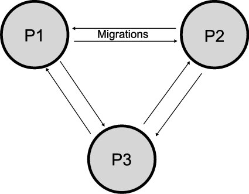
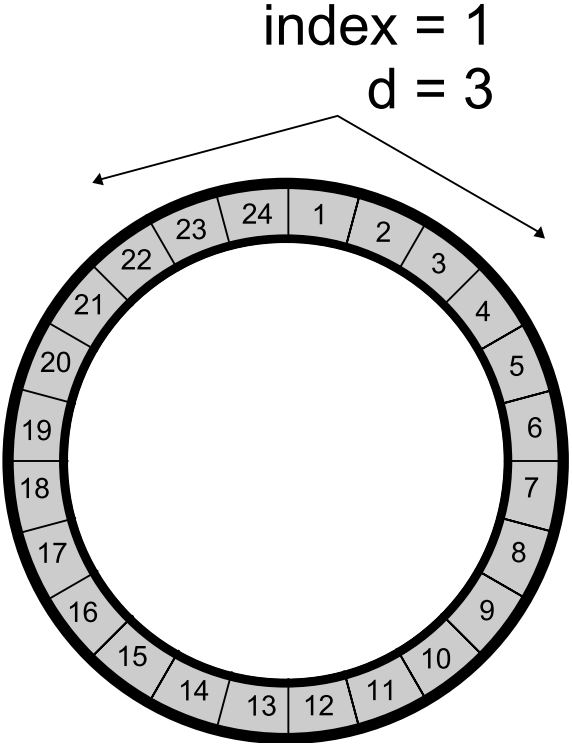

***********************************
Selection and Population Management
***********************************

* One of the main driving forces of evolutionary computation algorithms is the variation operators
* Another major driving force is the selection strategy

    * This determines an individual's ability to survive and have offspring based on their fitness values

* Selection is based on the *relative* fitness values of the individual
* It works independently from the actual problem and representation

Generational vs. Steady State
=============================

* All the algorithms provided so far have been implemented as a generational algorithm

    * A whole new population is created based on the current population
    * The new population becomes the current population
    * The population size remains the same
    * There are very discrete transitions between generations

* With the generational algorithm, depending on how the genetic operators are applied, the new population is filled with

    * Copies of unchanged selected chromosomes
    * Mutated selected chromosomes
    * Offspring resulting from crossover on selected chromosomes

* On the other hand, steady state algorithms provide a more continuous type of evolution

    * Not as clear discrete transitions between generations

* With steady state

    * Given a single population of size :math:`\mu`
    * Select some number of chromosomes :math:`\lambda` and apply the variation operators to produce the offspring
    * Replace :math:`\lambda` chromosomes in the population with the offspring

* The *generational gap* is the proportion of the the population that was replaced

    * :math:`\frac{\lambda}{\mu}`

* If the number of chromosomes selected is equal to the population size, it is equivalent to a generational algorithm

    * If :math:`\lambda = \mu`
    * When the generational gap is :math:`\frac{\lambda}{\mu} = 1`

* With a generational algorithm, the whole population is replaced
* But with a generational gap less than one, there needs to be another selection mechanism for replacement

    * Determining which candidate solutions of the population are to be replaced with the :math:`\lambda` offspring

Tournament Selection
====================

* Two very basic selections *could* be implemented

#. Uniform selection

    * Each chromosome has an equal chance at being selected

        * :math:`p(i) = \frac{1}{\mu}`
        * Where :math:`p(i)` is the probability of an individual chromosome being selected

    * Some forms of evolutionary computation use this selection exclusively
    * However, in general, it's not going to perform well as there is nothing guiding the search

        * The algorithm will not converge
        * There is low *selection pressure*

#. Select the top chromosomes only and apply the genetic operators

    * As already seen, this will not perform well as the population will converge too quickly on some local optimum
    * There is high *selection pressure*

* An alternative highly effective selection is to go somewhere in between these ideas
* This is where tournament selection comes in

    * Randomly pick a subset of :math:`k` chromosomes from the population
    * Select the best of these :math:`k` chromosomes

.. figure:: tournament_selection.png
    :width: 600 px
    :align: center
    :target: https://www.tutorialspoint.com/genetic_algorithms/genetic_algorithms_parent_selection.htm

    Tournament selection being performed on a population of size 13. Here, :math:`k = 3`, meaning three chromosomes were
    selected at random. Of the three, the candidate solution with the highest fitness is then returned as the selected
    chromosome.

* The value of :math:`k` is typically kept low, but can be adjusted as needed

    * If :math:`k = 1`, this would be the same as a uniform selection
    * If :math:`k = \mu`, this would be the same as always selecting the best
    * As :math:`k` increases, so does the selection pressure

Fitness Proportional Selection
==============================

* There are a collection of selection strategies that are fitness proportional

    * The probability of selecting an individual depends on its fitness value compared to the whole population's fitness

* The simplest of these is to have the probability be the individual's proportion of the total population fitness

    * :math:`p(i) = \frac{f(i)}{\sum^{\mu}_{j}f(j)}`
    * Where :math:`p(i)` is the probability of selecting individual :math:`i`
    * And :math:`f(i)` is the fitness of individual :math:`i`
    * Note that the sum of the probabilities must be one :math:`\sum^{\mu}_{j=1}p(j) = 1`

* The benefit here is that by selecting highly fit individuals, the search may produce high quality solutions quickly
* However, this may cause the population to get stuck in a local maximum

    * Premature convergence
    * It is important to ensure the population stays diverse

* Further, when the population begins to converge, this strategy becomes similar to a uniform selection

    * Learning will stagnate when the fitness values of the chromosomes within the population are similar

* Modifications to this strategy include adding some constant or *windowing*

    * Windowing is subtracting the minimum fitness within the population from all individuals within the population

* Several selection probabilities are shown in the below table for some maximization problem

    * One regular, one with adding some constant, and one and windowing

* Here, adding a constant made the lowest fit individual more likely to be selected
* While also making the selection probabilities more similar

* With windowing, the lowest fit individual had zero probability of being selected
* While also making the selection probabilities more different

.. list-table:: Modifications to Fitness Proportional Selection
    :widths: 50 50 50 50 50 50
    :header-rows: 1

    * - :math:`i`
      - :math:`f(i)`
      - :math:`p(i)` for :math:`f(i)`
      - :math:`f(i) + 10`
      - :math:`p(i)` for :math:`f(i) + 10`
      -  Windowing :math:`p(i)` for :math:`f(i)`
    * - A
      - :math:`1`
      - :math:`0.1`
      - :math:`11`
      - :math:`0.257`
      - :math:`0`
    * - B
      - :math:`4`
      - :math:`0.4`
      - :math:`14`
      - :math:`0.350`
      - :math:`0.333`
    * - C
      - :math:`5`
      - :math:`0.5`
      - :math:`15`
      - :math:`0.375`
      - :math:`0.666`
    * - **Total**
      - **10**
      - **1.0**
      - **40**
      - **1.0**
      - **1.0**

Roulette Wheel Selection
^^^^^^^^^^^^^^^^^^^^^^^^

* Fitness proportional selection is commonly referred to as a *roulette wheel* selection

.. figure:: roulette_wheel_selection.png
    :width: 600 px
    :align: center
    :target: https://www.tutorialspoint.com/genetic_algorithms/genetic_algorithms_parent_selection.htm

    Visualization of roulette wheel selection. Each individual is assigned a piece of the wheel proportional to that
    individual's proportion of fitness of the population's total fitness.

Stochastic Universal Sampling
^^^^^^^^^^^^^^^^^^^^^^^^^^^^^

* Typically, the roulette wheel has one arm and is *spun* :math:`\lambda` times
* An alternative is to spin a roulette wheel with :math:`\lambda` arms once

    * This means the wheel is spun only once
    * This produces a diverse set of selected individuals

.. figure:: stochastic_universal_sampling_selection.png
    :width: 600 px
    :align: center
    :target: https://www.tutorialspoint.com/genetic_algorithms/genetic_algorithms_parent_selection.htm

    Example of a roulette wheel where :math:\lambda=2`.

.. warning::

    Although possible, fitness proportional selections often requires some alterations to work with algorithms
    minimizing fitness or negative fitness values.

Survivor Selection
==================

* With a steady state algorithm, survivor selection is needed

    * Which individuals survive and which are replaced

* Any rules could be used, but common ones include

    * Random

        * Randomly select :math:`\lambda` to replace

    * Age based

        * Replace the :math:`\lambda` oldest individuals
        * Ignores fitness
        * Might kill off the best individuals

    * Fitness based

        * Replace the :math:`\lambda` worst individuals based on fitness
        * Will kill off the worst candidate solutions
        * May cause the population to converge prematurely

    * Diversity based

        * Replace :math:`\lambda` candidate solutions that are the most similar
        * The idea is, replace those that add little diversity to the population

    * Similarity based

        * Replace the :math:`\lambda` candidate solutions with the most similar fitness to the offspring
        * Similar to diversity and easy to implement with an assumption
        * Those with a similar fitness may be similar in the genotype space

Elitism
^^^^^^^

* Regardless of using a generational or steady state algorithm, elitism is commonly used in evolutionary computation
* The idea is, always have a copy of the best :math:`x` chromosomes in the population

    * Typically :math:`x=1`
    * Having :math:`x` too high will cause premature convergence

Diversity
=========

* Diversity is how much the members of the populations differ from one another
* Diversity is important within a population

    * Balances exploration and exploitation
    * It helps to prevent premature convergence

* As with anything with evolutionary computation, there are no rules on what should be done
* Below are some high-level ideas, but is in no way exhaustive

    * Explicitly add a diversity measure to the fitness calculation
    * Only have similar individuals compete with one another
    * *The Island Model*

        * Distribute the population into sub-populations that evolve independently with periodic migrations

    * *Ring Species*

        * Only allow individuals to mate if they are *close* to one another within the population

    Island model layout with three sub-populations. Each of the three sub-populations evolve independently. This allows
    each sub-population to explore the search space along its own path, thereby preserving diversity between the
    sub-populations. Periodically, members of the sub-populations migrate to other sub-populations to introduce
    diversity to the individual sub-populations.

    Ring species treats the population as a ring/circle and mating can only occur between chromosomes if they exist
    within some distance (number of indices) of one another. In this example, the distance :math:`d=3`, therefore only
    the candidate solutions at indices 22, 23, 24, 1, 2, 3, and 4 would be eligible for mating.

* Further, there are no rules on where the diversity should be measured

    * Genotype space

        * How similar the chromosomes are
        * Depends on the encoding
        * Hamming distance?
        * Levenshtein distance?

    * Phenotype space

        * How different are the phenotypes (what the chromosomes represent)
        * May be very different from the genotype space's distance

    * Algorithm space

        * Some *distance* based on the algorithm's framework
        * For example, ring species and the island model

For Next Class
==============

* TBD
